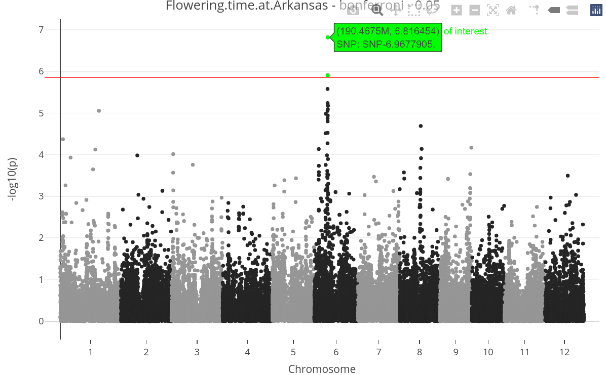
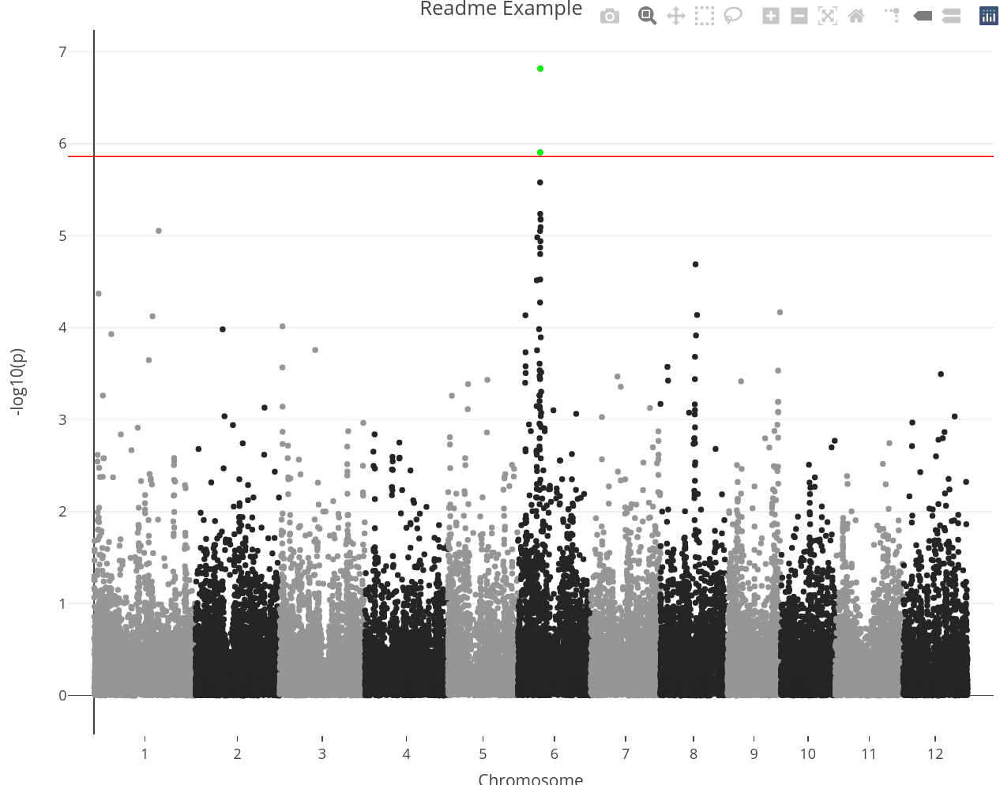

<!-- README.md is generated from README.Rmd. Please edit that file -->

```{r, include = FALSE}
knitr::opts_chunk$set(
  collapse = TRUE,
  comment = "#>"
)
dir.create("readmeTemp")
```

# GWAS-Engine

<!-- badges: start -->
<!-- badges: end -->

The goal of GWAS-Engine is to provide simple "input/output" style code for GWAS analysis in order to be used inside an API.


# Introduction

TODO: GWAS descrtiption

# Build GWAS-Engine

The easiest way to use GWAS-Engine is to use the [Docker](https://www.docker.com/) image. To build the docker image simply do:

```sh
git clone https://github.com/ut-biomet/GWAS-Engine
cd GWAS-Engine
docker build -t gwasengine ./
```

## Test the image

You can test that the image is build correctly by running:

```sh
docker run --entrypoint="Rscript" gwasengine ./tests/testthat.R
```

All tests should pass.

# How to use GWAS-Engine

### Get help

To get the help about all the parameters you can use with GWAS-Engine you can simply run:

```sh
docker run gwasengine
```

<details><summary>Click to expand</summary>

```{sh}
docker run gwasengine
```

</details>

### Run GWAS

```{sh}
docker run -v "$PWD"/data/geno/:/geno \
    -v "$PWD"/data/pheno/:/pheno \
    -v "$PWD"/readmeTemp:/out gwasengine \
    gwas \
    --genoFile "/geno/testMarkerData01.vcf.gz" \
    --phenoFile "/pheno/testPhenoData01.csv" \
    --trait "Flowering.time.at.Arkansas" \
    --test "score" \
    --fixed 0 \
    --response "quantitative" \
    --thresh_maf 0.05 \
    --thresh_callrate 0.95 \
    --outFile "/out/gwasRes.json"
```


### Draw Manhattan Plot

```{sh}
docker run -v "$PWD"/readmeTemp:/files gwasengine \
    manplot \
    --gwasFile "/files/gwasRes.json" \
    --adj_method "bonferroni" \
    --thresh_p 0.05 \
    --outFile "/files/manPlot.html"
```



### Adjust p-values


```{sh}
docker run -v "$PWD"/readmeTemp:/files gwasengine \
    adjresults \
    --gwasFile "/files/gwasRes.json" \
    --adj_method "bonferroni" \
    --outFile "/files/adjRes.json"
```


### Draw LD plot

```{sh}
docker run -v "$PWD"/data/geno/:/geno \
    -v "$PWD"/readmeTemp:/out gwasengine \
    ldplot \
    --genoFile "/geno/testMarkerData01.vcf.gz" \
    --from 42 \
    --to 62 \
    --outFile "/out/ldplot.png"
```

```{r}
library(png)
img <- readPNG("readmeTemp/ldplot.png")
grid::grid.raster(img)
```


# For developpers:

## Dependencies

Package dependencies are managed using [Renv](https://rstudio.github.io/renv/articles/renv.html). To install dependencies do in R console: `renv::restore()`.


```{r dep}
# required packages for using GWAS-Engine:
library(gaston) # for many functions
library(jsonlite) # manage json format
library(manhattanly) # manhattan plot using plotly
library(R6) # R object oriented
```


## Load R scripts

Load all `.R` files in folder `src`.
 
```{r source}
invisible(
  sapply(FUN = source,
         X = list.files("src", pattern = ".R$",full.names = T))
)
```


## Main functions


There is the list of some main function that GWAS-engine can run.

```{r runGWAS}
gwas_results <- run_gwas(genoFile = "data/geno/testMarkerData01.vcf.gz",
                         phenoFile = "data/pheno/testPhenoData01.csv",
                         genoUrl = NULL,
                         phenoUrl = NULL,
                         trait = "Flowering.time.at.Arkansas",
                         test = "score",
                         fixed = 0,
                         response = "quantitative",
                         thresh_maf = 0.05,
                         thresh_callrate = 0.95,
                         outFile = tempfile(fileext = ".json"))
gwas_results$file
substr(gwas_results$gwasRes, start=1, stop=500)
```


```{r draw_manhattanPlot}
p <- draw_manhattanPlot(gwasFile = gwas_results$file,
                        gwasUrl = NULL,
                        adj_method = "bonferroni",
                        thresh_p = 0.05,
                        chr = NA,
                        outFile = tempfile(fileext = ".html"))
```
```{r eval=FALSE, include=FALSE}
p
```


```{r adj_pvals}
gwas_adj <- run_resAdjustment(gwasFile = gwas_results$file,
                              gwasUrl = NULL,
                              adj_method = "bonferroni",
                              outFile = tempfile(fileext = ".json"))
substr(gwas_adj$gwasAdjusted, start=1, stop=500)
```


```{r draw_ldPlot}
imgFile <- draw_ldPlot(genoFile = "data/geno/testMarkerData01.vcf.gz",
                       genoUrl = NULL,
                       from = 42,
                       to = 62,
                       outFile = tempfile(fileext = ".png")) 
```


## Load data

Example data are stored in the `data` folder.

`readData` read and prepare the data for GWAS analysis
```{r loadDta}
data <- readData(genoFile = "data/geno/testMarkerData01.vcf",
                 phenoFile = "data/pheno/testPhenoData01.csv")
```

For online data, they can be loaded using:

```{r downloadDta, eval=FALSE}
data <- downloadData(genoUrl = "url/to/geno_data.vcf",
                     phenoUrl = "url/to/pheno_data.csv")
```


## GWAS

The `gwas` function return a `data.frame`.

```{r}
gwasRes <- gwas(data = data,
                trait = "Flowering.time.at.Arkansas",
                test = "score",
                fixed = 0,
                response = "quantitative",
                thresh_maf = 0.05,
                thresh_callrate = 0.95)
head(gwasRes)
```


Save GWAS result in a `.json` file.

```{r}
(file <- saveGWAS(gwasRes, metadata = "README"))
cat(paste(readLines(file, n=20), collapse = "\n"))
```

## Manhattan plot

This function generates a "plotly" graph.

```{r manPlot}
p <- manPlot(gwas = gwasRes,
             adj_method = "bonferroni",
             thresh_p = 0.05,
             chr = NA,
             title = "Readme Example")
```


```{r eval=FALSE, include=FALSE}
p
```


## LD PLot

Compute $r^2$ Linkage Disequilibrium (LD) between given SNPs and save a plot in a temporary PNG file.

```{r}
gDta <- readGenoData("data/geno/testMarkerData01.vcf.gz")
(imgFile <- LDplot(geno = gDta,
                   from = 1,
                   to = 20,
                   file = tempfile(fileext = ".png")))
```


```{r}
img <- readPNG(imgFile)
grid::grid.raster(img)
```


# Functions documentation

All the functions of this engine use `roxygen2` for documentation. You can generate a markdown documentation located in `./doc/README.md` using the function `writeDoc` (defined in `./src/utils.R`):

```{r eval=FALSE}
writeDoc(srcDir = "src",
         docDir = "doc")
```


# Tests

The R package `testthat` is needed to run the unit tests.
To run the unit tests of this engine you can use the command:

```sh
Rscript ./tests/testthat.R
```


# Data references

The genotypic and phenotypic data used as example come from:

Keyan Zhao, Chih-Wei Tung, Georgia C. Eizenga, Mark H. Wright, M. Liakat Ali, Adam H. Price, Gareth J. Norton, M. Rafiqul Islam, Andy Reynolds, Jason Mezey, Anna M. McClung, Carlos D. Bustamante & Susan R. McCouch (2011). [Genome-wide association mapping reveals a rich genetic architecture of complex traits in *Oryza sativa*.](http://www.nature.com/ncomms/journal/v2/n9/full/ncomms1467.html) Nat Comm 2:467 | DOI: 10.1038/ncomms1467, Published Online 13 Sep 2011.

```{r, include = FALSE}
# remove temp dir
unlink("readmeTemp", recursive = TRUE)
```
