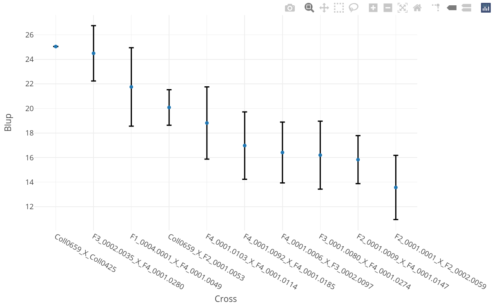
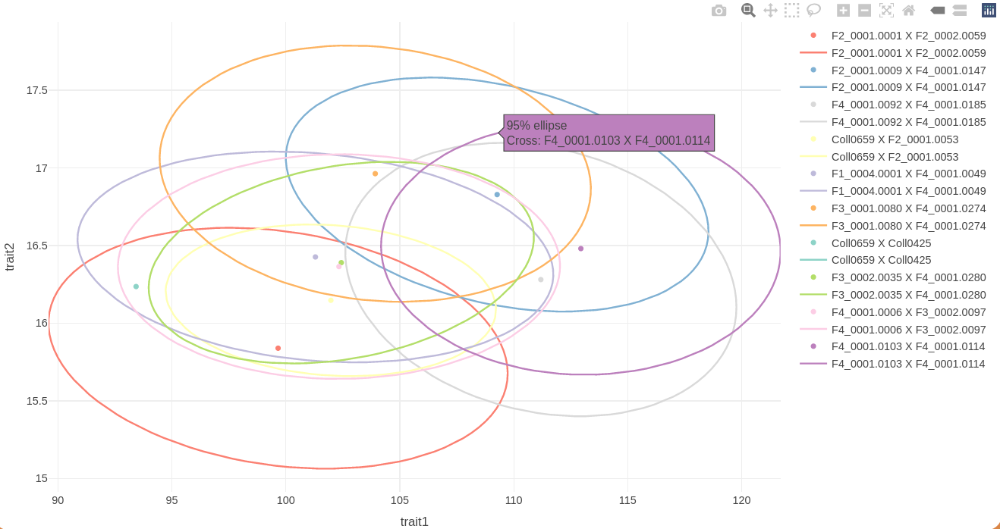
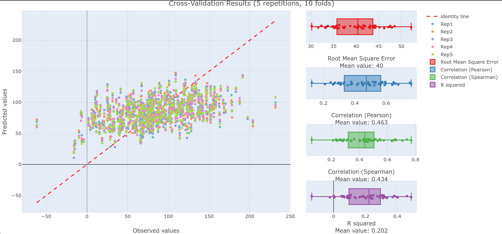

---
output:
  github_document:
    pandoc_args: [
      "--columns", "2000"
    ]
    toc: true
---

<!-- README.md is generated from README.Rmd. Please edit that file -->

```{r, include = FALSE}
knitr::opts_chunk$set(
  collapse = TRUE,
  comment = "#>"
)
options(max.print = 50)
dir.create("readmeTemp")
```

# r-geno-tools-engine

<!-- badges: start -->
<!-- badges: end -->

The goal of "r-geno-tools-engine" is to provide a simple "input/output" style command line toolbox for several genomic related analysis in order to be used inside an API or other services.


# Build r-geno-tools-engine

The easiest way to use r-geno-tools-engine is to use the [Docker](https://www.docker.com/) image. To build the docker image simply do:

```sh
git clone https://github.com/ut-biomet/r-geno-tools-engine
cd r-geno-tools-engine
docker build -t rgenotoolsengine ./
```

## Test the image

You can test the image by running:

```sh
docker run --rm --entrypoint="Rscript" rgenotoolsengine ./tests/testthat.R
```

All tests should pass.


# How to use r-geno-tools-engine

## from Docker

Basically the command to use the engine from the docker image is as follow:

```sh
docker run --rm rgenotoolsengine <subcommand> --param1 valueOfParam1 --param2 valueOfParam2 ...
```

The sub-command can be one of: (see: `docker run --rm rgenotoolsengine --help`)

- `gwas`: to do a gwas analysis from geno and pheno files
- `gwas-manplot`: to create an interactive or static manhathan plot from the results generated by `gwas`
- `gwas-adjresults`: to calculate the adjusted p-value from the results generated by `gwas`
- `ldplot`: to get a plot showing the Linkage disequilibrium between consecutive markers.
- `relmat-ped`: to calculate the relationship matrix from a pedigree file.
- `relmat-heatmap`: to get the heatmap of a relationship matrix.
- `pedNetwork`: to get an interactive pedigree network from a pedigree file.

The parameters to use depends of the sub-command. You can have an exhaustive list of them
by using:

```sh
docker run --rm rgenotoolsengine <subcommand> --help
```

However, the tools need to read/write files from the host machine.
To let docker container access those files, you need to mount the the folders
containing the files in the container using the option `-v --volume`.
Then the file path must be specify relative to the place in the container.
(See examples below).

```sh
docker run --rm \
    -v /path/to/folder1/on/host/:/dockerFolder1 \
    -v /path/to/folder2/on/host/:/dockerFolder2 \
    <subcommand> \
    --fileParam1 "/dockerFolder1/nameOfFile1.txt" \
    --fileParam2 "/dockerFolder2/nameOfFile2.txt" \
    --param3 ...
```


## Without Docker (need R installed)

This r-geno-tools-engine is written in `R`, therefore it can also be run
directly from your computer (without docker) if you have `R` and the all the
dependencies packages installed.

### Install dependencies

To install r-geno-tools-engine's packages dependencies through [`renv`](https://rstudio.github.io/renv/articles/renv.html) you can simply run:

```shell
make deps
```

Or in an `R` console:

```R
# open the repo as an Rstudio project
# or use `setwd('path/to/r-geno-tools-engine)`

# Install `renv`
install.packages(renv)

# Install dependencies
renv::restore()
```


### usage

To use the engine from `R`, move to the location of the engine and execute the `R-geno-tools-Engine.R` file with the `Rscript` command.

From a bash terminal:

```sh
cd /path/to/r-geno-tools-engine
Rscript ./r-geno-tools-engine.R <subcommand> --param1 valueOfParam1 --param2 valueOfParam2 ...
```

See:

```
Rscript ./r-geno-tools-engine.R --help
```

and

```
Rscript ./r-geno-tools-engine.R <subcommand> --help
```

If you want to use the engine from another location, you need to set an environment variable named `RGENOROOT` specifying the location of the engine. For example:

```sh
export RGENOROOT='/path/to/r-geno-tools-engine'
Rscript /path/to/r-geno-tools-engine/r-geno-tools-engine.R --help
```


#### Error management

There is a special option flag available, `--json-errors`, that will make this tool write errors information as json in `stderr` and will exit with status code of `42`, this can be usefull if you integrate this tool in others.

For example:

```sh
Rscript ./r-geno-tools-engine.R relmat-ped --pedFile "this_file_do_not_exist.csv" --outFile "/out/pedRelMat.json"
```

```json
{
    "message":"Error in calc_pedRelMat(...): file not found\nAdditional information:\n- code : FILE_NOT_FOUND\n- file : doNotExist",
    "extra":{
        "code":"FILE_NOT_FOUND",
        "file":"this_file_do_not_exist.csv",
        "error_location":"calc_pedRelMat(...)",
        "trace":"calc_pedRelMat(...)"
    }
}
```

The `extra` field will contains elements related to the specific errors (in this case, for example, the `file` that have not been found).

Unexpected errors will also exit with an error code `42` and write information in `stderr` as json with the following informations:
```json
{
    "message":"<error message>",
    "extra":{
        "code":"UNEXPECTED_ERROR",
        "stacktrace":"<informations on error location>"
    }
}
```


## As an R library

It is also possible to use this engine in other project written in `R` as a
library. For that I suggest to include this repository as a git sub-module of
your project.

Then you can load in your code the engine's function using:

```r
invisible(
  sapply(FUN = source,
         X = list.files("path/to/r-geno-tools-engine/src", pattern = ".R$",full.names = T))
)
```

For each tool of the engine, some "main functions" are available. Those
functions do essentially the same than the command lines ones. It is recommended
to use those functions in your R project.

Other "utility" functions are also available (eg. for loading data, save the results...) see the [functions documentation](./doc/README.md) for an exhaustive list.


# Functions documentation

All the R functions of this engine are documented in [`./doc/README.md`](doc/README.md).

You can generate this markdown documentation using the function `writeDoc` (defined in [`./src/utils.R`](src/utils.R)):

```{r eval=FALSE}
writeDoc(
  srcDir = "src",
  docDir = "doc"
)
```


# Tests

The R package `testthat` is needed to run the unit tests.
To run the unit tests of this engine you can use the command:

```sh
Rscript ./tests/testthat.R
```


# Tools

## GWAS

<details><summary>Click to expand</summary>

### Introduction

This toolbox provide several genomic analysis. To get a simple description of each of them, please

GWAS stands for [Genome-Wide Association Study](https://en.wikipedia.org/wiki/Genome-wide_association_study). It is a statistical study that aims to detect genetic markers associated with a particular phenotypic trait.

To test if a marker is associated with a particular phenotypic trait, we split individuals into different groups according to their genotype for the studied marker and we test if there is a statistical difference between the phenotypic values of the groups. The strength of the statistical difference is measured by what statisticians call the "[p-value](https://en.wikipedia.org/wiki/P-value)".

Usually to consider a test "statistically significant" we check if the p-value of the test is lower than a threshold "α". In this case the test is considered positive (*"there is a statistical difference"*) but we have a probability α to have a false positive. Very often α is equal to 5% or 1%.

GWAS analysis does this test individually and independently for all the genetic markers in the data-set and records the "statistical significance" (the p-values) of all the tests.

However, the number of tested genetic markers are usually very large (several hundreds of thousands or several million) therefore, the number of false-positive can be high even for a small value of α. For example, with α=1%, 500000 markers, and if none of them is associated with the phenotypic trait, we can still expect 5000 "significant test".

To avoid that, the p-values must be [adjusted](https://en.wikipedia.org/wiki/Multiple_comparisons_problem) according to the number of markers.

Finally, the result of a GWAS analysis is presented as a [Manhattan_plot](https://en.wikipedia.org/wiki/Manhattan_plot) which shows the `-log(p-value)` on the y-axis and all the markers (order according to their position on the chromosomes) on the x-axis. A horizontal line represents the significance threshold and the points of the markers above the line can be considered as being associated with the phenotypic trait.


r-geno-tools-engine provides command line tools to do GWAS analysis.

> Note: You can also check this [7min video](https://www.youtube.com/watch?v=sOP8WacfBM8) by Nuno Carvalho that explain GWAS very well.


### Functions


#### `gwas`

To do a gwas analysis and write the results in a json file.

```sh
docker run --rm -v "$PWD"/data/geno/:/geno \
    -v "$PWD"/data/pheno/:/pheno \
    -v "$PWD"/readmeTemp:/out rgenotoolsengine \
    gwas \
    --genoFile "/geno/testMarkerData01.vcf.gz" \
    --phenoFile "/pheno/testPhenoData01.csv" \
    --trait "Flowering.time.at.Arkansas" \
    --test "score" \
    --fixed 0 \
    --response "quantitative" \
    --thresh_maf 0.05 \
    --thresh_callrate 0.95 \
    --outFile "/out/gwasRes.json"
```

#### `gwas-manplot`

To create a Manhattan plot.

**Interactive plot:**

```sh
docker run --rm -v "$PWD"/readmeTemp:/files rgenotoolsengine \
    gwas-manplot \
    --gwasFile "/files/gwasRes.json" \
    --adj_method "bonferroni" \
    --thresh_p 0.05 \
    --interactive TRUE \
    --filter_nPoints 3000 \
    --outFile "/files/manPlot.html"
```

**Static plot:**

```sh
docker run --rm -v "$PWD"/readmeTemp:/files rgenotoolsengine \
    gwas-manplot \
    --gwasFile "/files/gwasRes.json" \
    --adj_method "bonferroni" \
    --thresh_p 0.05 \
    --interactive FALSE \
    --outFile "/files/manPlot.png"
```


#### `adjresults`

To create a `json` file with the gwas results with adjusted p-values.
It is also possible to filter the result to keep the values with the lowest
p-values.

```sh
docker run --rm -v "$PWD"/readmeTemp:/files rgenotoolsengine \
    gwas-adjResults \
    --gwasFile "/files/gwasRes.json" \
    --adj_method "bonferroni" \
    --filter_nPoints 3000 \
    --outFile "/files/adjRes.json"
```


### Main R functions

For a usage as R library one can use those functions.

```{r include=FALSE}
invisible(
  sapply(
    FUN = source,
    X = list.files("src", pattern = ".R$", full.names = T)
  )
)
```


```{r runGWAS}
gwas_results <- run_gwas(
  genoFile = "data/geno/testMarkerData01.vcf.gz",
  phenoFile = "data/pheno/testPhenoData01.csv",
  genoUrl = NULL,
  phenoUrl = NULL,
  trait = "Flowering.time.at.Arkansas",
  test = "score",
  fixed = 0,
  response = "quantitative",
  thresh_maf = 0.05,
  thresh_callrate = 0.95,
  outFile = tempfile(fileext = ".json")
)
gwas_results$file
substr(gwas_results$gwasRes, start = 1, stop = 500)
```

```{r draw_manhattanPlot}
p <- draw_manhattanPlot(
  gwasFile = gwas_results$file,
  gwasUrl = NULL,
  adj_method = "bonferroni",
  thresh_p = 0.05,
  chr = NA,
  interactive = TRUE,
  # filter_pAdj = 1,
  # filter_nPoints = Inf,
  filter_quant = 0.1,
  outFile = tempfile(fileext = ".html")
)
```

```{r adj_pvals}
gwas_adj <- run_resAdjustment(
  gwasFile = gwas_results$file,
  gwasUrl = NULL,
  adj_method = "bonferroni",
  outFile = tempfile(fileext = ".json")
)
substr(gwas_adj$gwasAdjusted, start = 1, stop = 500)
```

</details>


## LD plot

<details><summary>Click to expand</summary>

This help to calculate and visualize the linkage disequilibrium between some
consecutive snps.


```sh
docker run --rm -v "$PWD"/data/geno/:/geno \
    -v "$PWD"/readmeTemp:/out rgenotoolsengine \
    ldplot \
    --genoFile "/geno/testMarkerData01.vcf.gz" \
    --from 42 \
    --to 62 \
    --outFile "/out/ldplot.png"
```

**Main function**

```{r draw_ldPlot}
imgFile <- draw_ldPlot(
  genoFile = "data/geno/testMarkerData01.vcf.gz",
  genoUrl = NULL,
  from = 42,
  to = 62,
  outFile = tempfile(fileext = ".png")
)
```

</details>


## Relationship matrix

<details><summary>Click to expand</summary>

Relationship matrix represents how close two individuals are to each other (share the same genes). It can be calculated using their pedigree, or their genotypes.


### Pedigree relationship matrix

This engine can calculate the pedigree-based relationship matrix:

```sh
docker run --rm -v "$PWD"/data/pedigree/:/pedigree \
    -v "$PWD"/readmeTemp:/out rgenotoolsengine \
    relmat-ped \
    --pedFile "/pedigree/testPedData_char.csv" \
    --outFile "/out/pedRelMat.json"
```

```{r pedRelMat}
calc_pedRelMat(
  pedFile = "data/pedigree/testPedData_char.csv",
  pedUrl = NULL,
  header = TRUE,
  unknown_string = "",
  outFile = tempfile(fileext = ".json")
)
```


### Genomic relationship matrix

This engine can calculate the genomic-based relationship matrix:

```sh
docker run --rm -v "$PWD"/data/geno/:/geno \
    -v "$PWD"/readmeTemp:/out rgenotoolsengine \
    relmat-geno \
    --genoFile "/geno/breedGame_geno.vcf.gz" \
    --outFile "/out/genoRelMat.json"
```


```{r genoRelMat}
calc_genoRelMat(
  genoFile = "data/geno/breedGame_geno.vcf.gz",
  genoUrl = NULL,
  outFile = tempfile(fileext = ".json")
)
```


### Combined relationship matrix

This method allow to correct a pedigree relationship matrix using a genomic
relationship matrix.

2 methods are implemented:

- `Legarra`: *Legarra, A, et al. 2009 A relationship matrix including full pedigree and genomic information. Journal of Dairy Science 92, 4656–4663*
- `Martini`: *Martini, JW, et al. 2018 The effect of the H-1 scaling factors tau and omega on the structure of H in the single-step procedure. Genetics Selection Evolution 50(1), 16*. This method use additional parameters `tau` and `omega`. Martini's
method with `tau=1` and `omega=1` is equivalent to the `Legarra`'s method.

```sh
docker run --rm -v "$PWD"/data/results/:/results \
    -v "$PWD"/readmeTemp:/out rgenotoolsengine \
    relmat-combined \
    --ped-relmatFile /results/breedGame_pedRelMat.csv
    --geno-relmatFile /results/breedGame_genoRelMat.csv
    --combine-method Martini
    --tau 1
    --omega 0.5
    --outFile "/out/combined_relMat.json"
```


```{r combinedRelMat}
calc_combinedRelMat(
  pedRelMatFile = "data/results/breedGame_pedRelMat.csv",
  genoRelMatFile = "data/results/breedGame_genoRelMat.csv",
  method = "Martini",
  tau = 1,
  omega = 0.5,
  outFile = tempfile(fileext = ".json")
)
```


### Relationship matrix visualisation

The engine include a function to generate an heatmap of a relationship matrix:

This heatmap can either be interactive (`.html` file) or static (`.png` file).


```sh
docker run --rm -v "$PWD"/data/results/:/results \
    -v "$PWD"/readmeTemp:/out rgenotoolsengine \
    relmat-heatmap \
    --relmatFile "/results/pedRelMat.json" \
    --outFile "/out/relMat_heatmap.png"
```

```{r relMat-heatmap}
draw_relHeatmap(
  relMatFile = "data/results/pedigreeRelationship.csv",
  relMatUrl = NULL,
  interactive = FALSE,
  outFile = tempfile(fileext = ".png")
)
```

</details>

## Pedigree network

<details><summary>Click to expand</summary>

**_This is quite experimental_**

The engine contain a function to generate an interactive network of the pedigree relations.

Individuals with parental relations are linked with an arrow pointing from the parents to the offspring.


> Note: This network is not organized by generation (like a genealogical tree) can be big, messy and not very responsive if the number of individual in the pedigree is big.


```sh
docker run --rm -v "$PWD"/data/pedigree/:/pedigree \
    -v "$PWD"/readmeTemp:/out rgenotoolsengine \
    pedNetwork \
    --pedFile "/pedigree/testPedData_char.csv" \
    --outFile "/out/pedNet.html"
```

**Main function**

```{r draw_pedNet}
imgFile <- draw_pedNetwork(
  pedFile = "data/pedigree/testPedData_char.csv",
  pedUrl = NULL,
  unknown_string = "",
  header = TRUE,
  outFile = tempfile(fileext = ".html")
)
```


</details>


## Crossing Simulation

<details><summary>Click to expand</summary>

### Introduction

<details><summary>Click to see <strong>GitHub</strong> version</summary>
This engine contain a simulation tool that can simulate the genotypes of
some progeny given the phased genotypes of parental individuals.

The for the simulation, the engine needs:

- The phased genotypes of the parents
- A crossing table specifying which cross to simulate
- The SNP coordinates in Morgan


To generate the SNP genotypes of new individuals from those of the parents,
the engine simulate two gametogenesis, one from each parent:

For each pair of chromosome:

We drew the number of crossing-overs \$n_{co}\$ for each chromosome in a
Poisson distribution of rate \$l_{chr}\$, which is the length of the chromosome
in Morgan:

\$\$
n_{co} \\sim \\text{Pois}(l_{chr})
\$\$


When \$n_{co} \\neq 0 \$, we drew independently the positions of crossing-overs
in a uniform distribution along the length of the chromosome in Morgan.
We had, the sampled positions \$pos_i\$ \n
(\$\\forall i \\in [0,n_{co}+1 ] \$)
of the crossing-overs so
that \$pos_j < pos_{j+1}\$ (\$\\forall j \\in [0,n_{co}]\$)
with \$pos_0 = 0\$ and \$pos_{n_{co}+1} = l_{chr}\$.


\$X\$ was the \$2\\times n_{snp_k}\$ matrix representing the genotype of the
parent for the current pair of chromosomes \$k\$. Each individual represents one
chromosome of the pair. \$Y\$ was the vector of length \${n_{snp}}_k\$ representing
the genotype of the gamete for the chromosome pair. We set \$[a,b] = [1, 2]\$
or \$[2, 1]\$ with probability \$\\frac{1}{2}\$. \$Y\$ was then calculated as:

$$
Y[i] = \left\{
\begin{array}{ll}
X[a,i] & \text{if} \quad \exists\ k \in [0, floor\left(\frac{n_{co}}{2}\right)],  pos_{2k} \leq pos_i < pos_{2k+1} \\
X[b,i] & \text{if} \quad \exists\ k \in [1, floor\left(\frac{n_{co}}{2}\right)],  pos_{2k-1} < pos_i \leq pos_{2k}
\end{array}
\right.
$$

where \$pos_i\$ is the position of the marker \$i\$.

Genotype of the offspring is obtain by merging two gametes from its parents.

</details>

<details><summary>Click to see <strong>GitLab</strong> version</summary>

This engine contain a simulation tool that can simulate the genotypes of
some progeny given the phased genotypes of parental individuals.

The for the simulation, the engine needs:

- The phased genotypes of the parents
- A crossing table specifying which cross to simulate
- The SNP coordinates in Morgan


To generate the SNP genotypes of new individuals from those of the parents,
the engine simulate two gametogenesis, one from each parent:

For each pair of chromosome:

- We drew the number of crossing-overs \$`n_{co}`\$ for each chromosome in a
Poisson distribution of rate \$`l_{chr}`\$, which is the length of the chromosome
in Morgan: \$`n_{co} \sim \text{Pois}(l_{chr})`\$
- When \$`n_{co} \neq 0 `\$, we drew independently the positions of crossing-overs
in a uniform distribution along the length of the chromosome in Morgan.
We had, the sampled positions \$`pos_i`\$
(\$`\forall i \in \llbracket 0,n_{co}+1 \rrbracket `\$) of the crossing-overs so
that \$`pos_j < pos_{j+1}`\$ (\$`\forall j \in \llbracket0,n_{co}\rrbracket`\$)
with \$`pos_0 = 0`\$ and \$`pos_{n_{co}+1} = l_{chr}`\$.
- \$`X`\$ was the \$`2 \times {n_{snp}}_k`\$ matrix representing the genotype of the
parent for the current pair of chromosomes \$`k`\$. Each individual represents one
chromosome of the pair. \$Y\$ was the vector of length \$`{n_{snp}}_k`\$ representing
the genotype of the gamete for the chromosome pair. We set \$`[a,b] = [1, 2]`\$
or \$`[2, 1]`\$ with probability \$`\frac{1}{2}`\$. \$`Y`\$ was then calculated as:

```math
Y[i] = \left\{
\begin{array}{ll}
X[a,i] & \text{if} \quad \exists\ k \in [0, floor\left(\frac{n_{co}}{2}\right)],  pos_{2k} \leq pos_i < pos_{2k+1} \\
X[b,i] & \text{if} \quad \exists\ k \in [1, floor\left(\frac{n_{co}}{2}\right)],  pos_{2k-1} < pos_i \leq pos_{2k}
\end{array}
\right.
```

where \$`pos_i`\$ is the position of the marker \$`i`\$.

Genotype of the offspring is obtain by merging two gametes from its parents.

</details>


### Command


```sh
docker run --rm -v "$PWD"/data/:/data \
    -v "$PWD"/readmeTemp:/out rgenotoolsengine \
    crossing-simulation \
    --genoFile "/data/geno/breedGame_phasedGeno.vcf.gz" \
    --crossTableFile "/data/crossingTable/breedGame_crossTable.csv" \
    --SNPcoordFile "/data/SNPcoordinates/breedingGame_SNPcoord.csv" \
    --nCross 10 \
    --outFile "/out/crossSim.vcf.gz"
```

**Main function**

```{r crossing-sim}
crossingSimulation(
  genoFile = "data/geno/breedGame_phasedGeno.vcf.gz",
  crossTableFile = "data/crossingTable/breedGame_crossTable.csv",
  SNPcoordFile = "data/SNPcoordinates/breedingGame_SNPcoord.csv",
  nCross = 10,
  outFile = tempfile(fileext = ".vcf.gz")
)
```

</details>


## Progenies BLUP variance and expected values

<details><summary>Click to expand</summary>

### Introduction

We would like to estimate the esperance and variance of progenies' genotypes from parents' (phased) genotypes and recombination rates of markers.

#### Theory

Let's consider 2 markers $x$ and $y$ place on the same chromosome. A given individual have 2 alleles for each of those markers:

- the maternal alleles $x_M, y_M$
- the paternal alleles: $x_P, y_P$.

Let $X_i$ be the random variable representing the genotype value of the marker $x$ in a gamete from the individual $i$. And let $x_{ij}$ be the genotype value of the allele $j$ of the marker $x$ for individual $i$. (this is not a random variable)

We call $r_{xy}$ be the recombination rate between $x$ and $y$.

We are interested in the variance, covariance and expected value of $X_i$ and $Y_i$.

For one gamete, we have:
$$
\begin{align}
\mathbb{E}(X_i) &= \frac{1}{2}(x_M+x_P)\\
Cov(X_i,Y_i) &= \frac{1}{4} (1-2r_{xy}) z_{ixy}\\
Var(X_i) &= \frac{1}{4} z_{ixx}\\
\text{with } z_{ixy} &= x_My_M + x_Py_P - x_My_P - x_Py_M\\
\end{align}
$$

And for a progeny from parent 1 and 2 we have:

$$
\begin{align}
\mathbb{E}(X_1 + X_2) &= \frac{1}{2}(x_{1M} + x_{1P} + x_{2M} + x_{2P})\\
Cov(X_1 + X_2, Y_1 + Y_2) &= \frac{1}{4} (1-2r) (z_{1xy} + z_{2xy})\\
Var(X_1+X_2) &= \frac{1}{4}(z_{1xx} + z_{2xx})\\
\end{align}
$$


We can also calculate the expected value and variance of the genetic value of the progeny if we suppose an additive genetic architecture and if we know the markers effects $e_x$.
Let $G$ be the genetic value of the progeny of individual $1$ and $2$: $G = \sum_i e_i (X_{1i} + X_{2i})$

$$
\begin{align}
\mathbb{E}(G) &= \frac{1}{2} \sum_i e_i (x_{1iM} + x_{1iP} + x_{2iM} + x_{2iP}) \\
Var(G) &= \frac{1}{4} \sum_{jk} e_je_k (1-2r_{jk})(z_{1jk} + z_{2jk}) \\
\end{align}
$$

When considering 2 traits $a$ and $b$ we have:

$$Cov(G_a;G_b) = \sum_{m}\sum_{k} eff_{a_m} eff_{b_k} ( \mathbb{E}(X_{1m} X_{1k}) +  \mathbb{E}(X_{1m} X_{2k}) +  \mathbb{E}(X_{2m} X_{1k}) +  \mathbb{E}(X_{2m} X_{2k})) - \mathbb{ \mathbb{E}}(G_a)\mathbb{ \mathbb{E}}(G_b)$$

With:

$$
\begin{eqnarray}
 \mathbb{E}(X_{1m} X_{1k}) &=& \frac{1}{4}(2x_{1mM}x_{1kM}
+ 2x_{1mP}x_{1kP})
- \frac{r_{X_{1m}X_{1k}}}{2}
(x_{1mM} x_{1kM} - x_{1mM} x_{1kP} - x_{1mP} x_{1kM} + x_{1mP} x_{1kP})\\
 \mathbb{E}(X_{2m} X_{2k}) &=& \frac{1}{4}(2x_{2mM}x_{2kM}
+ 2x_{2mP}x_{2kP})
- \frac{r_{X_{2m}X_{2k}}}{2}
(x_{2mM} x_{2kM} - x_{2mM} x_{2kP} - x_{2mP} x_{2kM} + x_{2mP} x_{2kP})\\
 \mathbb{E}(X_{1m} X_{2k}) &=& \frac{1}{4} (
x_{1mM} x_{2kM}
+ x_{1mM} x_{2kP}
+ x_{1mP} x_{2kM}
+ x_{1mP} x_{2kP} )\\
 \mathbb{E}(X_{2m} X_{1k}) &=& \frac{1}{4} (
x_{2mM} x_{1kM}
+ x_{2mM} x_{1kP}
+ x_{2mP} x_{1kM}
+ x_{2mP} x_{1kP} )
\end{eqnarray}
$$


<details><summary>Proof</summary>

Let $P(x_{ij})$ be the probability that the individual $i$ transmit its allele $j$ for the marker $x$ in one of it's gamete.
And let $P(x_ij,y_kl)$ be the probability that the individuals $i$ and $k$ transmit their alleles $j$ and $l$ for markers $x$ and $y$ in one of their gamete.

We have the following formula:

- $P(x_{iM}) = P(x_{iP}) = P(y_{iM}) = P(y_{iP}) = \frac{1}{2}$
- $P(x_{iM}y_{iM}) = P(x_{iP}y{i_P})$
- $P(x_{iM}y_{iP}) = P(x_{iP}y_{iM})$


##### Expected value

$$
\begin{align}
\mathbb{E}(X_i) &= \sum_jx_{ij}P(x_{ij})\\
\mathbb{E}(X_i) &= x_{iM}P(x_{iM}) + x_{iP}P(x_{iP})\\
\mathbb{E}(X_i) &= \frac{1}{2} (x_{iM}+x_{iP})\\
\end{align}
$$


##### Covariance

By definition the recombination rate $r_{xy}$ between markers $x$ and $y$ is $r_{xy} \overset{def}{=} P(x_{iM}y_{iP} \cup x_{iP}y_{iM})$ therefore:

$$
\begin{align}
r_{xy} &\overset{def}{=} P(x_{iM}y_{iP} \cup x_{iP}y_{iM})\\
  &= P(x_{iM}y_{iP}) + P(x_{iP}y_{iM}) - P(x_{iM}y_{iP} \cap {ix}_Py_{iM})\\
  &= P(x_{iM}y_{iP}) + P(x_{iP}y_{iM}) - 0\\
r_{xy} &= 2P(x_{iM}y_{iP}) = 2P(x_{iP}y_{iM})\\
P(x_{iM}y_{iP}) = P(x_{iP}y_{iM}) &= \frac{r_{xy}}{2}
\end{align}
$$

and

$$
\begin{align}
1 - r_{xy} &= 1 - P(x_{iM}y_{iP} \cup x_{iP}y_{iM})\\
      &= P(x_{iM}y_{iM} \cup x_{iP}y_{iP})\\
      &= P(x_{iM}y_{iM}) + P(x_{iP}y_{iP}) -  P(x_{iM}y_{iM} \cap x_{iP}y_{iP})\\
      &= P(x_{iM}y_{iM}) + P(x_{iP}y_{iP}) - 0\\
1 - r_{xy} &= 2P(x_{iM}y_{iM}) = 2P(x_{iP}y_{iP})\\
P(x_{iM}y_{iM}) = P(x_{iP}y_{iP}) &= \frac{1-r_{xy}}{2}
\end{align}
$$


We can now calculate the formula of $Cov(X_i, Y_i)$

$$
\begin{align}
Cov(X_i, Y_i) &\overset{def}{=} \mathbb{E}[(X_i-\mathbb{E}(X_i))(Y_i-\mathbb{E}(Y_i))]\\
Cov(X_i, Y_i)  &= \mathbb{E}(X_iY_i) - \mathbb{E}(X_i)\mathbb{E}(Y_i) \ \text{(covariance property)}\\
\end{align}
$$

First let's calculate $\mathbb{E}(X_i)\mathbb{E}(Y_i)$

$$
\begin{align}
\mathbb{E}(X_i)\mathbb{E}(Y_i) &= \frac{1}{2}(x_{iM}+x_{iP})\frac{1}{2}(y_{iM}+y_{iP})\\
\mathbb{E}(X_i)\mathbb{E}(Y_i) &= \frac{1}{4}(x_{iM}+x_{iP})(y_{iM}+y_{iP})\\
\mathbb{E}(X_i)\mathbb{E}(Y_i) &= \frac{1}{4}(x_{iM}y_{iM} + x_{iM}y_{iP} + x_{iP}y_{iM} + x_{iP}y_{iP})\\
\end{align}
$$


Now let's calculate $\mathbb{E}(X_iY_i)$

$$
\begin{align}
\mathbb{E}(X_iY_i) &= \sum_{j,k}x_{ij}y{ik} \times P(x_{ij}y_{ik})\\
\mathbb{E}(X_iY_i) &=  x_{iM}y_{iM} P(x_{iM}y_{iM})
    + x_{iM}y_{iP} P(x_{iM}y_{iP})
    + x_{iP}y_{iM} P(x_{iP}y_{iM})
    + x_{iP}y_{iP} P(x_{iP}y_{iP})\\
\mathbb{E}(X_iY_i) &=  x_{iM}y_{iM} \frac{1-r_{xy}}{2}
    + x_{iM}y_{iP} \frac{r_{xy}}{2}
    + x_{iP}y_{iM} \frac{r_{xy}}{2}
    + x_{iP}y_{iP} \frac{1-r_{xy}}{2})\\
\mathbb{E}(X_iY_i) &= \frac{1}{2}(x_{iM}y_{iM}) - \frac{r_{xy}}{2}(x_{iM}y_{iM})
    +  \frac{r_{xy}}{2} (x_{iM}y_{iP})
    +  \frac{r_{xy}}{2} (x_{iP}y_{iM})
    + \frac{1}{2}(x_{iP}y_{iP}) - \frac{r_{xy}}{2}(x_{iP}y_{iP})\\
\mathbb{E}(X_iY_i) &= \frac{1}{2}(x_{iM}y_{iM} + x_{iP}y_{iP})
    + \frac{r_{xy}}{2}(-x_{iM}y_{iM} + x_{iM}y_{iP} + x_{iP}y_{iM} -x_{iP}y_{iP})\\
\mathbb{E}(X_iY_i) &= \frac{1}{4}(2x_{iM}y_{iM} + 2x_{iP}y_{iP})
    + \frac{r_{xy}}{2}(-x_{iM}y_{iM} + x_{iM}y_{iP} + x_{iP}y_{iM} -x_{iP}y_{iP})\\
\mathbb{E}(X_iY_i) &= \frac{1}{4}(2x_{iM}y_{iM} + 2x_{iP}y_{iP})
    - \frac{r_{xy}}{2}(x_{iM}y_{iM} - x_{iM}y_{iP} - x_{iP}y_{iM} + x_{iP}y_{iP})\\
\end{align}
$$

We now calculate $Cov(X_i,Y_i) = \mathbb{E}(X_iY_i) - \mathbb{E}(X_i)\mathbb{E}(Y_i)$:


$$
\begin{align}
\mathbb{E}(X_iY_i) - \mathbb{E}(X_i)\mathbb{E}(Y_i) &=
    \frac{1}{4}(2x_{iM}y_{iM} + 2x_{iP}y_{iP})
    - \frac{r_{xy}}{2}(x_{iM}y_{iM} - x_{iM}y_{iP} - x_{iP}y_{iM} + x_{iP}y_{iP})
    -\frac{1}{4}(x_{iM}y_{iM} + x_{iM}y_{iP} + x_{iP}y_{iM} + x_{iP}y_{iP})\\
Cov(X_i,Y_i) &=
    \frac{1}{4}(2x_{iM}y_{iM} + 2x_{iP}y_{iP} - x_{iM}y_{iM} - x_{iM}y_{iP} - x_{iP}y_{iM} - x_{iP}y_{iP})
    - \frac{r_{xy}}{2}(x_{iM}y_{iM} - x_{iM}y_{iP} - x_{iP}y_{iM} + x_{iP}y_{iP})\\
 &= \frac{1}{4}(x_{iM}y_{iM} + x_{iP}y_{iP} - x_{iM}y_{iP} - x_{iP}y_{iM} )
    - \frac{r_{xy}}{2}(x_{iM}y_{iM} - x_{iM}y_{iP} - x_{iP}y_{iM} + x_{iP}y_{iP})\\
 &= \frac{1}{4}z_{ixy} - \frac{r_{xy}}{2}z_{ixy} \qquad\text{with: } z_{ixy} = x_{iM}y_{iM} - x_{iM}y_{iP} - x_{iP}y_{iM} + x_{iP}y_{iP}\\
Cov(X_i,Y_i) &= \frac{1}{4}(1-2r_{xy})z_{ixy}\\
\end{align}
$$

##### Variance

We can now calculate the variance $Var(X_i)$

$$
\begin{align}
Var(X_i) &= Cov(X_i, X_i)\\
 &= \frac{1}{4}(1-2r_{xx})z_{ixx}\\
 &= \frac{1}{4}(1-0)z_{ixx}\\
Var(X_i) &= \frac{1}{4}z_{ixx}
\end{align}
$$


##### For the sum of $X_1,X_2$ and $Y_1,Y_2$


Let $x_ij$ be the genotype value of the allele $j$ of the marker $x$ for the gamete of individual $i$:


Let's calculate $\mathbb{E}(X_1 + X_2)$

$$
\begin{align}
\mathbb{E}(X_1 + X_2) &= \mathbb{E}(X_1) + \mathbb{E}(X_2)\\
 &= \frac{1}{2} (x_{1M}+x_{1P}) + \frac{1}{2} (x_{2M}+x_{2P})\\
\mathbb{E}(X_1 + X_2) &= \frac{1}{2}(x_{1M} + x_{1P} + x_{2M} + x_{2P})\\
\end{align}
$$

Let's calculate $Var(X_1 + X_2)$

$$
\begin{align}
Var(X_1 + X_2) &= Var(X_1) + Var(X_2) + 2 Cov(X_1, X_2)\\
  &= Var(X_1) + Var(X_2) + 0 \qquad \text{(we consider } X_1, X_2 \text{ independent)}\\
  &= \frac{1}{4}z_{1xx} + \frac{1}{4}z_{2xx}\\
Var(X_1 + X_2) &= \frac{1}{4} (z_{1xx} + z_{2xx})
\end{align}
$$

Let's calculate $Cov(X_1 + X_2, Y_1 + Y_2)$

$$
\begin{align}
Cov(X_1 + X_2, Y_1 + Y_2) &= Cov(X_1, Y_1) + Cov(X_1, Y_2) + Cov(X_2, Y_1) + Cov(X_2, Y_2)\\
 &= Cov(X_1, Y_1) + 0 + 0 + Cov(X_2, Y_2)  \qquad \text{(we consider } X_1, Y_2 \text{ and } X_2, Y_1 \text{ independent)}\\
 &=  \frac{1}{4}(1-2r_{xy})z_{1xy} +  \frac{1}{4}(1-2r_{xy})z_{2xy} \\
Cov(X_1 + X_2, Y_1 + Y_2) &= \frac{1}{4}(1-2r_{xy})(z_{1xy} + z_{2xy}) \\
\end{align}
$$


##### Genetic values

We will now consider all the markers.

Let $X_ij$ be the random variable representing the genotype value of the marker $j$ in a gamete from the individual $i$.
Let $x_{ijM}$ and $x_{ijP}$ be the genotype value of the maternal ($M$) and paternal ($P$) allels of the marker $j$ for the individual $i$. (this is not a random variable)

 be the genotype value of the allele $j$ of the marker $x$ for the gamete of individual $i$. (this is not a random variable)

Let's consider an additive genetic architecture and let $e_j$ be the effect of marker $j$.
Let $G$ be the genetic value of the progeny of individual $1$ and $2$, so:

- $G = \sum_j e_j (X_{1j} + X_{2j})$


$$
\begin{align}
\mathbb{E}(G) &= \mathbb{E}(\sum_j e_j (X_{1j} + X_{2j}))\\
 &= \sum_j e_j \mathbb{E}(X_{1j} + X_{2j})\\
 &= \sum_j e_j \frac{1}{2}(x_{1jM} + x_{1jP} + x_{2jM} + x_{2jP})\\
\mathbb{E}(G) &= \frac{1}{2} \sum_j e_j (x_{1jM} + x_{1jP} + x_{2jM} + x_{2jP})\\
\end{align}
$$

> Note: we can recognise that this is the mean of the genetic value of the 2 parents: $\frac{1}{2} (\sum_j e_j (x_{1jM} + x_{1jP}) + \sum_j e_j  (x_{2jM} + x_{2jP}))$

$$
\begin{align}
Var(G) &= Var(\sum_j e_j (X_{1j} + X_{2j}))\\
 &= \sum_{jk} Cov(e_j(X_{1j} + X_{2j}), e_k(X_{1k}+X_{2k})) \qquad \text{(Bienaymé's identity)}\\
 &= \sum_{jk} e_je_kCov(X_{1j} + X_{2j}, X_{1k}+X_{2k})\\
Var(G) &= \sum_{jk} e_je_k  \frac{1}{4}(1-2r_{jk})(z_{1jk} + z_{2jk})\\
\end{align}
$$

in Matrix notation: with $X$ a random vector and $a$ a vector:

$$
\begin{align}
Cov(X) &= E(XX') - E(X)E(X') \\
Cov(a'X) &= E(a'X(a'X)') - E(a'X)E((a'X)') \\
 &= E(aXX'a) - a'E(X)E(X')a \\
 &= a'E(XX')a - aE(X)E(X')a \\
 &= a'(E(XX') - E(X)E(X'))a \\
Cov(a'X) &= a'Cov(X)a \\
\end{align}
$$

##### Covariance of the genetic values


$$Cov(G_a;G_b) = E(G_a G_b) - E(G_a) E(G_b)$$

$$G_a G_b = \sum_{m}\sum_{k} eff_{a_m}(X_{1m} + X_{2m}) \times eff_{b_k}(X_{1k} + X_{2k})$$

$$\begin{eqnarray}
E(G_a G_b) &=& \sum_{m}\sum_{k} E(eff_{a_m}(X_{1m} + X_{2m}) \times eff_{b_k}(X_{1k} + X_{2k}))\\
&=& \sum_{m}\sum_{k} eff_{a_m} eff_{b_k} E((X_{1m} + X_{2m}) \times (X_{1k} + X_{2k}))
\end{eqnarray}$$


$$\begin{eqnarray}
(X_{1m} + X_{2m}) \times (X_{1k} + X_{2k}) &=& X_{1m} X_{1k} + X_{1m} X_{2k} + X_{2m} X_{1k} + X_{2m} X_{2k}\\
E((X_{1m} + X_{2m}) \times (X_{1k} + X_{2k})) &=& E(X_{1m} X_{1k}) + E(X_{1m} X_{2k}) + E(X_{2m} X_{1k}) + E(X_{2m} X_{2k})
\end{eqnarray}$$

$E(X_{im} X_{jk}) (i,j \in [1;2]^2)$ etc... were already calculated before (split all possible values and probability for $X_{im}$ or $X_{jk}$)

</details>


### Command

#### Calculation

```sh
docker run --rm -v "$PWD"/data/:/data \
    -v "$PWD"/readmeTemp:/out rgenotoolsengine \
    progeny-blup-calculation \
    --genoFile "/data/geno/breedGame_phasedGeno.vcf.gz" \
    --crossTableFile "/data/crossingTable/breedGame_small_crossTable.csv" \
    --SNPcoordFile "/data/SNPcoordinates/breedingGame_SNPcoord.csv" \
    --markerEffectsFile "/data/markerEffects/breedGame_markerEffects.csv" \
    --outFile "/out/progBlups.json"
```

**Main function**

```{r progeny-blup-calculation}
calc_progenyBlupEstimation(
  genoFile = "data/geno/breedGame_phasedGeno.vcf.gz",
  crossTableFile = "data/crossingTable/breedGame_small_crossTable.csv",
  SNPcoordFile = "data/SNPcoordinates/breedingGame_SNPcoord.csv",
  markerEffectsFile = "data/markerEffects/breedGame_markerEffects.csv",
  outFile = tempfile(fileext = ".json")
)
```


#### Plot

##### 1 trait

```sh
docker run --rm -v "$PWD"/data/:/data \
    -v "$PWD"/readmeTemp:/out rgenotoolsengine \
    progeny-blup-plot \
    --progeniesBlupFile "/data/results/progenyBlupEstimation.json" \
    --outFile "/out/progBlupsPlot.html"
```

**Main function**

```{r progeny-blup-plot}
plot <- draw_progBlupsPlot(
  progEstimFile = "data/results/progenyBlupEstimation.json",
  sorting = "dec",
  outFile = tempfile(fileext = ".html")
)
```




##### 2 traits

```sh
docker run --rm -v "$PWD"/data/:/data \
    -v "$PWD"/readmeTemp:/out rgenotoolsengine \
    progeny-blup-plot-2-traits \
    --progeniesBlupFile "/data/results/progenyBlupEstimation_2traits.json" \
    --x-trait "trait1"
    --y-trait "trait2"
    --outFile "/out/progBlupsPlot.html"
```

**Main function**

```{r progeny-blup-plot-2-traits}
plot <- draw_progBlupsPlot_2traits(
  progEstimFile = "data/results/progenyBlupEstimation_2traits.json",
  x_trait = "trait1",
  y_trait = "trait2",
  outFile = tempfile(fileext = ".html")
)
```


</details>


## Genomic selection

<details><summary>Click to expand</summary>

### Model evaluation

Before training a model is is good practive to evaluate the performance a the model.

This can be done with the following command:

```sh
./r-geno-tools-engine.R evaluate-gs-model --genoFile data/genomic_selection/geno_G1.vcf.gz --phenoFile data/genomic_selection/pheno_train.csv --trait pheno --with-dominance true --outFile ./model_evaluation.json
```

Once the evaluation is done, you can visualize it with:

```sh
./r-geno-tools-engine.R plot-gs-model-evaluation --evaluation-file ./model_evaluation.json --outFile evaluation_plot.html
```



### Model training

A GS model can be build with the command:

```sh
./r-geno-tools-engine.R train-gs-model --genoFile data/genomic_selection/geno_G1.vcf.gz --phenoFile data/genomic_selection/pheno_train.csv --trait pheno --with-dominance true --outFile ./estimated_markers_effects.json
```

This command will create a "marker effects" file that contains the estimated markers effects that can be used to make predicitons.

2 models can be build, one with only additive effects estimation
(with `--with-dominance false`) or one with both additive and dominance effects
estimations with (with `--with-dominance true`).

### Model predictions

GS prediction can be made from a "marker effects" file and a genotype file with 
the command:

```sh
 ./r-geno-tools-engine.R gs-predictions --genoFile data/genomic_selection/geno_G2.vcf.gz --markerEffectsFile ./estimated_markers_effects.json --outFile predictions.csv
```


### Generate random marker effects

In order to create data set for testing, a command is available to generate 
marker effects.

```sh
 ./r-geno-tools-engine.R generate-rnd-marker-effects --genoFile data/geno/breedGame_geno.vcf.gz --outFile ./random_marker_effects.json 
```

This command will also print the distribution of the genetic values of the provided
individuals.

The variance of the genetic values can be tuned with the parameters `--rate-add` and `--rate-dom`
(that control the variance of the markers effects).

### Generate phenotypes

Once some marker effects have been generated, we can also generate phenotypes with:
```sh
 ./r-geno-tools-engine.R simulate-phenotype --genoFile data/geno/breedGame_geno.vcf.gz --markerEffectsFile random_marker_effects.json --heritability 0.6 --outFile ./simulated_phenotypes.json 
```

This command will also print the distribution of the phenotypic values of the provided
individuals, along with: 
- the standard distribution of the "environmental noise"
- the broad sense heritability for the given population

</details>

# Data references

Some example data are available in the folder [data](data/). This folder also includes examples of output files.

These examples output files can be automatically generated using the function `createResultExample` (defined in [`./src/utils.R`](src/utils.R)):

```{r eval=FALSE}
createResultExample()
```

The genotypic and phenotypic data used as example come from:

> Keyan Zhao, Chih-Wei Tung, Georgia C. Eizenga, Mark H. Wright, M. Liakat Ali, Adam H. Price, Gareth J. Norton, M. Rafiqul Islam, Andy Reynolds, Jason Mezey, Anna M. McClung, Carlos D. Bustamante & Susan R. McCouch (2011). [Genome-wide association mapping reveals a rich genetic architecture of complex traits in *Oryza sativa*.](http://www.nature.com/ncomms/journal/v2/n9/full/ncomms1467.html) Nat Comm 2:467 | DOI: 10.1038/ncomms1467, Published Online 13 Sep 2011.

> Flutre, T., Diot, J., and David, J. (2019). [PlantBreedGame: A Serious Game that Puts Students in the Breeder’s Seat. Crop Science.](https://acsess.onlinelibrary.wiley.com/doi/10.2135/cropsci2019.03.0183le) DOI 10.2135/cropsci2019.03.0183le


# Utils

The [`utils`](./utils) folder contain miscellaneous code that can be useful for developers working on this project. This engine should NOT depend on any file of this folder.

```{r, include = FALSE}
# remove temp dir
unlink("readmeTemp", recursive = TRUE)
```
