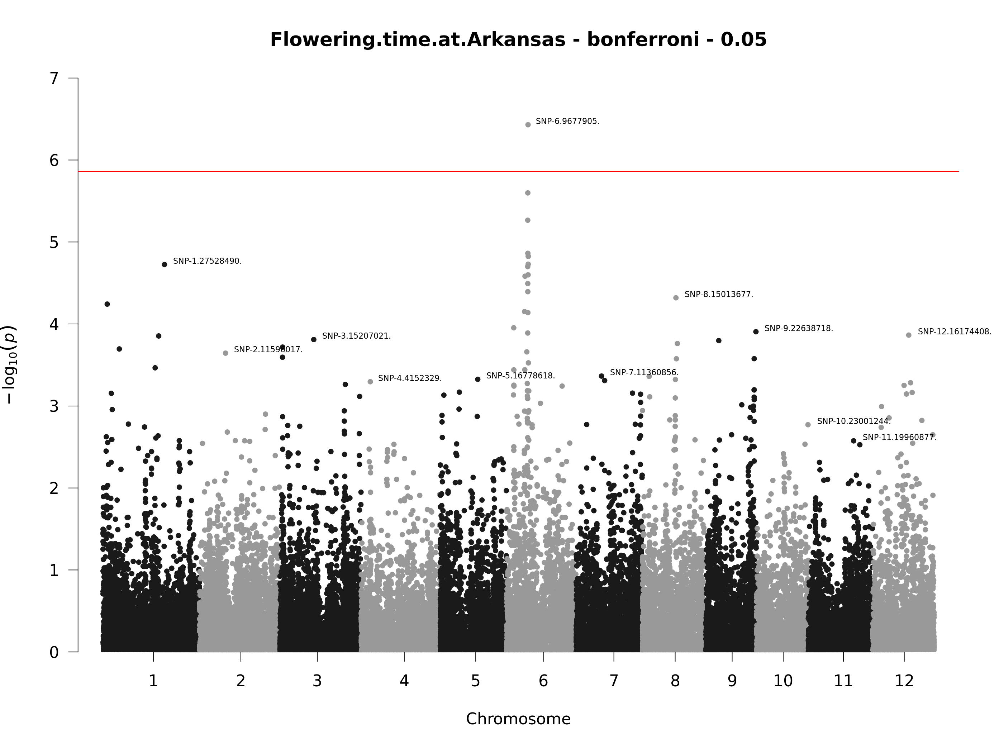
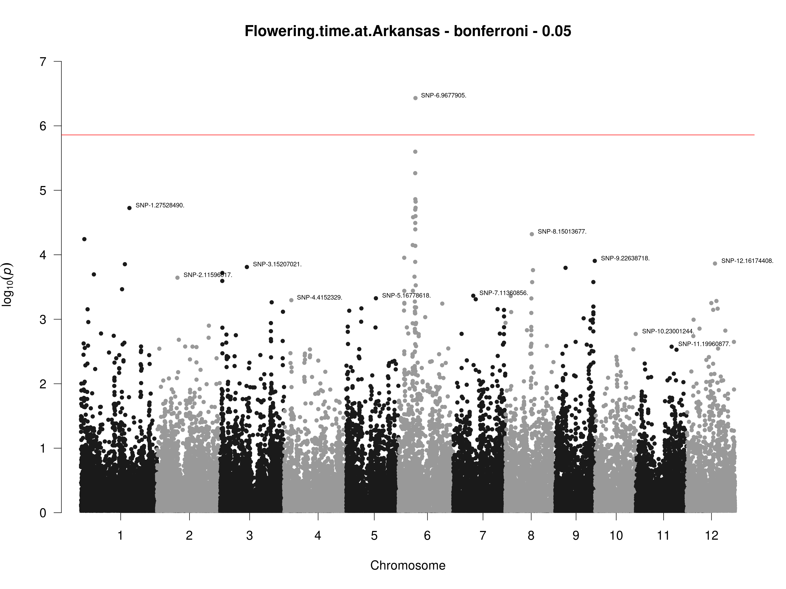

-   [GWAS-Engine](#gwas-engine)
-   [Introduction](#introduction)
-   [Build GWAS-Engine](#build-gwas-engine)
    -   [Test the image](#test-the-image)
-   [How to use GWAS-Engine](#how-to-use-gwas-engine)
    -   [Examples](#examples)
        -   [Draw Manhattan Plot](#draw-manhattan-plot)
        -   [Adjust p-values](#adjust-p-values)
        -   [Draw LD plot](#draw-ld-plot)
-   [For `R` developpers:](#for-r-developpers)
    -   [Dependencies](#dependencies)
    -   [GWAS-Engine as a R library](#gwas-engine-as-a-r-library)
        -   [Function documentation](#function-documentation)
        -   [Main functions](#main-functions)
        -   [Other functions](#other-functions)
-   [Tests](#tests)
-   [Data references](#data-references)

<!-- README.md is generated from README.Rmd. Please edit that file -->

# GWAS-Engine

<!-- badges: start -->
<!-- badges: end -->

The goal of GWAS-Engine is to provide simple “input/output” style code
for GWAS analysis in order to be used inside an API or other services.

# Introduction

GWAS stands for [Genome-Wide Association
Study](https://en.wikipedia.org/wiki/Genome-wide_association_study). It
is a statistical study that aims to detect genetic markers associated
with a particular phenotypic trait.

To test if a marker is associated with a particular phenotypic trait, we
split individuals into different groups according to their genotype for
the studied marker and we test if there is a statistical difference
between the phenotypic values of the groups. The strength of the
statistical difference is measured by what statisticians call the
“[p-value](https://en.wikipedia.org/wiki/P-value)”.

Usually to consider a test “statistically significant” we check if the
p-value of the test is lower than a threshold “α”. In this case the test
is considered positive (*“there is a statistical difference”*) but we
have a probability α to have a false positive. Very often α is equal to
5% or 1%.

GWAS analysis does this test individually and independently for all the
genetic markers in the data-set and records the “statistical
significance” (the p-values) of all the tests.

However, the number of tested genetic markers are usually very large
(several hundreds of thousands or several million) therefore, the number
of false-positive can be high even for a small value of α. For example,
with α=1%, 500000 markers, and if none of them is associated with the
phenotypic trait, we can still expect 5000 “significant test”.

To avoid that, the p-values must be
[adjusted](https://en.wikipedia.org/wiki/Multiple_comparisons_problem)
according to the number of markers.

Finally, the result of a GWAS analysis is presented as a
[Manhattan_plot](https://en.wikipedia.org/wiki/Manhattan_plot) which
shows the `-log(p-value)` on the y-axis and all the markers (order
according to their position on the chromosomes) on the x-axis. A
horizontal line represents the significance threshold and the points of
the markers above the line can be considered as being associated with
the phenotypic trait.


GWAS-Engine provides command line tools to do GWAS analysis.

> Note: You can also check this [7min
> video](https://www.youtube.com/watch?v=sOP8WacfBM8) by Nuno Carvalho
> that explain GWAS very well.

# Build GWAS-Engine

The easiest way to use GWAS-Engine is to use the
[Docker](https://www.docker.com/) image. To build the docker image
simply do:

``` sh
git clone https://github.com/ut-biomet/GWAS-Engine
cd GWAS-Engine
docker build -t gwasengine ./
```

## Test the image

You can test that the image is build correctly by running:

``` sh
docker run --entrypoint="Rscript" gwasengine ./tests/testthat.R
```

All tests should pass.

# How to use GWAS-Engine

Basically the command to use the engine from the docker image is as
follow:

``` sh
docker run gwasengine tool --param1 valueOfParam1 --param2 valueOfParam2 ...
```

-   `tool` can be either:
    -   `gwas`: to do a gwas analysis from geno and pheno files
    -   `manplot`: to create an interactive manhathan plot from the
        results generated by `gwas`
    -   `adjresults`: to calculate the adjusted p-value from the results
        generated by `gwas`
    -   `ldplot`: to get a plot showing the Linkage disequilibrium
        between consecutive markers.

The other parameters depends of the tool and you can have the exhaustive
list of them with the command:

``` sh
docker run gwasengine
```

<details>
<summary>
Click to see outputs
</summary>

``` sh
docker run gwasengine
#> Warning message:
#> Project requested R version '4.1.1' but '4.0.5' is currently being used 
#> usage: gwas-engine.R [--] [--help] [--opts OPTS] [--genoFile GENOFILE]
#>        [--phenoFile PHENOFILE] [--gwasFile GWASFILE] [--outFile
#>        OUTFILE] [--adj_method ADJ_METHOD] [--thresh_p THRESH_P] [--test
#>        TEST] [--fixed FIXED] [--response RESPONSE] [--trait TRAIT]
#>        [--thresh_maf THRESH_MAF] [--thresh_callrate THRESH_CALLRATE]
#>        [--chr CHR] [--interactive INTERACTIVE] [--filter_pAdj
#>        FILTER_PADJ] [--filter_nPoints FILTER_NPOINTS] [--filter_quant
#>        FILTER_QUANT] [--from FROM] [--to TO] fun
#> 
#> Run GWAS-Engine's tools
#> 
#> positional arguments:
#>   fun                GWAS-Engine's function you want to run: `gwas`,
#>                      `manplot`, `ldplot` or `adjresults`
#> 
#> flags:
#>   -h, --help         show this help message and exit
#> 
#> optional arguments:
#>   -x, --opts         RDS file containing argument values
#>   -g, --genoFile     [`gwas`, `ldplot`] path of the geno data file
#>                      (`.vcf` or `.vcf.gz` file)
#>   -p, --phenoFile    [`gwas`] path of the phenotypic data file (`csv`
#>                      file)
#>   --gwasFile         [`manplot`, `adjresults`] path of the gwas result
#>                      data file (json file)
#>   -o, --outFile      [`gwas`, `manplot`, `ldplot`, `adjresults`] file
#>                      where to save the results,
#>   -a, --adj_method   [`manplot`, `adjresults`] p-value correction
#>                      method: "holm", "hochberg", "bonferroni", "BH",
#>                      "BY", "fdr", "none". Default: "bonferroni". (see
#>                      https://www.rdocumentation.org/packages/stats/versions/3.6.2/topics/p.adjust
#>                      for more details) [default: bonferroni]
#>   -t, --thresh_p     [`manplot`, `adjresults`] p value significant
#>                      threshold (default 0.05) [default: 0.05]
#>   --test             [`gwas`] Which test to use. Either `"score"`,
#>                      `"wald"` or `"lrt"`. For binary phenotypes, test =
#>                      `"score"` is mandatory. For more information about
#>                      this parameters see:
#>                      https://www.rdocumentation.org/packages/gaston/versions/1.4.9/topics/association.test
#>   -f, --fixed        [`gwas`] Number of Principal Components to include
#>                      in the model with fixed effect (for test =
#>                      `"wald"` or `"lrt"`). Default value is 0. For more
#>                      information about this parameters see:
#>                      https://www.rdocumentation.org/packages/gaston/versions/1.4.9/topics/association.test
#>                      [default: 0]
#>   -r, --response     [`gwas`] Either "quantitative" or "binary". Is the
#>                      trait a quantitative or a binary phenotype?
#>                      Default value is "quantitative" [default:
#>                      quantitative]
#>   --trait            [`gwas`] name of the trait to analyze. Must be a
#>                      column name of the phenotypic file.
#>   --thresh_maf       [`gwas`] Threshold for filtering markers. Only
#>                      markers with minor allele frequency > `thresh_maf`
#>                      will be kept.
#>   --thresh_callrate  [`gwas`] Threshold for filtering markers. Only
#>                      markers with a callrate > `thresh_callrate` will
#>                      be kept.
#>   -c, --chr          [`manplot`] name of the chromosome to show (show
#>                      all by default)
#>   -i, --interactive  [`manplot`] should the plot be interactive: TRUE
#>                      or FALSE (the default is TRUE) [default: TRUE]
#>   --filter_pAdj      [`manplot`] threshold to remove points with pAdj >
#>                      filter_pAdj from the plot (default no filtering)
#>                      [default: 1]
#>   --filter_nPoints   [`manplot`] threshold to keep only the
#>                      filter_nPoints with the lowest p-values for the
#>                      plot (default no filtering) [default: Inf]
#>   --filter_quant     [`manplot`] threshold to keep only the
#>                      filter_quant*100 % of the points with the lowest
#>                      p-values for the plot (default no filtering)
#>                      [default: 0]
#>   --from             [`ldplot`] lower bound of the range of SNPs for
#>                      which the LD is computed (`from` must be lower
#>                      than `to`)
#>   --to               [`ldplot`] upper bound of the range of SNPs for
#>                      which the LD is computed (the total number of SNP
#>                      should be lower than 50)
```

</details>

However, in order to let the docker container read/write files from the
host machine, you need to mount the the folders containing the files in
the container using the option `-v --volume`. Then the file path must be
specify relative to the place in the container. (See examples below).

## Examples

``` sh
docker run -v "$PWD"/data/geno/:/geno \
    -v "$PWD"/data/pheno/:/pheno \
    -v "$PWD"/readmeTemp:/out gwasengine \
    gwas \
    --genoFile "/geno/testMarkerData01.vcf.gz" \
    --phenoFile "/pheno/testPhenoData01.csv" \
    --trait "Flowering.time.at.Arkansas" \
    --test "score" \
    --fixed 0 \
    --response "quantitative" \
    --thresh_maf 0.05 \
    --thresh_callrate 0.95 \
    --outFile "/out/gwasRes.json"
```

<details>
<summary>
Click to see outputs
</summary>

``` sh
docker run -v "$PWD"/data/geno/:/geno \
    -v "$PWD"/data/pheno/:/pheno \
    -v "$PWD"/readmeTemp:/out gwasengine \
    gwas \
    --genoFile "/geno/testMarkerData01.vcf.gz" \
    --phenoFile "/pheno/testPhenoData01.csv" \
    --trait "Flowering.time.at.Arkansas" \
    --test "score" \
    --fixed 0 \
    --response "quantitative" \
    --thresh_maf 0.05 \
    --thresh_callrate 0.95 \
    --outFile "/out/gwasRes.json"
#> Warning message:
#> Project requested R version '4.1.1' but '4.0.5' is currently being used 
#> 2021-10-26 05:28:37 call to GWAS-Engine.R:
#>      help = FALSE
#>      opts = NA
#>      genoFile = /geno/testMarkerData01.vcf.gz
#>      phenoFile = /pheno/testPhenoData01.csv
#>      gwasFile = NA
#>      outFile = /out/gwasRes.json
#>      adj_method = bonferroni
#>      thresh_p = 0.05
#>      test = score
#>      fixed = 0
#>      response = quantitative
#>      trait = Flowering.time.at.Arkansas
#>      thresh_maf = 0.05
#>      thresh_callrate = 0.95
#>      chr = NA
#>      interactive = TRUE
#>      filter_pAdj = 1
#>      filter_nPoints = Inf
#>      filter_quant = 0
#>      from = NA
#>      to = NA
#>      fun = gwas
#> 2021-10-26 05:28:37 - r-run_gwas(): Get data ...
#> 2021-10-26 05:28:37 - r-readData(): get geno data ...
#> 2021-10-26 05:28:37 - r-readGenoData(): Check file extention ... 
#> 2021-10-26 05:28:37 - r-readGenoData(): Read geno file ... 
#> ped stats and snps stats have been set. 
#> 'p' has been set. 
#> 'mu' and 'sigma' have been set.
#> 2021-10-26 05:28:38 - r-readGenoData(): Read geno file DONE 
#> 2021-10-26 05:28:38 - r-readGenoData(): DONE, return output.
#> 2021-10-26 05:28:38 - r-readData(): get geno data DONE
#> 2021-10-26 05:28:38 - r-readData(): get pheno data ...
#> 2021-10-26 05:28:38 - r-readPhenoData(): Read phenotypic file ... 
#> 2021-10-26 05:28:38 - r-readPhenoData(): Read phenotypic file DONE 
#> 2021-10-26 05:28:38 - r-readPhenoData(): DONE, return output.
#> 2021-10-26 05:28:38 - r-readData(): get pheno data DONE
#> 2021-10-26 05:28:38 - r-readData(): prepare data ...
#> 2021-10-26 05:28:38 - r-prepareData(): Remove from geno data individuals that are not in phenotypic data-set ...
#> 2021-10-26 05:28:39 - r-prepareData(): Remove from geno data individuals that are not in phenotypic data-set DONE
#> 2021-10-26 05:28:39 - r-prepareData(): reorder matrix ...
#> 2021-10-26 05:28:39 - r-prepareData(): reorder matrix DONE
#> 2021-10-26 05:28:39 - r-prepareData(): remove monomorphic markers ...
#> 2021-10-26 05:28:39 - r-prepareData(): remove monomorphic markers DONE
#> 2021-10-26 05:28:39 - r-prepareData(): DONE, return output.
#> 2021-10-26 05:28:39 - r-readData(): prepare data DONE
#> 2021-10-26 05:28:39 - r-readData(): DONE, return output.
#> 2021-10-26 05:28:39 - r-run_gwas(): Get data DONE
#> 2021-10-26 05:28:39 - r-run_gwas(): GWAS analysis ...
#> 2021-10-26 05:28:39 - r-gwas(): Check inputs ...
#> 2021-10-26 05:28:39 - r-gwas(): Check inputs DONE
#> 2021-10-26 05:28:39 - r-gwas(): aggregate data in bed matrix ...
#> 2021-10-26 05:28:39 - r-gwas(): aggregate data in bed matrix DONE
#> 2021-10-26 05:28:39 - r-gwas(): remove individuals with missing phenotypic values ...
#> 2021-10-26 05:28:39 - r-gwas(): remove samples with missing phenotypic values DONE
#> 2021-10-26 05:28:39 - r-gwas(): filter SNPs ...
#> 2021-10-26 05:28:39 - r-gwas(): filter SNPs DONE
#> 2021-10-26 05:28:39 - r-gwas(): calculate genetic relatinoal matrix ...
#> 2021-10-26 05:28:39 - r-gwas(): calculate genetic relatinoal matrix DONE
#> 2021-10-26 05:28:39 - r-gwas(): fit model ...
#> [Iteration 1] theta = 78.0648 78.2819
#> [Iteration 1] log L = -1002.17
#> [Iteration 1] AI-REML update
#> [Iteration 1] ||gradient|| = 0.344544
#> [Iteration 2] theta = 22.5608 163.026
#> [Iteration 2] log L = -990.943
#> [Iteration 2] AI-REML update
#> [Iteration 2] ||gradient|| = 0.79883
#> [Iteration 3] theta = 27.7198 190.625
#> [Iteration 3] log L = -986.649
#> [Iteration 3] AI-REML update
#> [Iteration 3] ||gradient|| = 0.113948
#> [Iteration 4] theta = 29.2501 195.436
#> [Iteration 4] log L = -986.513
#> [Iteration 4] AI-REML update
#> [Iteration 4] ||gradient|| = 0.00580972
#> [Iteration 5] theta =  29.402 195.213
#> [Iteration 5] log L = -986.513
#> [Iteration 5] AI-REML update
#> [Iteration 5] ||gradient|| = 0.000323319
#> [Iteration 6] theta = 29.4176 195.143
#> [Iteration 6] log L = -986.513
#> [Iteration 6] AI-REML update
#> [Iteration 6] ||gradient|| = 4.32664e-05
#> [Iteration 7] theta = 29.4198 195.133
#> [Iteration 7] log L = -986.513
#> [Iteration 7] AI-REML update
#> [Iteration 7] ||gradient|| = 5.95174e-06
#> 2021-10-26 05:28:40 - r-gwas(): fit model DONE
#> 2021-10-26 05:28:40 - r-gwas(): DONE, return output.
#> 2021-10-26 05:28:40 - r-run_gwas(): GWAS analysis DONE
#> 2021-10-26 05:28:40 - r-run_gwas(): Save metadata ...
#> 2021-10-26 05:28:40 - r-run_gwas(): Save metadata DONE
#> 2021-10-26 05:28:40 - r-run_gwas(): Save results ...
#> 2021-10-26 05:28:40 - r-saveGWAS(): Check file ...
#> 2021-10-26 05:28:40 - r-saveGWAS(): Check file DONE
#> 2021-10-26 05:28:40 - r-run_gwas(): Save results DONE
```

</details>

### Draw Manhattan Plot

``` sh
docker run -v "$PWD"/readmeTemp:/files gwasengine \
    manplot \
    --gwasFile "/files/gwasRes.json" \
    --adj_method "bonferroni" \
    --thresh_p 0.05 \
    --interactive TRUE \
    --filter_nPoints 3000 \
    --outFile "/files/manPlot.html"
```

<details>
<summary>
Click to see outputs
</summary>

**Interactive plot**

``` sh
docker run -v "$PWD"/readmeTemp:/files gwasengine \
    manplot \
    --gwasFile "/files/gwasRes.json" \
    --adj_method "bonferroni" \
    --thresh_p 0.05 \
    --interactive TRUE \
    --filter_nPoints 3000 \
    --outFile "/files/manPlot.html"
#> Warning message:
#> Project requested R version '4.1.1' but '4.0.5' is currently being used 
#> 2021-10-26 05:28:43 call to GWAS-Engine.R:
#>      help = FALSE
#>      opts = NA
#>      genoFile = NA
#>      phenoFile = NA
#>      gwasFile = /files/gwasRes.json
#>      outFile = /files/manPlot.html
#>      adj_method = bonferroni
#>      thresh_p = 0.05
#>      test = NA
#>      fixed = 0
#>      response = quantitative
#>      trait = NA
#>      thresh_maf = NA
#>      thresh_callrate = NA
#>      chr = NA
#>      interactive = TRUE
#>      filter_pAdj = 1
#>      filter_nPoints = 3000
#>      filter_quant = 0
#>      from = NA
#>      to = NA
#>      fun = manplot
#> 2021-10-26 05:28:43 - r-draw_manhattanPlot(): Check outFile ...
#> 2021-10-26 05:28:43 - r-draw_manhattanPlot(): Check outFile DONE
#> 2021-10-26 05:28:43 - r-draw_manhattanPlot(): Get data ...
#> 2021-10-26 05:28:43 - r-readGWAS(): Read result file ... 
#> 2021-10-26 05:28:43 - r-readGWAS(): Read result file DONE 
#> 2021-10-26 05:28:43 - r-readGWAS(): Convert Json to data.frame ... 
#> 2021-10-26 05:28:44 - r-readGWAS(): Convert Json to data.frame DONE 
#> 2021-10-26 05:28:44 - r-readGWAS(): DONE, return output.
#> 2021-10-26 05:28:44 - r-draw_manhattanPlot(): Get data DONE
#> 2021-10-26 05:28:44 - r-draw_manhattanPlot(): Draw Manhattan Plot ...
#> 2021-10-26 05:28:44 - r-manPlot(): Check chromosome name ...
#> 2021-10-26 05:28:44 - r-manPlot(): Check chromosome name DONE
#> 2021-10-26 05:28:44 - r-manPlot(): Adjust p-values ...
#> 2021-10-26 05:28:44 - r-adjustPval(): Check adj_method ...
#> 2021-10-26 05:28:44 - r-adjustPval(): Check adj_method DONE
#> 2021-10-26 05:28:44 - r-adjustPval(): Check p values ...
#> 2021-10-26 05:28:44 - r-adjustPval(): Check p values DONE
#> 2021-10-26 05:28:44 - r-adjustPval(): Adjust p-values ...
#> 2021-10-26 05:28:44 - r-adjustPval(): Adjust p-values DONE
#> 2021-10-26 05:28:44 - r-adjustPval(): Adjust threshold ...
#> 2021-10-26 05:28:44 - r-adjustPval(): Adjust threshold DONE
#> 2021-10-26 05:28:44 - r-adjustPval(): DONE, return output
#> 2021-10-26 05:28:44 - r-manPlot(): Adjust p-values DONE
#> 2021-10-26 05:28:44 - r-manPlot(): Check duplicated SNP ID ...
#> 2021-10-26 05:28:44 - r-manPlot(): Check duplicated SNP ID DONE
#> 2021-10-26 05:28:44 - r-manPlot(): Extract significant SNP ...
#> 2021-10-26 05:28:44 - r-manPlot(): Extract significant SNP DONE
#> 2021-10-26 05:28:44 - r-manPlot(): Filter points ...
#> 2021-10-26 05:28:44 - r-manPlot(): skip filter_pAdj
#> 2021-10-26 05:28:44 - r-manPlot(): skip filter_quant
#> 2021-10-26 05:28:44 - r-manPlot(): Filter points DONE
#> 2021-10-26 05:28:44 - r-manPlot(): Draw plot ...
#> 2021-10-26 05:28:44 - r-manPlot(): Draw plot DONE
#> 2021-10-26 05:28:44 - r-manPlot(): DONE, return output
#> 2021-10-26 05:28:44 - r-draw_manhattanPlot(): Draw Manhattan Plot DONE
#> 2021-10-26 05:28:44 - r-draw_manhattanPlot(): Save results ...
#> 2021-10-26 05:28:46 - r-draw_manhattanPlot(): Save results DONE
```


**Static plot**

``` sh
docker run -v "$PWD"/readmeTemp:/files gwasengine \
    manplot \
    --gwasFile "/files/gwasRes.json" \
    --adj_method "bonferroni" \
    --thresh_p 0.05 \
    --interactive FALSE \
    --outFile "/files/manPlot.png"
#> Warning message:
#> Project requested R version '4.1.1' but '4.0.5' is currently being used 
#> 2021-10-26 05:28:49 call to GWAS-Engine.R:
#>      help = FALSE
#>      opts = NA
#>      genoFile = NA
#>      phenoFile = NA
#>      gwasFile = /files/gwasRes.json
#>      outFile = /files/manPlot.png
#>      adj_method = bonferroni
#>      thresh_p = 0.05
#>      test = NA
#>      fixed = 0
#>      response = quantitative
#>      trait = NA
#>      thresh_maf = NA
#>      thresh_callrate = NA
#>      chr = NA
#>      interactive = FALSE
#>      filter_pAdj = 1
#>      filter_nPoints = Inf
#>      filter_quant = 0
#>      from = NA
#>      to = NA
#>      fun = manplot
#> 2021-10-26 05:28:49 - r-draw_manhattanPlot(): Check outFile ...
#> 2021-10-26 05:28:49 - r-draw_manhattanPlot(): Check outFile DONE
#> 2021-10-26 05:28:49 - r-draw_manhattanPlot(): Get data ...
#> 2021-10-26 05:28:49 - r-readGWAS(): Read result file ... 
#> 2021-10-26 05:28:49 - r-readGWAS(): Read result file DONE 
#> 2021-10-26 05:28:49 - r-readGWAS(): Convert Json to data.frame ... 
#> 2021-10-26 05:28:49 - r-readGWAS(): Convert Json to data.frame DONE 
#> 2021-10-26 05:28:49 - r-readGWAS(): DONE, return output.
#> 2021-10-26 05:28:49 - r-draw_manhattanPlot(): Get data DONE
#> 2021-10-26 05:28:49 - r-draw_manhattanPlot(): Open connexion to draw the png plot ...
#> 2021-10-26 05:28:49 - r-draw_manhattanPlot(): Open connexion to draw the png plot DONE
#> 2021-10-26 05:28:49 - r-draw_manhattanPlot(): Draw Manhattan Plot ...
#> 2021-10-26 05:28:49 - r-manPlot(): Check chromosome name ...
#> 2021-10-26 05:28:49 - r-manPlot(): Check chromosome name DONE
#> 2021-10-26 05:28:49 - r-manPlot(): Adjust p-values ...
#> 2021-10-26 05:28:49 - r-adjustPval(): Check adj_method ...
#> 2021-10-26 05:28:49 - r-adjustPval(): Check adj_method DONE
#> 2021-10-26 05:28:49 - r-adjustPval(): Check p values ...
#> 2021-10-26 05:28:49 - r-adjustPval(): Check p values DONE
#> 2021-10-26 05:28:49 - r-adjustPval(): Adjust p-values ...
#> 2021-10-26 05:28:49 - r-adjustPval(): Adjust p-values DONE
#> 2021-10-26 05:28:49 - r-adjustPval(): Adjust threshold ...
#> 2021-10-26 05:28:49 - r-adjustPval(): Adjust threshold DONE
#> 2021-10-26 05:28:49 - r-adjustPval(): DONE, return output
#> 2021-10-26 05:28:49 - r-manPlot(): Adjust p-values DONE
#> 2021-10-26 05:28:49 - r-manPlot(): Check duplicated SNP ID ...
#> 2021-10-26 05:28:49 - r-manPlot(): Check duplicated SNP ID DONE
#> 2021-10-26 05:28:49 - r-manPlot(): Extract significant SNP ...
#> 2021-10-26 05:28:49 - r-manPlot(): Extract significant SNP DONE
#> 2021-10-26 05:28:49 - r-manPlot(): Filter points ...
#> 2021-10-26 05:28:49 - r-manPlot(): skip filter_pAdj
#> 2021-10-26 05:28:49 - r-manPlot(): skip filter_quant
#> 2021-10-26 05:28:49 - r-manPlot(): skip filter_nPoints
#> 2021-10-26 05:28:49 - r-manPlot(): Filter points DONE
#> 2021-10-26 05:28:49 - r-manPlot(): Draw plot ...
#> 2021-10-26 05:28:50 - r-manPlot(): Draw plot DONE
#> 2021-10-26 05:28:50 - r-manPlot(): DONE, return output
#> 2021-10-26 05:28:50 - r-draw_manhattanPlot(): Draw Manhattan Plot DONE
#> 2021-10-26 05:28:50 - r-draw_manhattanPlot(): Save results ...
#> 2021-10-26 05:28:50 - r-draw_manhattanPlot(): Save results DONE
```

<!-- -->

</details>

### Adjust p-values

``` sh
docker run -v "$PWD"/readmeTemp:/files gwasengine \
    adjresults \
    --gwasFile "/files/gwasRes.json" \
    --adj_method "bonferroni" \
    --outFile "/files/adjRes.json"
```

<details>
<summary>
Click to see outputs
</summary>

``` sh
docker run -v "$PWD"/readmeTemp:/files gwasengine \
    adjresults \
    --gwasFile "/files/gwasRes.json" \
    --adj_method "bonferroni" \
    --outFile "/files/adjRes.json"
#> Warning message:
#> Project requested R version '4.1.1' but '4.0.5' is currently being used 
#> 2021-10-26 05:28:54 call to GWAS-Engine.R:
#>      help = FALSE
#>      opts = NA
#>      genoFile = NA
#>      phenoFile = NA
#>      gwasFile = /files/gwasRes.json
#>      outFile = /files/adjRes.json
#>      adj_method = bonferroni
#>      thresh_p = 0.05
#>      test = NA
#>      fixed = 0
#>      response = quantitative
#>      trait = NA
#>      thresh_maf = NA
#>      thresh_callrate = NA
#>      chr = NA
#>      interactive = TRUE
#>      filter_pAdj = 1
#>      filter_nPoints = Inf
#>      filter_quant = 0
#>      from = NA
#>      to = NA
#>      fun = adjresults
#> 2021-10-26 05:28:54 - r-run_resAdjustment(): Get data ...
#> 2021-10-26 05:28:54 - r-readGWAS(): Read result file ... 
#> 2021-10-26 05:28:54 - r-readGWAS(): Read result file DONE 
#> 2021-10-26 05:28:54 - r-readGWAS(): Convert Json to data.frame ... 
#> 2021-10-26 05:28:55 - r-readGWAS(): Convert Json to data.frame DONE 
#> 2021-10-26 05:28:55 - r-readGWAS(): DONE, return output.
#> 2021-10-26 05:28:55 - r-run_resAdjustment(): Get data DONE
#> 2021-10-26 05:28:55 - r-run_resAdjustment(): Adjust p-values ...
#> 2021-10-26 05:28:55 - r-adjustPval(): Check adj_method ...
#> 2021-10-26 05:28:55 - r-adjustPval(): Check adj_method DONE
#> 2021-10-26 05:28:55 - r-adjustPval(): Check p values ...
#> 2021-10-26 05:28:55 - r-adjustPval(): Check p values DONE
#> 2021-10-26 05:28:55 - r-adjustPval(): Adjust p-values ...
#> 2021-10-26 05:28:55 - r-adjustPval(): Adjust p-values DONE
#> 2021-10-26 05:28:55 - r-adjustPval(): DONE, return output
#> 2021-10-26 05:28:55 - r-run_resAdjustment(): Adjust p-values DONE
#> 2021-10-26 05:28:55 - r-run_resAdjustment(): Save results ...
#> 2021-10-26 05:28:55 - r-saveGWAS(): Check file ...
#> 2021-10-26 05:28:55 - r-saveGWAS(): Check file DONE
#> 2021-10-26 05:28:55 - r-run_resAdjustment(): Save results DONE
```

</details>

### Draw LD plot

``` sh
docker run -v "$PWD"/data/geno/:/geno \
    -v "$PWD"/readmeTemp:/out gwasengine \
    ldplot \
    --genoFile "/geno/testMarkerData01.vcf.gz" \
    --from 42 \
    --to 62 \
    --outFile "/out/ldplot.png"
```

<details>
<summary>
Click to see outputs
</summary>

``` sh
docker run -v "$PWD"/data/geno/:/geno \
    -v "$PWD"/readmeTemp:/out gwasengine \
    ldplot \
    --genoFile "/geno/testMarkerData01.vcf.gz" \
    --from 42 \
    --to 62 \
    --outFile "/out/ldplot.png"
#> Warning message:
#> Project requested R version '4.1.1' but '4.0.5' is currently being used 
#> 2021-10-26 05:28:58 call to GWAS-Engine.R:
#>      help = FALSE
#>      opts = NA
#>      genoFile = /geno/testMarkerData01.vcf.gz
#>      phenoFile = NA
#>      gwasFile = NA
#>      outFile = /out/ldplot.png
#>      adj_method = bonferroni
#>      thresh_p = 0.05
#>      test = NA
#>      fixed = 0
#>      response = quantitative
#>      trait = NA
#>      thresh_maf = NA
#>      thresh_callrate = NA
#>      chr = NA
#>      interactive = TRUE
#>      filter_pAdj = 1
#>      filter_nPoints = Inf
#>      filter_quant = 0
#>      from = 42
#>      to = 62
#>      fun = ldplot
#> 2021-10-26 05:28:58 - r-draw_ldPlot(): Get data ...
#> 2021-10-26 05:28:59 - r-readGenoData(): Check file extention ... 
#> 2021-10-26 05:28:59 - r-readGenoData(): Read geno file ... 
#> ped stats and snps stats have been set. 
#> 'p' has been set. 
#> 'mu' and 'sigma' have been set.
#> 2021-10-26 05:28:59 - r-readGenoData(): Read geno file DONE 
#> 2021-10-26 05:28:59 - r-readGenoData(): DONE, return output.
#> 2021-10-26 05:28:59 - r-draw_ldPlot(): Get data DONE
#> 2021-10-26 05:28:59 - r-draw_ldPlot(): Draw LD Plot ...
#> 2021-10-26 05:28:59 - r-LDplot(): Check "from" and "to" format ...
#> 2021-10-26 05:28:59 - r-LDplot(): Check "from" and "to" format DONE
#> 2021-10-26 05:28:59 - r-LDplot(): Check "from" < "to"...
#> 2021-10-26 05:28:59 - r-LDplot(): Check "from" < "to" DONE
#> 2021-10-26 05:28:59 - r-LDplot(): Check number of SNP < 50...
#> 2021-10-26 05:28:59 - r-LDplot(): Check number of SNP < 50 DONE
#> 2021-10-26 05:28:59 - r-LDplot(): Check file ...
#> 2021-10-26 05:28:59 - r-LDplot(): Check file DONE
#> 2021-10-26 05:28:59 - r-LDplot(): Compute LD ...
#> 2021-10-26 05:28:59 - r-LDplot(): Compute LD DONE
#> 2021-10-26 05:28:59 - r-LDplot(): Create LD plot ...
#> 2021-10-26 05:28:59 - r-LDplot(): Create create file: /out/ldplot.png
#> 2021-10-26 05:29:00 - r-LDplot(): Create LD plot DONE
#> 2021-10-26 05:29:00 - r-LDplot(): DONE, return output
#> 2021-10-26 05:29:00 - r-draw_ldPlot(): Draw LD Plot DONE
```

``` r
library(png)
img <- readPNG("readmeTemp/ldplot.png")
grid::grid.raster(img)
```

<!-- -->

</details>

# For `R` developpers:

This GWAS-Engine is written in `R`, therefore it can also be run
directly from your computer (without docker) if you have all the
dependencies installed. To do so you can execute the `gwas-engine.R`
file with the `Rscript` command.

For example from a bash terminal:

``` sh
Rscript ./gwas-engine.R \
    gwas \
    --genoFile "data/geno/testMarkerData01.vcf.gz" \
    --phenoFile "data/pheno/testPhenoData01.csv" \
    --trait "Flowering.time.at.Arkansas" \
    --test "score" \
    --fixed 0 \
    --response "quantitative" \
    --thresh_maf 0.05 \
    --thresh_callrate 0.95 \
    --outFile "readmeTemp/gwasRes.json"
```

``` sh
Rscript ./gwas-engine.R \
    manplot \
    --gwasFile "data/results/gwasResult.json" \
    --adj_method "bonferroni" \
    --thresh_p 0.05 \
    --interactive FALSE \
    --outFile "readmeTemp/manplot.png"
```

## Dependencies

Package dependencies are managed using
[Renv](https://rstudio.github.io/renv/articles/renv.html). To install
dependencies do in a R console: `renv::restore()`. (you need
`/path/to/GWAS-Engine` as working directory).

## GWAS-Engine as a R library

It is possible to use GWAS-Engine as a library to be used in other R
projects.

To do so, you can load all the code of this engine using

``` r
sapply(FUN = source,
       X = list.files("/path/to/GWAS-Engine/src", pattern = ".R$", full.names = T))
```

### Function documentation

All the functions of this engine use `roxygen2` for documentation. You
can generate a **markdown documentation located in
[`./doc/README.md`](doc/README.md)** using the function `writeDoc`
(defined in [`./src/utils.R`](src/utils.R)):

``` r
writeDoc(srcDir = "src",
         docDir = "doc")
```

### Main functions

GWAS-Engine provide 4 main R functions similar to what can be done with
command line arguments.

They take as inputs file paths and other specific argument and write the
results in output files:

``` r
gwas_results <- run_gwas(genoFile = "data/geno/testMarkerData01.vcf.gz",
                         phenoFile = "data/pheno/testPhenoData01.csv",
                         genoUrl = NULL,
                         phenoUrl = NULL,
                         trait = "Flowering.time.at.Arkansas",
                         test = "score",
                         fixed = 0,
                         response = "quantitative",
                         thresh_maf = 0.05,
                         thresh_callrate = 0.95,
                         outFile = tempfile(fileext = ".json"))
#> 2021-10-26 14:29:02 - r-run_gwas(): Get data ...
#> 2021-10-26 14:29:02 - r-readData(): get geno data ...
#> 2021-10-26 14:29:02 - r-readGenoData(): Check file extention ... 
#> 2021-10-26 14:29:02 - r-readGenoData(): Read geno file ... 
#> ped stats and snps stats have been set. 
#> 'p' has been set. 
#> 'mu' and 'sigma' have been set.
#> 2021-10-26 14:29:03 - r-readGenoData(): Read geno file DONE 
#> 2021-10-26 14:29:03 - r-readGenoData(): DONE, return output.
#> 2021-10-26 14:29:03 - r-readData(): get geno data DONE
#> 2021-10-26 14:29:03 - r-readData(): get pheno data ...
#> 2021-10-26 14:29:03 - r-readPhenoData(): Read phenotypic file ... 
#> 2021-10-26 14:29:03 - r-readPhenoData(): Read phenotypic file DONE 
#> 2021-10-26 14:29:03 - r-readPhenoData(): DONE, return output.
#> 2021-10-26 14:29:03 - r-readData(): get pheno data DONE
#> 2021-10-26 14:29:03 - r-readData(): prepare data ...
#> 2021-10-26 14:29:03 - r-prepareData(): Remove from geno data individuals that are not in phenotypic data-set ...
#> 2021-10-26 14:29:03 - r-prepareData(): Remove from geno data individuals that are not in phenotypic data-set DONE
#> 2021-10-26 14:29:03 - r-prepareData(): reorder matrix ...
#> 2021-10-26 14:29:03 - r-prepareData(): reorder matrix DONE
#> 2021-10-26 14:29:03 - r-prepareData(): remove monomorphic markers ...
#> 2021-10-26 14:29:03 - r-prepareData(): remove monomorphic markers DONE
#> 2021-10-26 14:29:03 - r-prepareData(): DONE, return output.
#> 2021-10-26 14:29:03 - r-readData(): prepare data DONE
#> 2021-10-26 14:29:03 - r-readData(): DONE, return output.
#> 2021-10-26 14:29:03 - r-run_gwas(): Get data DONE
#> 2021-10-26 14:29:03 - r-run_gwas(): GWAS analysis ...
#> 2021-10-26 14:29:03 - r-gwas(): Check inputs ...
#> 2021-10-26 14:29:03 - r-gwas(): Check inputs DONE
#> 2021-10-26 14:29:03 - r-gwas(): aggregate data in bed matrix ...
#> 2021-10-26 14:29:03 - r-gwas(): aggregate data in bed matrix DONE
#> 2021-10-26 14:29:03 - r-gwas(): remove individuals with missing phenotypic values ...
#> 2021-10-26 14:29:03 - r-gwas(): remove samples with missing phenotypic values DONE
#> 2021-10-26 14:29:03 - r-gwas(): filter SNPs ...
#> 2021-10-26 14:29:03 - r-gwas(): filter SNPs DONE
#> 2021-10-26 14:29:03 - r-gwas(): calculate genetic relatinoal matrix ...
#> 2021-10-26 14:29:03 - r-gwas(): calculate genetic relatinoal matrix DONE
#> 2021-10-26 14:29:03 - r-gwas(): fit model ...
#> [Iteration 1] theta = 78.0648 78.2819
#> [Iteration 1] log L = -1002.17
#> [Iteration 1] AI-REML update
#> [Iteration 1] ||gradient|| = 0.344543
#> [Iteration 2] theta = 22.5611 163.026
#> [Iteration 2] log L = -990.943
#> [Iteration 2] AI-REML update
#> [Iteration 2] ||gradient|| = 0.798817
#> [Iteration 3] theta =   27.72 190.624
#> [Iteration 3] log L = -986.649
#> [Iteration 3] AI-REML update
#> [Iteration 3] ||gradient|| = 0.113945
#> [Iteration 4] theta = 29.2502 195.436
#> [Iteration 4] log L = -986.513
#> [Iteration 4] AI-REML update
#> [Iteration 4] ||gradient|| = 0.00580942
#> [Iteration 5] theta = 29.4021 195.213
#> [Iteration 5] log L = -986.513
#> [Iteration 5] AI-REML update
#> [Iteration 5] ||gradient|| = 0.000323294
#> [Iteration 6] theta = 29.4178 195.143
#> [Iteration 6] log L = -986.513
#> [Iteration 6] AI-REML update
#> [Iteration 6] ||gradient|| = 4.32635e-05
#> [Iteration 7] theta = 29.4199 195.133
#> [Iteration 7] log L = -986.513
#> [Iteration 7] AI-REML update
#> [Iteration 7] ||gradient|| = 5.95139e-06
#> 2021-10-26 14:29:04 - r-gwas(): fit model DONE
#> 2021-10-26 14:29:04 - r-gwas(): DONE, return output.
#> 2021-10-26 14:29:04 - r-run_gwas(): GWAS analysis DONE
#> 2021-10-26 14:29:04 - r-run_gwas(): Save metadata ...
#> 2021-10-26 14:29:04 - r-run_gwas(): Save metadata DONE
#> 2021-10-26 14:29:04 - r-run_gwas(): Save results ...
#> 2021-10-26 14:29:04 - r-saveGWAS(): Check file ...
#> 2021-10-26 14:29:04 - r-saveGWAS(): Check file DONE
#> 2021-10-26 14:29:04 - r-run_gwas(): Save results DONE
gwas_results$file
#> [1] "/tmp/RtmpkVrNfy/file31578681848ad.json"
substr(gwas_results$gwasRes, start=1, stop=500)
#> [
#>   {
#>     "chr": "1",
#>     "pos": 9563,
#>     "id": "SNP-1.8562.",
#>     "A1": "A",
#>     "A2": "T",
#>     "freqA2": 0.1359,
#>     "score": 4.395,
#>     "p": 0.036
#>   },
#>   {
#>     "chr": "1",
#>     "pos": 25922,
#>     "id": "SNP-1.24921.",
#>     "A1": "C",
#>     "A2": "T",
#>     "freqA2": 0.1254,
#>     "score": 1.6745,
#>     "p": 0.1957
#>   },
#>   {
#>     "chr": "1",
#>     "pos": 26254,
#>     "id": "SNP-1.25253.",
#>     "A1": "A",
#>     "A2": "T",
#>     "freqA2": 0.2935,
#>     "score": 3.6592,
#>     "p": 0.0558
#>   },
#>   {
#>     "chr": "1",
#>     "pos
```

``` r
p <- draw_manhattanPlot(gwasFile = gwas_results$file,
                        gwasUrl = NULL,
                        adj_method = "bonferroni",
                        thresh_p = 0.05,
                        chr = NA,
                        interactive = TRUE,
                        # filter_pAdj = 1,
                        # filter_nPoints = Inf,
                        filter_quant = 0.1,
                        outFile = tempfile(fileext = ".html"))
#> 2021-10-26 14:29:04 - r-draw_manhattanPlot(): Check outFile ...
#> 2021-10-26 14:29:04 - r-draw_manhattanPlot(): Check outFile DONE
#> 2021-10-26 14:29:04 - r-draw_manhattanPlot(): Get data ...
#> 2021-10-26 14:29:04 - r-readGWAS(): Read result file ... 
#> 2021-10-26 14:29:04 - r-readGWAS(): Read result file DONE 
#> 2021-10-26 14:29:04 - r-readGWAS(): Convert Json to data.frame ... 
#> 2021-10-26 14:29:05 - r-readGWAS(): Convert Json to data.frame DONE 
#> 2021-10-26 14:29:05 - r-readGWAS(): DONE, return output.
#> 2021-10-26 14:29:05 - r-draw_manhattanPlot(): Get data DONE
#> 2021-10-26 14:29:05 - r-draw_manhattanPlot(): Draw Manhattan Plot ...
#> 2021-10-26 14:29:05 - r-manPlot(): Check chromosome name ...
#> 2021-10-26 14:29:05 - r-manPlot(): Check chromosome name DONE
#> 2021-10-26 14:29:05 - r-manPlot(): Adjust p-values ...
#> 2021-10-26 14:29:05 - r-adjustPval(): Check adj_method ...
#> 2021-10-26 14:29:05 - r-adjustPval(): Check adj_method DONE
#> 2021-10-26 14:29:05 - r-adjustPval(): Check p values ...
#> 2021-10-26 14:29:05 - r-adjustPval(): Check p values DONE
#> 2021-10-26 14:29:05 - r-adjustPval(): Adjust p-values ...
#> 2021-10-26 14:29:05 - r-adjustPval(): Adjust p-values DONE
#> 2021-10-26 14:29:05 - r-adjustPval(): Adjust threshold ...
#> 2021-10-26 14:29:05 - r-adjustPval(): Adjust threshold DONE
#> 2021-10-26 14:29:05 - r-adjustPval(): DONE, return output
#> 2021-10-26 14:29:05 - r-manPlot(): Adjust p-values DONE
#> 2021-10-26 14:29:05 - r-manPlot(): Check duplicated SNP ID ...
#> 2021-10-26 14:29:05 - r-manPlot(): Check duplicated SNP ID DONE
#> 2021-10-26 14:29:05 - r-manPlot(): Extract significant SNP ...
#> 2021-10-26 14:29:05 - r-manPlot(): Extract significant SNP DONE
#> 2021-10-26 14:29:05 - r-manPlot(): Filter points ...
#> 2021-10-26 14:29:05 - r-manPlot(): skip filter_pAdj
#> 2021-10-26 14:29:05 - r-manPlot(): skip filter_nPoints
#> 2021-10-26 14:29:05 - r-manPlot(): Filter points DONE
#> 2021-10-26 14:29:05 - r-manPlot(): Draw plot ...
#> 2021-10-26 14:29:05 - r-manPlot(): Draw plot DONE
#> 2021-10-26 14:29:05 - r-manPlot(): DONE, return output
#> 2021-10-26 14:29:05 - r-draw_manhattanPlot(): Draw Manhattan Plot DONE
#> 2021-10-26 14:29:05 - r-draw_manhattanPlot(): Save results ...
#> 2021-10-26 14:29:06 - r-draw_manhattanPlot(): Save results DONE
```

``` r
manPlotFile <- tempfile(fileext = ".png")
p <- draw_manhattanPlot(gwasFile = gwas_results$file,
                        gwasUrl = NULL,
                        adj_method = "bonferroni",
                        thresh_p = 0.05,
                        chr = NA,
                        interactive = FALSE,
                        outFile = manPlotFile)
#> 2021-10-26 14:29:06 - r-draw_manhattanPlot(): Check outFile ...
#> 2021-10-26 14:29:06 - r-draw_manhattanPlot(): Check outFile DONE
#> 2021-10-26 14:29:06 - r-draw_manhattanPlot(): Get data ...
#> 2021-10-26 14:29:06 - r-readGWAS(): Read result file ... 
#> 2021-10-26 14:29:06 - r-readGWAS(): Read result file DONE 
#> 2021-10-26 14:29:06 - r-readGWAS(): Convert Json to data.frame ... 
#> 2021-10-26 14:29:07 - r-readGWAS(): Convert Json to data.frame DONE 
#> 2021-10-26 14:29:07 - r-readGWAS(): DONE, return output.
#> 2021-10-26 14:29:07 - r-draw_manhattanPlot(): Get data DONE
#> 2021-10-26 14:29:07 - r-draw_manhattanPlot(): Open connexion to draw the png plot ...
#> 2021-10-26 14:29:07 - r-draw_manhattanPlot(): Open connexion to draw the png plot DONE
#> 2021-10-26 14:29:07 - r-draw_manhattanPlot(): Draw Manhattan Plot ...
#> 2021-10-26 14:29:07 - r-manPlot(): Check chromosome name ...
#> 2021-10-26 14:29:07 - r-manPlot(): Check chromosome name DONE
#> 2021-10-26 14:29:07 - r-manPlot(): Adjust p-values ...
#> 2021-10-26 14:29:07 - r-adjustPval(): Check adj_method ...
#> 2021-10-26 14:29:07 - r-adjustPval(): Check adj_method DONE
#> 2021-10-26 14:29:07 - r-adjustPval(): Check p values ...
#> 2021-10-26 14:29:07 - r-adjustPval(): Check p values DONE
#> 2021-10-26 14:29:07 - r-adjustPval(): Adjust p-values ...
#> 2021-10-26 14:29:07 - r-adjustPval(): Adjust p-values DONE
#> 2021-10-26 14:29:07 - r-adjustPval(): Adjust threshold ...
#> 2021-10-26 14:29:07 - r-adjustPval(): Adjust threshold DONE
#> 2021-10-26 14:29:07 - r-adjustPval(): DONE, return output
#> 2021-10-26 14:29:07 - r-manPlot(): Adjust p-values DONE
#> 2021-10-26 14:29:07 - r-manPlot(): Check duplicated SNP ID ...
#> 2021-10-26 14:29:07 - r-manPlot(): Check duplicated SNP ID DONE
#> 2021-10-26 14:29:07 - r-manPlot(): Extract significant SNP ...
#> 2021-10-26 14:29:07 - r-manPlot(): Extract significant SNP DONE
#> 2021-10-26 14:29:07 - r-manPlot(): Filter points ...
#> 2021-10-26 14:29:07 - r-manPlot(): skip filter_pAdj
#> 2021-10-26 14:29:07 - r-manPlot(): skip filter_quant
#> 2021-10-26 14:29:07 - r-manPlot(): skip filter_nPoints
#> 2021-10-26 14:29:07 - r-manPlot(): Filter points DONE
#> 2021-10-26 14:29:07 - r-manPlot(): Draw plot ...
#> 2021-10-26 14:29:08 - r-manPlot(): Draw plot DONE
#> 2021-10-26 14:29:08 - r-manPlot(): DONE, return output
#> 2021-10-26 14:29:08 - r-draw_manhattanPlot(): Draw Manhattan Plot DONE
#> 2021-10-26 14:29:08 - r-draw_manhattanPlot(): Save results ...
#> 2021-10-26 14:29:08 - r-draw_manhattanPlot(): Save results DONE
```

<!-- -->

``` r
gwas_adj <- run_resAdjustment(gwasFile = gwas_results$file,
                              gwasUrl = NULL,
                              adj_method = "bonferroni",
                              outFile = tempfile(fileext = ".json"))
#> 2021-10-26 14:29:08 - r-run_resAdjustment(): Get data ...
#> 2021-10-26 14:29:08 - r-readGWAS(): Read result file ... 
#> 2021-10-26 14:29:08 - r-readGWAS(): Read result file DONE 
#> 2021-10-26 14:29:08 - r-readGWAS(): Convert Json to data.frame ... 
#> 2021-10-26 14:29:08 - r-readGWAS(): Convert Json to data.frame DONE 
#> 2021-10-26 14:29:08 - r-readGWAS(): DONE, return output.
#> 2021-10-26 14:29:08 - r-run_resAdjustment(): Get data DONE
#> 2021-10-26 14:29:08 - r-run_resAdjustment(): Adjust p-values ...
#> 2021-10-26 14:29:08 - r-adjustPval(): Check adj_method ...
#> 2021-10-26 14:29:08 - r-adjustPval(): Check adj_method DONE
#> 2021-10-26 14:29:08 - r-adjustPval(): Check p values ...
#> 2021-10-26 14:29:08 - r-adjustPval(): Check p values DONE
#> 2021-10-26 14:29:08 - r-adjustPval(): Adjust p-values ...
#> 2021-10-26 14:29:08 - r-adjustPval(): Adjust p-values DONE
#> 2021-10-26 14:29:08 - r-adjustPval(): DONE, return output
#> 2021-10-26 14:29:08 - r-run_resAdjustment(): Adjust p-values DONE
#> 2021-10-26 14:29:08 - r-run_resAdjustment(): Save results ...
#> 2021-10-26 14:29:08 - r-saveGWAS(): Check file ...
#> 2021-10-26 14:29:08 - r-saveGWAS(): Check file DONE
#> 2021-10-26 14:29:08 - r-run_resAdjustment(): Save results DONE
substr(gwas_adj$gwasAdjusted, start=1, stop=500)
#> [
#>   {
#>     "chr": "1",
#>     "pos": 9563,
#>     "id": "SNP-1.8562.",
#>     "A1": "A",
#>     "A2": "T",
#>     "freqA2": 0.1359,
#>     "score": 4.395,
#>     "p": 0.036,
#>     "p_adj": 1
#>   },
#>   {
#>     "chr": "1",
#>     "pos": 25922,
#>     "id": "SNP-1.24921.",
#>     "A1": "C",
#>     "A2": "T",
#>     "freqA2": 0.1254,
#>     "score": 1.6745,
#>     "p": 0.1957,
#>     "p_adj": 1
#>   },
#>   {
#>     "chr": "1",
#>     "pos": 26254,
#>     "id": "SNP-1.25253.",
#>     "A1": "A",
#>     "A2": "T",
#>     "freqA2": 0.2935,
#>     "score": 3.6592,
#>     "p": 0.0558,
#> 
```

``` r
imgFile <- draw_ldPlot(genoFile = "data/geno/testMarkerData01.vcf.gz",
                       genoUrl = NULL,
                       from = 42,
                       to = 62,
                       outFile = tempfile(fileext = ".png")) 
#> 2021-10-26 14:29:09 - r-draw_ldPlot(): Get data ...
#> 2021-10-26 14:29:09 - r-readGenoData(): Check file extention ... 
#> 2021-10-26 14:29:09 - r-readGenoData(): Read geno file ... 
#> ped stats and snps stats have been set. 
#> 'p' has been set. 
#> 'mu' and 'sigma' have been set.
#> 2021-10-26 14:29:09 - r-readGenoData(): Read geno file DONE 
#> 2021-10-26 14:29:09 - r-readGenoData(): DONE, return output.
#> 2021-10-26 14:29:09 - r-draw_ldPlot(): Get data DONE
#> 2021-10-26 14:29:09 - r-draw_ldPlot(): Draw LD Plot ...
#> 2021-10-26 14:29:09 - r-LDplot(): Check "from" and "to" format ...
#> 2021-10-26 14:29:09 - r-LDplot(): Check "from" and "to" format DONE
#> 2021-10-26 14:29:09 - r-LDplot(): Check "from" < "to"...
#> 2021-10-26 14:29:09 - r-LDplot(): Check "from" < "to" DONE
#> 2021-10-26 14:29:09 - r-LDplot(): Check number of SNP < 50...
#> 2021-10-26 14:29:09 - r-LDplot(): Check number of SNP < 50 DONE
#> 2021-10-26 14:29:09 - r-LDplot(): Check file ...
#> 2021-10-26 14:29:09 - r-LDplot(): Check file DONE
#> 2021-10-26 14:29:09 - r-LDplot(): Compute LD ...
#> 2021-10-26 14:29:09 - r-LDplot(): Compute LD DONE
#> 2021-10-26 14:29:09 - r-LDplot(): Create LD plot ...
#> 2021-10-26 14:29:09 - r-LDplot(): Create create file: /tmp/RtmpkVrNfy/file315784cfd5d9e.png
#> 2021-10-26 14:29:10 - r-LDplot(): Create LD plot DONE
#> 2021-10-26 14:29:10 - r-LDplot(): DONE, return output
#> 2021-10-26 14:29:10 - r-draw_ldPlot(): Draw LD Plot DONE
```

> See: [src/mainFunctions.R](src/mainFunctions.R)

### Other functions

Other R functions used by the engine are defined in files:

-   [src/gwas.R](src/gwas.R)
-   [src/readWriteData.R](src/readWriteData.R)
-   [src/plot.R](src/plot.R)

For example:

#### Load data

Example data are stored in the `data` folder.

`readData` read and prepare the data for GWAS analysis

``` r
data <- readData(genoFile = "data/geno/testMarkerData01.vcf",
                 phenoFile = "data/pheno/testPhenoData01.csv")
```

For online data, they can be loaded using:

``` r
data <- downloadData(genoUrl = "url/to/geno_data.vcf",
                     phenoUrl = "url/to/pheno_data.csv")
```

> See: [src/readWriteData.R](src/readWriteData.R)

#### GWAS

The `gwas` function return a `data.frame`.

``` r
gwasRes <- gwas(data = data,
                trait = "Flowering.time.at.Arkansas",
                test = "score",
                fixed = 0,
                response = "quantitative",
                thresh_maf = 0.05,
                thresh_callrate = 0.95)
head(gwasRes)
```

Save GWAS result in a `.json` file.

``` r
(file <- saveGWAS(gwasRes, metadata = "README"))
cat(paste(readLines(file, n=20), collapse = "\n"))
```

#### Manhattan plot

This function generates a “plotly” graph.

``` r
p <- manPlot(gwas = gwasRes,
             adj_method = "bonferroni",
             thresh_p = 0.05,
             chr = NA,
             interactive = TRUE,
             filter_pAdj = 1,
             filter_nPoints = Inf,
             filter_quant = 0,
             title = "Readme Example")
```

<!--  -->

#### LD PLot

Compute *r*<sup>2</sup> Linkage Disequilibrium (LD) between given SNPs
and save a plot in a temporary PNG file.

``` r
gDta <- readGenoData("data/geno/testMarkerData01.vcf.gz")
(imgFile <- LDplot(geno = gDta,
                   from = 1,
                   to = 20,
                   file = tempfile(fileext = ".png")))
```

``` r
img <- readPNG(imgFile)
grid::grid.raster(img)
```

# Tests

The R package `testthat` is needed to run the unit tests. To run the
unit tests of this engine you can use the command:

``` sh
Rscript ./tests/testthat.R
```

# Data references

Some example data are available in the folder [data](data/). This folder
also includes examples of output files.

The genotypic and phenotypic data used as example come from:

> Keyan Zhao, Chih-Wei Tung, Georgia C. Eizenga, Mark H. Wright, M.
> Liakat Ali, Adam H. Price, Gareth J. Norton, M. Rafiqul Islam, Andy
> Reynolds, Jason Mezey, Anna M. McClung, Carlos D. Bustamante & Susan
> R. McCouch (2011). [Genome-wide association mapping reveals a rich
> genetic architecture of complex traits in *Oryza
> sativa*.](http://www.nature.com/ncomms/journal/v2/n9/full/ncomms1467.html)
> Nat Comm 2:467 \| DOI: 10.1038/ncomms1467, Published Online 13 Sep
> 2011.
