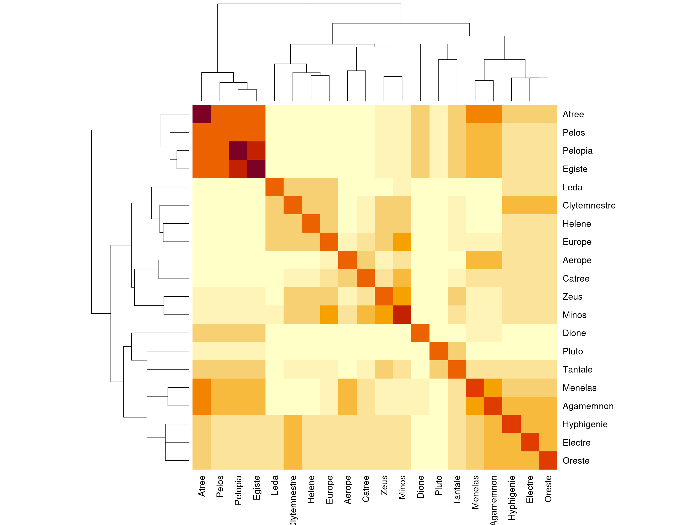
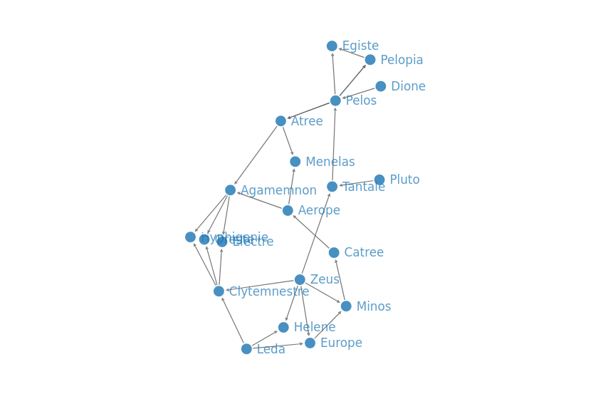

-   [r-geno-tools-engine](#r-geno-tools-engine)
-   [Build r-geno-tools-engine](#build-r-geno-tools-engine)
    -   [Test the image](#test-the-image)
-   [How to use r-geno-tools-engine](#how-to-use-r-geno-tools-engine)
    -   [from Docker](#from-docker)
    -   [Without Docker (need R
        installed)](#without-docker-need-r-installed)
        -   [Install dependencies](#install-dependencies)
        -   [usage](#usage)
    -   [As an R library](#as-an-r-library)
-   [Functions documentation](#functions-documentation)
-   [Tests](#tests)
-   [Tools](#tools)
    -   [GWAS](#gwas)
        -   [Introduction](#introduction)
        -   [Functions](#functions)
        -   [Main R functions](#main-r-functions)
    -   [LD plot](#ld-plot)
    -   [Relationship matrix](#relationship-matrix)
        -   [Pedigree relationship
            matrix](#pedigree-relationship-matrix)
        -   [Genomic relationship matrix](#genomic-relationship-matrix)
        -   [Combined relationship
            matrix](#combined-relationship-matrix)
        -   [Relationship matrix
            visualisation](#relationship-matrix-visualisation)
    -   [Pedigree network](#pedigree-network)
-   [Data references](#data-references)
-   [Utils](#utils)

<!-- README.md is generated from README.Rmd. Please edit that file -->

# r-geno-tools-engine

<!-- badges: start -->
<!-- badges: end -->

The goal of “r-geno-tools-engine” is to provide a simple “input/output”
style command line toolbox for several genomic related analysis in order
to be used inside an API or other services.

# Build r-geno-tools-engine

The easiest way to use r-geno-tools-engine is to use the
[Docker](https://www.docker.com/) image. To build the docker image
simply do:

``` sh
git clone https://github.com/ut-biomet/r-geno-tools-engine
cd r-geno-tools-engine
docker build -t rgenotoolsengine ./
```

## Test the image

You can test the image by running:

``` sh
docker run --rm --entrypoint="Rscript" rgenotoolsengine ./tests/testthat.R
```

All tests should pass.

# How to use r-geno-tools-engine

## from Docker

Basically the command to use the engine from the docker image is as
follow:

``` sh
docker run --rm rgenotoolsengine <subcommand> --param1 valueOfParam1 --param2 valueOfParam2 ...
```

The sub-command can be one of: (see:
`docker run --rm rgenotoolsengine --help`)

-   `gwas`: to do a gwas analysis from geno and pheno files
-   `gwas-manplot`: to create an interactive or static manhathan plot
    from the results generated by `gwas`
-   `gwas-adjresults`: to calculate the adjusted p-value from the
    results generated by `gwas`
-   `ldplot`: to get a plot showing the Linkage disequilibrium between
    consecutive markers.
-   `relmat-ped`: to calculate the relationship matrix from a pedigree
    file.
-   `relmat-heatmap`: to get the heatmap of a relationship matrix.
-   `pedNetwork`: to get an interactive pedigree network from a pedigree
    file.

The parameters to use depends of the sub-command. You can have an
exhaustive list of them by using:

``` sh
docker run --rm rgenotoolsengine <subcommand> --help
```

However, the tools need to read/write files from the host machine. To
let docker container access those files, you need to mount the the
folders containing the files in the container using the option
`-v --volume`. Then the file path must be specify relative to the place
in the container. (See examples below).

``` sh
docker run --rm \
    -v /path/to/folder1/on/host/:/dockerFolder1 \
    -v /path/to/folder2/on/host/:/dockerFolder2 \
    <subcommand> \
    --fileParam1 "/dockerFolder1/nameOfFile1.txt" \
    --fileParam2 "/dockerFolder2/nameOfFile2.txt" \
    --param3 ...
```

## Without Docker (need R installed)

This r-geno-tools-engine is written in `R`, therefore it can also be run
directly from your computer (without docker) if you have `R` and the all
the dependencies packages installed.

### Install dependencies

To install r-geno-tools-engine’s packages dependencies, first install
the [`renv`](https://rstudio.github.io/renv/articles/renv.html) package.
Then this package will install automatically the dependencies:

In an `R` console:

``` r
# open the repo as an Rstudio project
# or use `setwd('path/to/r-geno-tools-engine)`

# Install `renv`
install.packages(renv)

# Install dependencies
renv::restore()
```

### usage

To use the engine from `R` you can execute the `R-geno-tools-Engine.R`
file with the `Rscript` command.

From a bash terminal

``` sh
Rscript ./r-geno-tools-engine.R <subcommand> --param1 valueOfParam1 --param2 valueOfParam2 ...
```

See:

    Rscript ./r-geno-tools-engine.R --help

and

    Rscript ./r-geno-tools-engine.R <subcommand> --help

## As an R library

It is also possible to use this engine in other project written in `R`
as a library. For that I suggest to include this repository as a git
sub-module of your project.

Then you can load in your code the engine’s function using:

``` r
invisible(
  sapply(FUN = source,
         X = list.files("path/to/r-geno-tools-engine/src", pattern = ".R$",full.names = T))
)
```

For each tool of the engine, some “main functions” are available. Those
functions do essentially the same than the command lines ones. It is
recommended to use those functions in your R project.

Other “utility” functions are also available (eg. for loading data, save
the results…) see the [functions documentation](./doc/README.md) for an
exhaustive list.

# Functions documentation

All the R functions of this engine are documented in
[`./doc/README.md`](doc/README.md).

You can generate this markdown documentation using the function
`writeDoc` (defined in [`./src/utils.R`](src/utils.R)):

``` r
writeDoc(srcDir = "src",
         docDir = "doc")
```

# Tests

The R package `testthat` is needed to run the unit tests. To run the
unit tests of this engine you can use the command:

``` sh
Rscript ./tests/testthat.R
```

# Tools

## GWAS

<details>
<summary>
Click to expand
</summary>

### Introduction

This toolbox provide several genomic analysis. To get a simple
description of each of them, please

GWAS stands for [Genome-Wide Association
Study](https://en.wikipedia.org/wiki/Genome-wide_association_study). It
is a statistical study that aims to detect genetic markers associated
with a particular phenotypic trait.

To test if a marker is associated with a particular phenotypic trait, we
split individuals into different groups according to their genotype for
the studied marker and we test if there is a statistical difference
between the phenotypic values of the groups. The strength of the
statistical difference is measured by what statisticians call the
“[p-value](https://en.wikipedia.org/wiki/P-value)”.

Usually to consider a test “statistically significant” we check if the
p-value of the test is lower than a threshold “α”. In this case the test
is considered positive (*“there is a statistical difference”*) but we
have a probability α to have a false positive. Very often α is equal to
5% or 1%.

GWAS analysis does this test individually and independently for all the
genetic markers in the data-set and records the “statistical
significance” (the p-values) of all the tests.

However, the number of tested genetic markers are usually very large
(several hundreds of thousands or several million) therefore, the number
of false-positive can be high even for a small value of α. For example,
with α=1%, 500000 markers, and if none of them is associated with the
phenotypic trait, we can still expect 5000 “significant test”.

To avoid that, the p-values must be
[adjusted](https://en.wikipedia.org/wiki/Multiple_comparisons_problem)
according to the number of markers.

Finally, the result of a GWAS analysis is presented as a
[Manhattan_plot](https://en.wikipedia.org/wiki/Manhattan_plot) which
shows the `-log(p-value)` on the y-axis and all the markers (order
according to their position on the chromosomes) on the x-axis. A
horizontal line represents the significance threshold and the points of
the markers above the line can be considered as being associated with
the phenotypic trait.


r-geno-tools-engine provides command line tools to do GWAS analysis.

> Note: You can also check this [7min
> video](https://www.youtube.com/watch?v=sOP8WacfBM8) by Nuno Carvalho
> that explain GWAS very well.

### Functions

#### `gwas`

To do a gwas analysis and write the results in a json file.

``` sh
docker run --rm -v "$PWD"/data/geno/:/geno \
    -v "$PWD"/data/pheno/:/pheno \
    -v "$PWD"/readmeTemp:/out rgenotoolsengine \
    gwas \
    --genoFile "/geno/testMarkerData01.vcf.gz" \
    --phenoFile "/pheno/testPhenoData01.csv" \
    --trait "Flowering.time.at.Arkansas" \
    --test "score" \
    --fixed 0 \
    --response "quantitative" \
    --thresh_maf 0.05 \
    --thresh_callrate 0.95 \
    --outFile "/out/gwasRes.json"
```

#### `gwas-manplot`

To create a Manhattan plot.

**Interactive plot:**

``` sh
docker run --rm -v "$PWD"/readmeTemp:/files rgenotoolsengine \
    gwas-manplot \
    --gwasFile "/files/gwasRes.json" \
    --adj_method "bonferroni" \
    --thresh_p 0.05 \
    --interactive TRUE \
    --filter_nPoints 3000 \
    --outFile "/files/manPlot.html"
```

**Static plot:**

``` sh
docker run --rm -v "$PWD"/readmeTemp:/files rgenotoolsengine \
    gwas-manplot \
    --gwasFile "/files/gwasRes.json" \
    --adj_method "bonferroni" \
    --thresh_p 0.05 \
    --interactive FALSE \
    --outFile "/files/manPlot.png"
```

#### `adjresults`

To create a `json` file with the gwas results with adjusted p-values. It
is also possible to filter the result to keep the values with the lowest
p-values.

``` sh
docker run --rm -v "$PWD"/readmeTemp:/files rgenotoolsengine \
    gwas-adjResults \
    --gwasFile "/files/gwasRes.json" \
    --adj_method "bonferroni" \
    --filter_nPoints 3000 \
    --outFile "/files/adjRes.json"
```

### Main R functions

For a usage as R library one can use those functions.

``` r
gwas_results <- run_gwas(genoFile = "data/geno/testMarkerData01.vcf.gz",
                         phenoFile = "data/pheno/testPhenoData01.csv",
                         genoUrl = NULL,
                         phenoUrl = NULL,
                         trait = "Flowering.time.at.Arkansas",
                         test = "score",
                         fixed = 0,
                         response = "quantitative",
                         thresh_maf = 0.05,
                         thresh_callrate = 0.95,
                         outFile = tempfile(fileext = ".json"))
#> 2022-04-13 18:29:58 - r-run_gwas(): Get data ...
#> 2022-04-13 18:29:58 - r-readData(): get geno data ...
#> 2022-04-13 18:29:58 - r-readGenoData(): Check file extention ... 
#> 2022-04-13 18:29:58 - r-readGenoData(): Read geno file ... 
#> ped stats and snps stats have been set. 
#> 'p' has been set. 
#> 'mu' and 'sigma' have been set.
#> 2022-04-13 18:29:59 - r-readGenoData(): Read geno file DONE 
#> 2022-04-13 18:29:59 - r-readGenoData(): DONE, return output.
#> 2022-04-13 18:29:59 - r-readData(): get geno data DONE
#> 2022-04-13 18:29:59 - r-readData(): get pheno data ...
#> 2022-04-13 18:29:59 - r-readPhenoData(): Read phenotypic file ... 
#> 2022-04-13 18:29:59 - r-readPhenoData(): Read phenotypic file DONE 
#> 2022-04-13 18:29:59 - r-readPhenoData(): Check individuals unicity ...
#> 2022-04-13 18:29:59 - r-readPhenoData(): Check individuals unicity DONE
#> 2022-04-13 18:29:59 - r-readPhenoData(): Set pheno data's row names ...
#> 2022-04-13 18:29:59 - r-readPhenoData(): Set pheno data's row names DONE
#> 2022-04-13 18:29:59 - r-readPhenoData(): DONE, return output.
#> 2022-04-13 18:29:59 - r-readData(): get pheno data DONE
#> 2022-04-13 18:29:59 - r-readData(): prepare data ...
#> 2022-04-13 18:29:59 - r-prepareData(): Remove from geno data individuals that are not in phenotypic data-set ...
#> 2022-04-13 18:30:00 - r-prepareData(): Remove from geno data individuals that are not in phenotypic data-set DONE
#> 2022-04-13 18:30:00 - r-prepareData(): reorder matrix ...
#> 2022-04-13 18:30:00 - r-prepareData(): reorder matrix DONE
#> 2022-04-13 18:30:00 - r-prepareData(): remove monomorphic markers ...
#> 2022-04-13 18:30:00 - r-prepareData(): remove monomorphic markers DONE
#> 2022-04-13 18:30:00 - r-prepareData(): DONE, return output.
#> 2022-04-13 18:30:00 - r-readData(): prepare data DONE
#> 2022-04-13 18:30:00 - r-readData(): DONE, return output.
#> 2022-04-13 18:30:00 - r-run_gwas(): Get data DONE
#> 2022-04-13 18:30:00 - r-run_gwas(): GWAS analysis ...
#> 2022-04-13 18:30:00 - r-gwas(): Check inputs ...
#> 2022-04-13 18:30:00 - r-gwas(): Check inputs DONE
#> 2022-04-13 18:30:00 - r-gwas(): aggregate data in bed matrix ...
#> 2022-04-13 18:30:00 - r-gwas(): aggregate data in bed matrix DONE
#> 2022-04-13 18:30:00 - r-gwas(): remove individuals with missing phenotypic values ...
#> 2022-04-13 18:30:00 - r-gwas(): remove samples with missing phenotypic values DONE
#> 2022-04-13 18:30:00 - r-gwas(): filter SNPs ...
#> 2022-04-13 18:30:00 - r-gwas(): filter SNPs DONE
#> 2022-04-13 18:30:00 - r-gwas(): calculate genetic relatinoal matrix ...
#> 2022-04-13 18:30:00 - r-gwas(): calculate genetic relatinoal matrix DONE
#> 2022-04-13 18:30:00 - r-gwas(): fit model ...
#> [Iteration 1] theta = 78.0648 78.2819
#> [Iteration 1] log L = -1002.17
#> [Iteration 1] AI-REML update
#> [Iteration 1] ||gradient|| = 0.344543
#> [Iteration 2] theta =  22.561 163.026
#> [Iteration 2] log L = -990.943
#> [Iteration 2] AI-REML update
#> [Iteration 2] ||gradient|| = 0.798819
#> [Iteration 3] theta =   27.72 190.624
#> [Iteration 3] log L = -986.649
#> [Iteration 3] AI-REML update
#> [Iteration 3] ||gradient|| = 0.113946
#> [Iteration 4] theta = 29.2502 195.436
#> [Iteration 4] log L = -986.513
#> [Iteration 4] AI-REML update
#> [Iteration 4] ||gradient|| = 0.00580945
#> [Iteration 5] theta = 29.4021 195.213
#> [Iteration 5] log L = -986.513
#> [Iteration 5] AI-REML update
#> [Iteration 5] ||gradient|| = 0.000323295
#> [Iteration 6] theta = 29.4177 195.143
#> [Iteration 6] log L = -986.513
#> [Iteration 6] AI-REML update
#> [Iteration 6] ||gradient|| = 4.32635e-05
#> [Iteration 7] theta = 29.4199 195.133
#> [Iteration 7] log L = -986.513
#> [Iteration 7] AI-REML update
#> [Iteration 7] ||gradient|| = 5.95137e-06
#> 2022-04-13 18:30:01 - r-gwas(): fit model DONE
#> 2022-04-13 18:30:01 - r-gwas(): DONE, return output.
#> 2022-04-13 18:30:01 - r-run_gwas(): GWAS analysis DONE
#> 2022-04-13 18:30:01 - r-run_gwas(): Save metadata ...
#> 2022-04-13 18:30:01 - r-run_gwas(): Save metadata DONE
#> 2022-04-13 18:30:01 - r-run_gwas(): Save results ...
#> 2022-04-13 18:30:01 - r-saveGWAS(): Check file ...
#> 2022-04-13 18:30:01 - r-saveGWAS(): Check file DONE
#> 2022-04-13 18:30:01 - r-run_gwas(): Save results DONE
gwas_results$file
#> [1] "/tmp/RtmppgVKte/filea527f3add58ca.json"
substr(gwas_results$gwasRes, start=1, stop=500)
#> [
#>   {
#>     "chr": "1",
#>     "pos": 9563,
#>     "id": "SNP-1.8562.",
#>     "A1": "A",
#>     "A2": "T",
#>     "freqA2": 0.1359,
#>     "score": 4.395,
#>     "p": 0.036
#>   },
#>   {
#>     "chr": "1",
#>     "pos": 25922,
#>     "id": "SNP-1.24921.",
#>     "A1": "C",
#>     "A2": "T",
#>     "freqA2": 0.1254,
#>     "score": 1.6745,
#>     "p": 0.1957
#>   },
#>   {
#>     "chr": "1",
#>     "pos": 26254,
#>     "id": "SNP-1.25253.",
#>     "A1": "A",
#>     "A2": "T",
#>     "freqA2": 0.2935,
#>     "score": 3.6592,
#>     "p": 0.0558
#>   },
#>   {
#>     "chr": "1",
#>     "pos
```

``` r
p <- draw_manhattanPlot(gwasFile = gwas_results$file,
                        gwasUrl = NULL,
                        adj_method = "bonferroni",
                        thresh_p = 0.05,
                        chr = NA,
                        interactive = TRUE,
                        # filter_pAdj = 1,
                        # filter_nPoints = Inf,
                        filter_quant = 0.1,
                        outFile = tempfile(fileext = ".html"))
#> 2022-04-13 18:30:01 - r-draw_manhattanPlot(): Check outFile ...
#> 2022-04-13 18:30:01 - r-draw_manhattanPlot(): Check outFile DONE
#> 2022-04-13 18:30:01 - r-draw_manhattanPlot(): Get data ...
#> 2022-04-13 18:30:01 - r-readGWAS(): Read result file ... 
#> 2022-04-13 18:30:01 - r-readGWAS(): Read result file DONE 
#> 2022-04-13 18:30:01 - r-readGWAS(): Convert Json to data.frame ... 
#> 2022-04-13 18:30:02 - r-readGWAS(): Convert Json to data.frame DONE 
#> 2022-04-13 18:30:02 - r-readGWAS(): DONE, return output.
#> 2022-04-13 18:30:02 - r-draw_manhattanPlot(): Get data DONE
#> 2022-04-13 18:30:02 - r-draw_manhattanPlot(): Draw Manhattan Plot ...
#> 2022-04-13 18:30:02 - r-manPlot(): Check parameters...
#> 2022-04-13 18:30:02 - r-manPlot(): Check parameters DONE
#> 2022-04-13 18:30:02 - r-manPlot(): Check chromosome name ...
#> 2022-04-13 18:30:02 - r-manPlot(): Check chromosome name DONE
#> 2022-04-13 18:30:02 - r-manPlot(): Remove NAs ...
#> 2022-04-13 18:30:02 - r-manPlot(): Remove NAs DONE
#> 2022-04-13 18:30:02 - r-manPlot(): Adjust p-values ...
#> 2022-04-13 18:30:02 - r-adjustPval(): Check adj_method ...
#> 2022-04-13 18:30:02 - r-adjustPval(): Check adj_method DONE
#> 2022-04-13 18:30:02 - r-adjustPval(): Check p values ...
#> 2022-04-13 18:30:02 - r-adjustPval(): Check p values DONE
#> 2022-04-13 18:30:02 - r-adjustPval(): Adjust p-values ...
#> 2022-04-13 18:30:02 - r-adjustPval(): Adjust p-values DONE
#> 2022-04-13 18:30:02 - r-adjustPval(): Adjust threshold ...
#> 2022-04-13 18:30:02 - r-adjustPval(): Adjust threshold DONE
#> 2022-04-13 18:30:02 - r-adjustPval(): DONE, return output
#> 2022-04-13 18:30:02 - r-manPlot(): Adjust p-values DONE
#> 2022-04-13 18:30:02 - r-manPlot(): Check duplicated SNP ID ...
#> 2022-04-13 18:30:02 - r-manPlot(): Check duplicated SNP ID DONE
#> 2022-04-13 18:30:02 - r-manPlot(): Extract significant SNP ...
#> 2022-04-13 18:30:02 - r-manPlot(): Extract significant SNP DONE
#> 2022-04-13 18:30:02 - r-filterGWAS(): Check parameters...
#> 2022-04-13 18:30:02 - r-filterGWAS(): Check parameters DONE
#> 2022-04-13 18:30:02 - r-filterGWAS(): Filter points ...
#> 2022-04-13 18:30:02 - r-filterGWAS(): skip filter_pAdj
#> 2022-04-13 18:30:02 - r-filterGWAS(): skip filter_nPoints
#> 2022-04-13 18:30:02 - r-manPlot(): Draw plot ...
#> 2022-04-13 18:30:02 - r-manPlot(): Draw plot DONE
#> 2022-04-13 18:30:02 - r-manPlot(): DONE, return output
#> 2022-04-13 18:30:02 - r-draw_manhattanPlot(): Draw Manhattan Plot DONE
#> 2022-04-13 18:30:02 - r-draw_manhattanPlot(): Save results ...
#> 2022-04-13 18:30:03 - r-draw_manhattanPlot(): Save results DONE
```

``` r
gwas_adj <- run_resAdjustment(gwasFile = gwas_results$file,
                              gwasUrl = NULL,
                              adj_method = "bonferroni",
                              outFile = tempfile(fileext = ".json"))
#> 2022-04-13 18:30:03 - r-run_resAdjustment(): Get data ...
#> 2022-04-13 18:30:03 - r-readGWAS(): Read result file ... 
#> 2022-04-13 18:30:03 - r-readGWAS(): Read result file DONE 
#> 2022-04-13 18:30:03 - r-readGWAS(): Convert Json to data.frame ... 
#> 2022-04-13 18:30:04 - r-readGWAS(): Convert Json to data.frame DONE 
#> 2022-04-13 18:30:04 - r-readGWAS(): DONE, return output.
#> 2022-04-13 18:30:04 - r-run_resAdjustment(): Get data DONE
#> 2022-04-13 18:30:04 - r-run_resAdjustment(): Adjust p-values ...
#> 2022-04-13 18:30:04 - r-adjustPval(): Check adj_method ...
#> 2022-04-13 18:30:04 - r-adjustPval(): Check adj_method DONE
#> 2022-04-13 18:30:04 - r-adjustPval(): Check p values ...
#> 2022-04-13 18:30:04 - r-adjustPval(): Check p values DONE
#> 2022-04-13 18:30:04 - r-adjustPval(): Adjust p-values ...
#> 2022-04-13 18:30:04 - r-adjustPval(): Adjust p-values DONE
#> 2022-04-13 18:30:04 - r-adjustPval(): DONE, return output
#> 2022-04-13 18:30:04 - r-run_resAdjustment(): Adjust p-values DONE
#> 2022-04-13 18:30:04 - r-filterGWAS(): Check parameters...
#> 2022-04-13 18:30:04 - r-filterGWAS(): Check parameters DONE
#> 2022-04-13 18:30:04 - r-filterGWAS(): Filter points ...
#> 2022-04-13 18:30:04 - r-filterGWAS(): skip filter_pAdj
#> 2022-04-13 18:30:04 - r-filterGWAS(): skip filter_quant
#> 2022-04-13 18:30:04 - r-filterGWAS(): skip filter_nPoints
#> 2022-04-13 18:30:04 - r-run_resAdjustment(): Save results ...
#> 2022-04-13 18:30:04 - r-saveGWAS(): Check file ...
#> 2022-04-13 18:30:04 - r-saveGWAS(): Check file DONE
#> 2022-04-13 18:30:04 - r-run_resAdjustment(): Save results DONE
substr(gwas_adj$gwasAdjusted, start=1, stop=500)
#> [
#>   {
#>     "chr": "1",
#>     "pos": 9563,
#>     "id": "SNP-1.8562.",
#>     "A1": "A",
#>     "A2": "T",
#>     "freqA2": 0.1359,
#>     "score": 4.395,
#>     "p": 0.036,
#>     "p_adj": 1
#>   },
#>   {
#>     "chr": "1",
#>     "pos": 25922,
#>     "id": "SNP-1.24921.",
#>     "A1": "C",
#>     "A2": "T",
#>     "freqA2": 0.1254,
#>     "score": 1.6745,
#>     "p": 0.1957,
#>     "p_adj": 1
#>   },
#>   {
#>     "chr": "1",
#>     "pos": 26254,
#>     "id": "SNP-1.25253.",
#>     "A1": "A",
#>     "A2": "T",
#>     "freqA2": 0.2935,
#>     "score": 3.6592,
#>     "p": 0.0558,
#> 
```

</details>

## LD plot

<details>
<summary>
Click to expand
</summary>

This help to calculate and visualize the linkage disequilibrium between
some consecutive snps.

``` sh
docker run --rm -v "$PWD"/data/geno/:/geno \
    -v "$PWD"/readmeTemp:/out rgenotoolsengine \
    ldplot \
    --genoFile "/geno/testMarkerData01.vcf.gz" \
    --from 42 \
    --to 62 \
    --outFile "/out/ldplot.png"
```

**Main function**

``` r
imgFile <- draw_ldPlot(genoFile = "data/geno/testMarkerData01.vcf.gz",
                       genoUrl = NULL,
                       from = 42,
                       to = 62,
                       outFile = tempfile(fileext = ".png")) 
#> 2022-04-13 18:30:04 - r-draw_ldPlot(): Get data ...
#> 2022-04-13 18:30:04 - r-readGenoData(): Check file extention ... 
#> 2022-04-13 18:30:04 - r-readGenoData(): Read geno file ... 
#> ped stats and snps stats have been set. 
#> 'p' has been set. 
#> 'mu' and 'sigma' have been set.
#> 2022-04-13 18:30:05 - r-readGenoData(): Read geno file DONE 
#> 2022-04-13 18:30:05 - r-readGenoData(): DONE, return output.
#> 2022-04-13 18:30:05 - r-draw_ldPlot(): Get data DONE
#> 2022-04-13 18:30:05 - r-draw_ldPlot(): Draw LD Plot ...
#> 2022-04-13 18:30:05 - r-LDplot(): Check "from" and "to" format ...
#> 2022-04-13 18:30:05 - r-LDplot(): Check "from" and "to" format DONE
#> 2022-04-13 18:30:05 - r-LDplot(): Check "from" < "to"...
#> 2022-04-13 18:30:05 - r-LDplot(): Check "from" < "to" DONE
#> 2022-04-13 18:30:05 - r-LDplot(): Check number of SNP < 50...
#> 2022-04-13 18:30:05 - r-LDplot(): Check number of SNP < 50 DONE
#> 2022-04-13 18:30:05 - r-LDplot(): Check file ...
#> 2022-04-13 18:30:05 - r-LDplot(): Check file DONE
#> 2022-04-13 18:30:05 - r-LDplot(): Compute LD ...
#> 2022-04-13 18:30:05 - r-LDplot(): Compute LD DONE
#> 2022-04-13 18:30:05 - r-LDplot(): Create LD plot ...
#> 2022-04-13 18:30:05 - r-LDplot(): Create create file: /tmp/RtmppgVKte/filea527f6deefe88.png
#> 2022-04-13 18:30:05 - r-LDplot(): Create LD plot DONE
#> 2022-04-13 18:30:05 - r-LDplot(): DONE, return output
#> 2022-04-13 18:30:05 - r-draw_ldPlot(): Draw LD Plot DONE
```

</details>

## Relationship matrix

<details>
<summary>
Click to expand
</summary>

Relationship matrix represents how close two individuals are to each
other (share the same genes). It can be calculated using their pedigree,
or their genotypes.

### Pedigree relationship matrix

This engine can calculate the pedigree-based relationship matrix:

``` sh
docker run --rm -v "$PWD"/data/pedigree/:/pedigree \
    -v "$PWD"/readmeTemp:/out rgenotoolsengine \
    relmat-ped \
    --pedFile "/pedigree/testPedData_char.csv" \
    --outFile "/out/pedRelMat.json"
```

``` r
calc_pedRelMAt(pedFile = 'data/pedigree/testPedData_char.csv',
               pedUrl = NULL,
               header = TRUE,
               unknown_string = '',
               outFile = tempfile(fileext = ".json"))
#> 2022-04-13 18:30:05 - r-calc_pedRelMAt(): Get data ...
#> 2022-04-13 18:30:05 - r-readPedData: Read pedigree file ...
#> 2022-04-13 18:30:05 - r-readPedData: Read pedigree file DONE
#> 2022-04-13 18:30:05 - r-readPedData: Check pedigree file ...
#> 2022-04-13 18:30:05 - r-readPedData: Check pedigree file DONE
#> 2022-04-13 18:30:05 - r-readPedData: DONE, return output.
#> 2022-04-13 18:30:05 - r-calc_pedRelMAt(): Get data DONE
#> 2022-04-13 18:30:05 - r-calc_pedRelMAt(): Calcualte pedigree relationship matrix ...
#> 2022-04-13 18:30:05 - r-pedRelMat(): Check inputs ...
#> 2022-04-13 18:30:05 - r-pedRelMat(): Check inputs DONE
#> 2022-04-13 18:30:05 - r-pedRelMat(): Create look-up table ...
#> 2022-04-13 18:30:05 - r-pedRelMat(): Create look-up table DONE
#> 2022-04-13 18:30:05 - r-pedRelMat(): Calculate relationship matrix ...
#> 2022-04-13 18:30:05 - r-pedRelMat(): Calculate relationship matrix DONE
#> 2022-04-13 18:30:05 - r-pedRelMat(): DONE, return output.
#> 2022-04-13 18:30:05 - r-calc_pedRelMAt(): Calcualte pedigree relationship matrix DONE
#> 2022-04-13 18:30:05 - r-calc_pedRelMAt(): Get metadata ...
#> 2022-04-13 18:30:05 - r-calc_pedRelMAt(): Get metadata DONE
#> 2022-04-13 18:30:05 - r-calc_pedRelMAt(): Save results ...
#> 2022-04-13 18:30:05 - r-saveRelMat(): Check relationship matrix ...
#> 2022-04-13 18:30:05 - r-saveRelMat(): Check relationship matrix DONE
#> 2022-04-13 18:30:05 - r-saveRelMat(): Check file ...
#> 2022-04-13 18:30:05 - r-saveRelMat(): Check file DONE
#> 2022-04-13 18:30:05 - r-saveRelMat(): Check file format ...
#> 2022-04-13 18:30:05 - r-saveRelMat(): Check file format DONE
#> 2022-04-13 18:30:05 - r-saveRelMat(): Write relationship matrix in `.json` file ...
#> 2022-04-13 18:30:05 - r-saveRelMat(): Write relationship matrix in `.json` file DONE
#> 2022-04-13 18:30:05 - r-calc_pedRelMAt(): Save results DONE
#> $relMat
#>               Pluto     Zeus     Leda Dione   Tantale   Europe     Pelos  Minos
#> Pluto        1.0000 0.000000 0.000000 0.000 0.5000000 0.000000 0.2500000 0.0000
#> Zeus         0.0000 1.000000 0.000000 0.000 0.5000000 0.500000 0.2500000 0.7500
#>                Pelopia     Atree    Catree    Egiste    Aerope   Menelas
#> Pluto        0.2500000 0.2500000 0.0000000 0.2500000 0.0000000 0.1250000
#> Zeus         0.2500000 0.2500000 0.3750000 0.2500000 0.1875000 0.2187500
#>              Agamemnon Clytemnestre Helene   Electre    Oreste Hyphigenie
#> Pluto        0.1250000       0.0000 0.0000 0.0625000 0.0625000  0.0625000
#> Zeus         0.2187500       0.5000 0.5000 0.3593750 0.3593750  0.3593750
#>  [ reached getOption("max.print") -- omitted 18 rows ]
#> 
#> $metadata
#> $metadata$info
#> [1] "R-geno-engine, Pedigree relationship matrix"
#> 
#> $metadata$date
#> [1] "2022-04-13 18:30:05 JST"
#> 
#> $metadata$nInds
#> [1] 20
#> 
#> $metadata$pedFP
#> [1] "8a6b7f58359f42470000f4a5a2d440d7"
#> 
#> 
#> $file
#> [1] "/tmp/RtmppgVKte/filea527f5192ed79.json"
```

### Genomic relationship matrix

This engine can calculate the genomic-based relationship matrix:

``` sh
docker run --rm -v "$PWD"/data/geno/:/geno \
    -v "$PWD"/readmeTemp:/out rgenotoolsengine \
    relmat-geno \
    --genoFile "/geno/breedGame_geno.vcf.gz" \
    --outFile "/out/genoRelMat.json"
```

``` r
calc_genoRelMAt(genoFile = 'data/geno/breedGame_geno.vcf.gz',
                genoUrl = NULL,
                outFile = tempfile(fileext = ".json"))
#> 2022-04-13 18:30:05 - r-calc_genoRelMAt(): Get data ...
#> 2022-04-13 18:30:05 - r-readGenoData(): Check file extention ... 
#> 2022-04-13 18:30:05 - r-readGenoData(): Read geno file ... 
#> ped stats and snps stats have been set. 
#> 'p' has been set. 
#> 'mu' and 'sigma' have been set.
#> 2022-04-13 18:30:06 - r-readGenoData(): Read geno file DONE 
#> 2022-04-13 18:30:06 - r-readGenoData(): DONE, return output.
#> 2022-04-13 18:30:06 - r-calc_genoRelMAt(): Calcualte genomic relationship matrix ...
#> 2022-04-13 18:30:06 - r-genodRelMat(): Check inputs ...
#> 2022-04-13 18:30:06 - r-genodRelMat(): Check inputs DONE
#> 2022-04-13 18:30:06 - r-genodRelMat(): Calculate genomic relationship matrix ...
#> 2022-04-13 18:30:11 - r-genodRelMat(): Calculate genomic relationship matrix DONE
#> 2022-04-13 18:30:11 - r-genodRelMat(): DONE, return output.
#> 2022-04-13 18:30:11 - r-calc_genoRelMAt(): Calcualte genomic relationship matrix DONE
#> 2022-04-13 18:30:11 - r-calc_genoRelMAt(): Get metadata ...
#> 2022-04-13 18:30:11 - r-calc_genoRelMAt(): Get metadata DONE
#> 2022-04-13 18:30:11 - r-calc_genoRelMAt(): Save results ...
#> 2022-04-13 18:30:11 - r-saveRelMat(): Check relationship matrix ...
#> 2022-04-13 18:30:11 - r-saveRelMat(): Check relationship matrix DONE
#> 2022-04-13 18:30:11 - r-saveRelMat(): Check file ...
#> 2022-04-13 18:30:11 - r-saveRelMat(): Check file DONE
#> 2022-04-13 18:30:11 - r-saveRelMat(): Check file format ...
#> 2022-04-13 18:30:11 - r-saveRelMat(): Check file format DONE
#> 2022-04-13 18:30:11 - r-saveRelMat(): Write relationship matrix in `.json` file ...
#> 2022-04-13 18:30:18 - r-saveRelMat(): Write relationship matrix in `.json` file DONE
#> 2022-04-13 18:30:18 - r-calc_genoRelMAt(): Save results DONE
#> $relMat
#>                F2_0001.0001  F2_0001.0002  F2_0001.0003  F2_0001.0004
#>               F2_0001.0005  F2_0001.0006   F2_0001.0007  F2_0001.0008
#>               F2_0001.0009   F2_0001.0010 F2_0001.0011  F2_0001.0012
#>                F2_0001.0013  F2_0001.0014    F2_0001.0015  F2_0001.0016
#>               F2_0001.0017  F2_0001.0018  F2_0001.0019  F2_0001.0020
#>               F2_0001.0021  F2_0001.0022  F2_0001.0023  F2_0001.0024
#>                F2_0001.0025 F2_0001.0026 F2_0001.0027  F2_0001.0028
#>               F2_0001.0029  F2_0001.0030  F2_0001.0031  F2_0001.0032
#>               F2_0001.0033 F2_0001.0034   F2_0001.0035  F2_0001.0036
#>               F2_0001.0037   F2_0001.0038  F2_0001.0039  F2_0001.0040
#>              F2_0001.0041  F2_0001.0042  F2_0001.0043  F2_0001.0044
#>               F2_0001.0045   F2_0001.0046  F2_0001.0047   F2_0001.0048
#>               F2_0001.0049  F2_0001.0050  F2_0001.0051  F2_0001.0052
#>               F2_0001.0053  F2_0001.0054  F2_0001.0055  F2_0001.0056
#>               F2_0001.0057  F2_0001.0058  F2_0001.0059  F2_0001.0060
#>              F2_0001.0061  F2_0001.0062  F2_0001.0063  F2_0001.0064
#>               F2_0001.0065  F2_0001.0066  F2_0001.0067  F2_0001.0068
#>               F2_0001.0069  F2_0001.0070  F2_0001.0071  F2_0001.0072
#>               F2_0001.0073 F2_0001.0074  F2_0001.0075   F2_0001.0076
#>               F2_0001.0077  F2_0001.0078   F2_0001.0079  F2_0001.0080
#>                 F2_0001.0081 F2_0001.0082  F2_0001.0083 F2_0001.0084
#>               F2_0001.0085  F2_0001.0086 F2_0001.0087  F2_0001.0088
#>              F2_0001.0089 F2_0001.0090  F2_0001.0091  F2_0001.0092
#>               F2_0001.0093  F2_0001.0094  F2_0001.0095 F2_0001.0096
#>                F2_0001.0097  F2_0001.0098 F2_0001.0099  F2_0001.0100
#>               F2_0002.0001   F2_0002.0002   F2_0002.0003   F2_0002.0004
#>               F2_0002.0005  F2_0002.0006   F2_0002.0007   F2_0002.0008
#>               F2_0002.0009  F2_0002.0010  F2_0002.0011    F2_0002.0012
#>                 F2_0002.0013  F2_0002.0014   F2_0002.0015   F2_0002.0016
#>               F2_0002.0017   F2_0002.0018   F2_0002.0019   F2_0002.0020
#>               F2_0002.0021   F2_0002.0022  F2_0002.0023     F2_0002.0024
#>                F2_0002.0025   F2_0002.0026  F2_0002.0027  F2_0002.0028
#>               F2_0002.0029   F2_0002.0030   F2_0002.0031    F2_0002.0032
#>               F2_0002.0033    F2_0002.0034   F2_0002.0035   F2_0002.0036
#>               F2_0002.0037   F2_0002.0038   F2_0002.0039   F2_0002.0040
#>                 F2_0002.0041  F2_0002.0042   F2_0002.0043   F2_0002.0044
#>               F2_0002.0045    F2_0002.0046  F2_0002.0047   F2_0002.0048
#>                F2_0002.0049   F2_0002.0050   F2_0002.0051  F2_0002.0052
#>                F2_0002.0053   F2_0002.0054  F2_0002.0055  F2_0002.0056
#>               F2_0002.0057   F2_0002.0058  F2_0002.0059  F2_0002.0060
#>               F2_0002.0061   F2_0002.0062   F2_0002.0063  F2_0002.0064
#>               F2_0002.0065   F2_0002.0066  F2_0002.0067  F2_0002.0068
#>               F2_0002.0069   F2_0002.0070  F2_0002.0071  F2_0002.0072
#>                F2_0002.0073  F2_0002.0074   F2_0002.0075  F2_0002.0076
#>               F2_0002.0077    F2_0002.0078  F2_0002.0079  F2_0002.0080
#>               F2_0002.0081   F2_0002.0082   F2_0002.0083   F2_0002.0084
#>               F2_0002.0085  F2_0002.0086    F2_0002.0087   F2_0002.0088
#>                F2_0002.0089  F2_0002.0090   F2_0002.0091  F2_0002.0092
#>               F2_0002.0093  F2_0002.0094   F2_0002.0095   F2_0002.0096
#>                F2_0002.0097  F2_0002.0098    F2_0002.0099   F2_0002.0100
#>                F2_0003.0001   F2_0003.0002    F2_0003.0003   F2_0003.0004
#>               F2_0003.0005   F2_0003.0006  F2_0003.0007    F2_0003.0008
#>               F2_0003.0009  F2_0003.0010    F2_0003.0011   F2_0003.0012
#>                 F2_0003.0013  F2_0003.0014   F2_0003.0015  F2_0003.0016
#>                F2_0003.0017   F2_0003.0018   F2_0003.0019   F2_0003.0020
#>                F2_0003.0021   F2_0003.0022  F2_0003.0023  F2_0003.0024
#>               F2_0003.0025   F2_0003.0026  F2_0003.0027   F2_0003.0028
#>                F2_0003.0029  F2_0003.0030   F2_0003.0031  F2_0003.0032
#>               F2_0003.0033   F2_0003.0034   F2_0003.0035   F2_0003.0036
#>               F2_0003.0037    F2_0003.0038  F2_0003.0039    F2_0003.0040
#>               F2_0003.0041   F2_0003.0042   F2_0003.0043    F2_0003.0044
#>               F2_0003.0045   F2_0003.0046   F2_0003.0047  F2_0003.0048
#>                 F2_0003.0049  F2_0003.0050   F2_0003.0051   F2_0003.0052
#>               F2_0003.0053   F2_0003.0054   F2_0003.0055  F2_0003.0056
#>                F2_0003.0057  F2_0003.0058   F2_0003.0059  F2_0003.0060
#>                F2_0003.0061   F2_0003.0062   F2_0003.0063  F2_0003.0064
#>               F2_0003.0065   F2_0003.0066  F2_0003.0067   F2_0003.0068
#>               F2_0003.0069   F2_0003.0070  F2_0003.0071   F2_0003.0072
#>                F2_0003.0073  F2_0003.0074   F2_0003.0075    F2_0003.0076
#>               F2_0003.0077   F2_0003.0078   F2_0003.0079  F2_0003.0080
#>               F2_0003.0081  F2_0003.0082  F2_0003.0083   F2_0003.0084
#>               F2_0003.0085   F2_0003.0086  F2_0003.0087  F2_0003.0088
#>               F2_0003.0089   F2_0003.0090   F2_0003.0091  F2_0003.0092
#>               F2_0003.0093  F2_0003.0094  F2_0003.0095   F2_0003.0096
#>                F2_0003.0097   F2_0003.0098   F2_0003.0099   F2_0003.0100
#>               F3_0001.0001 F3_0001.0002   F3_0001.0003  F3_0001.0004
#>               F3_0001.0005  F3_0001.0006  F3_0001.0007  F3_0001.0008
#>                F3_0001.0009   F3_0001.0010  F3_0001.0011  F3_0001.0012
#>                F3_0001.0013  F3_0001.0014 F3_0001.0015  F3_0001.0016
#>               F3_0001.0017  F3_0001.0018  F3_0001.0019 F3_0001.0020
#>                F3_0001.0021  F3_0001.0022   F3_0001.0023  F3_0001.0024
#>               F3_0001.0025  F3_0001.0026  F3_0001.0027 F3_0001.0028
#>              F3_0001.0029   F3_0001.0030  F3_0001.0031  F3_0001.0032
#>                F3_0001.0033   F3_0001.0034 F3_0001.0035  F3_0001.0036
#>               F3_0001.0037  F3_0001.0038    F3_0001.0039  F3_0001.0040
#>               F3_0001.0041  F3_0001.0042  F3_0001.0043  F3_0001.0044
#>                 F3_0001.0045  F3_0001.0046  F3_0001.0047  F3_0001.0048
#>               F3_0001.0049  F3_0001.0050  F3_0001.0051   F3_0001.0052
#>              F3_0001.0053  F3_0001.0054   F3_0001.0055 F3_0001.0056
#>               F3_0001.0057 F3_0001.0058 F3_0001.0059  F3_0001.0060
#>               F3_0001.0061  F3_0001.0062 F3_0001.0063  F3_0001.0064
#>               F3_0001.0065  F3_0001.0066  F3_0001.0067  F3_0001.0068
#>                F3_0001.0069 F3_0001.0070  F3_0001.0071  F3_0001.0072
#>               F3_0001.0073   F3_0001.0074  F3_0001.0075   F3_0001.0076
#>               F3_0001.0077  F3_0001.0078  F3_0001.0079  F3_0001.0080
#>               F3_0001.0081  F3_0001.0082 F3_0001.0083  F3_0001.0084
#>                F3_0001.0085  F3_0001.0086  F3_0001.0087 F3_0001.0088
#>               F3_0001.0089 F3_0001.0090  F3_0001.0091 F3_0001.0092
#>                F3_0001.0093  F3_0001.0094  F3_0001.0095 F3_0001.0096
#>               F3_0001.0097  F3_0001.0098  F3_0001.0099  F3_0001.0100
#>                F3_0002.0001 F3_0002.0002 F3_0002.0003  F3_0002.0004
#>               F3_0002.0005  F3_0002.0006  F3_0002.0007  F3_0002.0008
#>                F3_0002.0009  F3_0002.0010 F3_0002.0011 F3_0002.0012
#>                 F3_0002.0013  F3_0002.0014 F3_0002.0015  F3_0002.0016
#>              F3_0002.0017  F3_0002.0018  F3_0002.0019   F3_0002.0020
#>              F3_0002.0021  F3_0002.0022  F3_0002.0023  F3_0002.0024
#>              F3_0002.0025 F3_0002.0026  F3_0002.0027  F3_0002.0028 F3_0002.0029
#>              F3_0002.0030  F3_0002.0031 F3_0002.0032  F3_0002.0033 F3_0002.0034
#>              F3_0002.0035  F3_0002.0036 F3_0002.0037   F3_0002.0038
#>               F3_0002.0039 F3_0002.0040   F3_0002.0041 F3_0002.0042
#>              F3_0002.0043  F3_0002.0044 F3_0002.0045 F3_0002.0046  F3_0002.0047
#>              F3_0002.0048 F3_0002.0049  F3_0002.0050 F3_0002.0051  F3_0002.0052
#>              F3_0002.0053 F3_0002.0054 F3_0002.0055 F3_0002.0056 F3_0002.0057
#>              F3_0002.0058  F3_0002.0059  F3_0002.0060  F3_0002.0061
#>               F3_0002.0062  F3_0002.0063   F3_0002.0064  F3_0002.0065
#>                F3_0002.0066 F3_0002.0067   F3_0002.0068  F3_0002.0069
#>               F3_0002.0070   F3_0002.0071 F3_0002.0072 F3_0002.0073
#>              F3_0002.0074  F3_0002.0075  F3_0002.0076  F3_0002.0077
#>              F3_0002.0078 F3_0002.0079 F3_0002.0080  F3_0002.0081 F3_0002.0082
#>               F3_0002.0083 F3_0002.0084   F3_0002.0085   F3_0002.0086
#>              F3_0002.0087  F3_0002.0088 F3_0002.0089 F3_0002.0090  F3_0002.0091
#>              F3_0002.0092 F3_0002.0093 F3_0002.0094 F3_0002.0095  F3_0002.0096
#>              F3_0002.0097 F3_0002.0098   F3_0002.0099  F3_0002.0100
#>              F3_0003.0001 F3_0003.0002  F3_0003.0003 F3_0003.0004 F3_0003.0005
#>              F3_0003.0006 F3_0003.0007  F3_0003.0008 F3_0003.0009  F3_0003.0010
#>                F3_0003.0011 F3_0003.0012 F3_0003.0013 F3_0003.0014 F3_0003.0015
#>              F3_0003.0016  F3_0003.0017 F3_0003.0018 F3_0003.0019  F3_0003.0020
#>              F3_0003.0021 F3_0003.0022  F3_0003.0023 F3_0003.0024  F3_0003.0025
#>              F3_0003.0026 F3_0003.0027 F3_0003.0028 F3_0003.0029  F3_0003.0030
#>              F3_0003.0031 F3_0003.0032 F3_0003.0033 F3_0003.0034 F3_0003.0035
#>              F3_0003.0036  F3_0003.0037  F3_0003.0038  F3_0003.0039
#>               F3_0003.0040 F3_0003.0041 F3_0003.0042  F3_0003.0043 F3_0003.0044
#>               F3_0003.0045 F3_0003.0046 F3_0003.0047   F3_0003.0048
#>              F3_0003.0049  F3_0003.0050  F3_0003.0051  F3_0003.0052
#>              F3_0003.0053 F3_0003.0054 F3_0003.0055 F3_0003.0056 F3_0003.0057
#>              F3_0003.0058 F3_0003.0059  F3_0003.0060 F3_0003.0061 F3_0003.0062
#>               F3_0003.0063 F3_0003.0064 F3_0003.0065  F3_0003.0066 F3_0003.0067
#>              F3_0003.0068  F3_0003.0069 F3_0003.0070  F3_0003.0071
#>                F3_0003.0072 F3_0003.0073 F3_0003.0074 F3_0003.0075 F3_0003.0076
#>              F3_0003.0077 F3_0003.0078 F3_0003.0079  F3_0003.0080  F3_0003.0081
#>               F3_0003.0082 F3_0003.0083 F3_0003.0084 F3_0003.0085 F3_0003.0086
#>               F3_0003.0087 F3_0003.0088 F3_0003.0089 F3_0003.0090  F3_0003.0091
#>              F3_0003.0092   F3_0003.0093 F3_0003.0094 F3_0003.0095
#>               F3_0003.0096 F3_0003.0097 F3_0003.0098  F3_0003.0099
#>                F3_0003.0100  F4_0001.0001   F4_0001.0002 F4_0001.0003
#>              F4_0001.0004  F4_0001.0005   F4_0001.0006 F4_0001.0007
#>               F4_0001.0008 F4_0001.0009  F4_0001.0010 F4_0001.0011 F4_0001.0012
#>              F4_0001.0013 F4_0001.0014   F4_0001.0015  F4_0001.0016
#>               F4_0001.0017 F4_0001.0018  F4_0001.0019 F4_0001.0020 F4_0001.0021
#>               F4_0001.0022  F4_0001.0023  F4_0001.0024 F4_0001.0025
#>               F4_0001.0026 F4_0001.0027  F4_0001.0028  F4_0001.0029
#>               F4_0001.0030  F4_0001.0031  F4_0001.0032  F4_0001.0033
#>               F4_0001.0034  F4_0001.0035 F4_0001.0036  F4_0001.0037
#>              F4_0001.0038   F4_0001.0039  F4_0001.0040 F4_0001.0041
#>              F4_0001.0042 F4_0001.0043  F4_0001.0044 F4_0001.0045 F4_0001.0046
#>               F4_0001.0047 F4_0001.0048  F4_0001.0049 F4_0001.0050
#>                F4_0001.0051 F4_0001.0052  F4_0001.0053  F4_0001.0054
#>              F4_0001.0055 F4_0001.0056  F4_0001.0057 F4_0001.0058  F4_0001.0059
#>              F4_0001.0060 F4_0001.0061 F4_0001.0062 F4_0001.0063  F4_0001.0064
#>               F4_0001.0065  F4_0001.0066  F4_0001.0067   F4_0001.0068
#>               F4_0001.0069  F4_0001.0070  F4_0001.0071  F4_0001.0072
#>              F4_0001.0073 F4_0001.0074 F4_0001.0075 F4_0001.0076 F4_0001.0077
#>              F4_0001.0078  F4_0001.0079 F4_0001.0080  F4_0001.0081
#>               F4_0001.0082  F4_0001.0083  F4_0001.0084 F4_0001.0085
#>              F4_0001.0086   F4_0001.0087 F4_0001.0088  F4_0001.0089
#>               F4_0001.0090  F4_0001.0091 F4_0001.0092 F4_0001.0093
#>                F4_0001.0094  F4_0001.0095 F4_0001.0096  F4_0001.0097
#>               F4_0001.0098  F4_0001.0099  F4_0001.0100  F4_0001.0101
#>              F4_0001.0102  F4_0001.0103 F4_0001.0104  F4_0001.0105
#>               F4_0001.0106 F4_0001.0107  F4_0001.0108  F4_0001.0109
#>              F4_0001.0110  F4_0001.0111  F4_0001.0112  F4_0001.0113
#>               F4_0001.0114 F4_0001.0115  F4_0001.0116   F4_0001.0117
#>              F4_0001.0118  F4_0001.0119    F4_0001.0120  F4_0001.0121
#>                 F4_0001.0122  F4_0001.0123 F4_0001.0124  F4_0001.0125
#>               F4_0001.0126  F4_0001.0127  F4_0001.0128  F4_0001.0129
#>              F4_0001.0130 F4_0001.0131 F4_0001.0132   F4_0001.0133 F4_0001.0134
#>                F4_0001.0135  F4_0001.0136  F4_0001.0137  F4_0001.0138
#>              F4_0001.0139  F4_0001.0140  F4_0001.0141  F4_0001.0142
#>                F4_0001.0143 F4_0001.0144   F4_0001.0145  F4_0001.0146
#>               F4_0001.0147  F4_0001.0148 F4_0001.0149 F4_0001.0150
#>               F4_0001.0151  F4_0001.0152    F4_0001.0153  F4_0001.0154
#>               F4_0001.0155   F4_0001.0156  F4_0001.0157  F4_0001.0158
#>              F4_0001.0159  F4_0001.0160  F4_0001.0161   F4_0001.0162
#>              F4_0001.0163 F4_0001.0164 F4_0001.0165 F4_0001.0166  F4_0001.0167
#>               F4_0001.0168  F4_0001.0169  F4_0001.0170 F4_0001.0171
#>               F4_0001.0172   F4_0001.0173 F4_0001.0174 F4_0001.0175
#>              F4_0001.0176 F4_0001.0177 F4_0001.0178  F4_0001.0179 F4_0001.0180
#>              F4_0001.0181 F4_0001.0182  F4_0001.0183  F4_0001.0184 F4_0001.0185
#>               F4_0001.0186   F4_0001.0187 F4_0001.0188  F4_0001.0189
#>              F4_0001.0190 F4_0001.0191  F4_0001.0192 F4_0001.0193 F4_0001.0194
#>              F4_0001.0195 F4_0001.0196 F4_0001.0197  F4_0001.0198  F4_0001.0199
#>                F4_0001.0200  F4_0001.0201  F4_0001.0202 F4_0001.0203
#>                F4_0001.0204 F4_0001.0205  F4_0001.0206  F4_0001.0207
#>               F4_0001.0208 F4_0001.0209 F4_0001.0210  F4_0001.0211
#>                F4_0001.0212 F4_0001.0213  F4_0001.0214 F4_0001.0215
#>              F4_0001.0216 F4_0001.0217 F4_0001.0218  F4_0001.0219  F4_0001.0220
#>              F4_0001.0221 F4_0001.0222 F4_0001.0223  F4_0001.0224 F4_0001.0225
#>               F4_0001.0226    F4_0001.0227 F4_0001.0228   F4_0001.0229
#>               F4_0001.0230 F4_0001.0231 F4_0001.0232 F4_0001.0233 F4_0001.0234
#>               F4_0001.0235  F4_0001.0236   F4_0001.0237  F4_0001.0238
#>               F4_0001.0239  F4_0001.0240  F4_0001.0241  F4_0001.0242
#>               F4_0001.0243   F4_0001.0244 F4_0001.0245  F4_0001.0246
#>               F4_0001.0247 F4_0001.0248 F4_0001.0249  F4_0001.0250 F4_0001.0251
#>              F4_0001.0252  F4_0001.0253 F4_0001.0254 F4_0001.0255  F4_0001.0256
#>              F4_0001.0257 F4_0001.0258 F4_0001.0259  F4_0001.0260  F4_0001.0261
#>               F4_0001.0262 F4_0001.0263 F4_0001.0264 F4_0001.0265 F4_0001.0266
#>               F4_0001.0267  F4_0001.0268 F4_0001.0269   F4_0001.0270
#>               F4_0001.0271  F4_0001.0272 F4_0001.0273  F4_0001.0274
#>              F4_0001.0275  F4_0001.0276 F4_0001.0277 F4_0001.0278 F4_0001.0279
#>               F4_0001.0280 F4_0001.0281  F4_0001.0282 F4_0001.0283 F4_0001.0284
#>               F4_0001.0285  F4_0001.0286 F4_0001.0287 F4_0001.0288
#>               F4_0001.0289 F4_0001.0290  F4_0001.0291  F4_0001.0292
#>              F4_0001.0293 F4_0001.0294  F4_0001.0295  F4_0001.0296
#>               F4_0001.0297 F4_0001.0298 F4_0001.0299   F4_0001.0300
#>                F1_0001.0001  F1_0002.0001   F1_0003.0001   F1_0004.0001
#>                   Coll0001      Coll0002       Coll0003      Coll0004
#>                    Coll0005      Coll0006      Coll0007      Coll0008
#>                    Coll0009      Coll0010      Coll0011       Coll0012
#>                   Coll0013      Coll0014      Coll0015      Coll0016
#>                    Coll0017       Coll0018      Coll0019      Coll0020
#>                   Coll0021      Coll0022     Coll0023       Coll0024
#>                   Coll0025      Coll0026       Coll0027      Coll0028
#>                    Coll0029      Coll0030      Coll0031      Coll0032
#>                   Coll0033      Coll0034       Coll0035      Coll0036
#>                   Coll0037      Coll0038       Coll0039      Coll0040
#>                   Coll0041      Coll0042      Coll0043      Coll0044
#>                   Coll0045      Coll0046      Coll0047       Coll0048
#>                    Coll0049       Coll0050      Coll0051      Coll0052
#>                   Coll0053       Coll0054      Coll0055      Coll0056
#>                   Coll0057       Coll0058       Coll0059     Coll0060
#>                   Coll0061      Coll0062      Coll0063      Coll0064
#>                   Coll0065      Coll0066        Coll0067       Coll0068
#>                    Coll0069      Coll0070      Coll0071      Coll0072
#>                   Coll0073       Coll0074      Coll0075     Coll0076
#>                   Coll0077      Coll0078         Coll0079       Coll0080
#>                   Coll0081      Coll0082      Coll0083       Coll0084
#>                   Coll0085       Coll0086       Coll0087       Coll0088
#>                   Coll0089      Coll0090      Coll0091        Coll0092
#>                     Coll0093      Coll0094     Coll0095        Coll0096
#>                   Coll0097       Coll0098      Coll0099     Coll0100
#>                    Coll0101        Coll0102      Coll0103      Coll0104
#>                   Coll0105     Coll0106      Coll0107       Coll0108
#>                   Coll0109      Coll0110      Coll0111      Coll0112
#>                   Coll0113      Coll0114      Coll0115      Coll0116
#>                    Coll0117       Coll0118       Coll0119      Coll0120
#>                   Coll0121      Coll0122      Coll0123       Coll0124
#>                   Coll0125      Coll0126       Coll0127       Coll0128
#>                   Coll0129       Coll0130      Coll0131      Coll0132
#>                   Coll0133       Coll0134      Coll0135      Coll0136
#>                   Coll0137       Coll0138       Coll0139      Coll0140
#>                   Coll0141      Coll0142     Coll0143      Coll0144
#>                   Coll0145      Coll0146      Coll0147      Coll0148
#>                    Coll0149       Coll0150      Coll0151      Coll0152
#>                   Coll0153      Coll0154       Coll0155      Coll0156
#>                   Coll0157     Coll0158       Coll0159      Coll0160
#>                     Coll0161      Coll0162       Coll0163      Coll0164
#>                   Coll0165      Coll0166      Coll0167       Coll0168
#>                   Coll0169      Coll0170       Coll0171       Coll0172
#>                   Coll0173      Coll0174       Coll0175      Coll0176
#>                   Coll0177      Coll0178       Coll0179     Coll0180
#>                   Coll0181      Coll0182      Coll0183      Coll0184
#>                   Coll0185       Coll0186       Coll0187       Coll0188
#>                   Coll0189      Coll0190       Coll0191      Coll0192
#>                   Coll0193      Coll0194      Coll0195      Coll0196
#>                    Coll0197      Coll0198      Coll0199      Coll0200
#>                    Coll0201       Coll0202       Coll0203        Coll0204
#>                    Coll0205      Coll0206       Coll0207      Coll0208
#>                   Coll0209      Coll0210      Coll0211      Coll0212
#>                    Coll0213      Coll0214       Coll0215        Coll0216
#>                   Coll0217      Coll0218      Coll0219        Coll0220
#>                   Coll0221       Coll0222       Coll0223      Coll0224
#>                   Coll0225      Coll0226       Coll0227      Coll0228
#>                   Coll0229      Coll0230       Coll0231      Coll0232
#>                   Coll0233      Coll0234      Coll0235      Coll0236
#>                   Coll0237      Coll0238      Coll0239      Coll0240
#>                     Coll0241      Coll0242      Coll0243      Coll0244
#>                   Coll0245      Coll0246      Coll0247       Coll0248
#>                    Coll0249      Coll0250       Coll0251       Coll0252
#>                     Coll0253      Coll0254        Coll0255      Coll0256
#>                   Coll0257      Coll0258       Coll0259      Coll0260
#>                   Coll0261      Coll0262       Coll0263      Coll0264
#>                   Coll0265      Coll0266      Coll0267       Coll0268
#>                    Coll0269       Coll0270      Coll0271      Coll0272
#>                   Coll0273      Coll0274      Coll0275      Coll0276
#>                    Coll0277      Coll0278       Coll0279      Coll0280
#>                   Coll0281      Coll0282       Coll0283     Coll0284
#>                    Coll0285      Coll0286       Coll0287      Coll0288
#>                      Coll0289      Coll0290       Coll0291      Coll0292
#>                   Coll0293      Coll0294       Coll0295     Coll0296
#>                   Coll0297       Coll0298       Coll0299      Coll0300
#>                   Coll0301      Coll0302      Coll0303      Coll0304
#>                   Coll0305       Coll0306       Coll0307      Coll0308
#>                  Coll0309      Coll0310      Coll0311       Coll0312
#>                   Coll0313      Coll0314      Coll0315      Coll0316
#>                   Coll0317       Coll0318      Coll0319     Coll0320
#>                   Coll0321       Coll0322      Coll0323       Coll0324
#>                    Coll0325       Coll0326     Coll0327      Coll0328
#>                  Coll0329      Coll0330      Coll0331        Coll0332
#>                   Coll0333      Coll0334      Coll0335       Coll0336
#>                   Coll0337      Coll0338       Coll0339      Coll0340
#>                   Coll0341      Coll0342      Coll0343      Coll0344
#>                   Coll0345      Coll0346      Coll0347      Coll0348
#>                   Coll0349      Coll0350       Coll0351      Coll0352
#>                   Coll0353     Coll0354       Coll0355      Coll0356
#>                   Coll0357      Coll0358      Coll0359      Coll0360
#>                   Coll0361      Coll0362      Coll0363      Coll0364
#>                   Coll0365      Coll0366      Coll0367       Coll0368
#>                   Coll0369       Coll0370       Coll0371       Coll0372
#>                   Coll0373      Coll0374      Coll0375       Coll0376
#>                   Coll0377       Coll0378     Coll0379      Coll0380
#>                    Coll0381        Coll0382       Coll0383      Coll0384
#>                   Coll0385       Coll0386      Coll0387       Coll0388
#>                     Coll0389      Coll0390      Coll0391      Coll0392
#>                   Coll0393       Coll0394       Coll0395      Coll0396
#>                   Coll0397      Coll0398      Coll0399      Coll0400
#>                   Coll0401      Coll0402      Coll0403      Coll0404
#>                   Coll0405      Coll0406      Coll0407      Coll0408
#>                   Coll0409      Coll0410      Coll0411        Coll0412
#>                    Coll0413       Coll0414      Coll0415      Coll0416
#>                    Coll0417      Coll0418      Coll0419      Coll0420
#>                   Coll0421      Coll0422       Coll0423      Coll0424
#>                    Coll0425       Coll0426      Coll0427      Coll0428
#>                   Coll0429      Coll0430      Coll0431     Coll0432
#>                   Coll0433      Coll0434      Coll0435      Coll0436
#>                   Coll0437      Coll0438     Coll0439      Coll0440
#>                   Coll0441      Coll0442      Coll0443      Coll0444
#>                   Coll0445      Coll0446      Coll0447       Coll0448
#>                   Coll0449      Coll0450      Coll0451      Coll0452
#>                   Coll0453       Coll0454       Coll0455      Coll0456
#>                   Coll0457      Coll0458      Coll0459     Coll0460
#>                    Coll0461        Coll0462      Coll0463      Coll0464
#>                   Coll0465      Coll0466      Coll0467      Coll0468
#>                    Coll0469       Coll0470      Coll0471      Coll0472
#>                  Coll0473      Coll0474      Coll0475      Coll0476
#>                   Coll0477        Coll0478      Coll0479       Coll0480
#>                    Coll0481      Coll0482      Coll0483        Coll0484
#>                   Coll0485       Coll0486      Coll0487       Coll0488
#>                    Coll0489       Coll0490       Coll0491      Coll0492
#>                   Coll0493       Coll0494      Coll0495      Coll0496
#>                    Coll0497      Coll0498      Coll0499       Coll0500
#>                      Coll0501      Coll0502      Coll0503      Coll0504
#>                   Coll0505       Coll0506     Coll0507      Coll0508
#>                   Coll0509       Coll0510       Coll0511       Coll0512
#>                   Coll0513     Coll0514      Coll0515      Coll0516
#>                   Coll0517      Coll0518      Coll0519       Coll0520
#>                   Coll0521      Coll0522       Coll0523       Coll0524
#>                  Coll0525      Coll0526      Coll0527      Coll0528
#>                  Coll0529      Coll0530      Coll0531      Coll0532
#>                   Coll0533       Coll0534      Coll0535      Coll0536
#>                   Coll0537       Coll0538      Coll0539      Coll0540
#>                   Coll0541      Coll0542        Coll0543      Coll0544
#>                   Coll0545       Coll0546      Coll0547      Coll0548
#>                   Coll0549       Coll0550       Coll0551      Coll0552
#>                   Coll0553      Coll0554      Coll0555      Coll0556
#>                    Coll0557       Coll0558      Coll0559       Coll0560
#>                    Coll0561      Coll0562      Coll0563      Coll0564
#>                    Coll0565      Coll0566      Coll0567      Coll0568
#>                   Coll0569     Coll0570      Coll0571      Coll0572
#>                    Coll0573      Coll0574      Coll0575       Coll0576
#>                   Coll0577      Coll0578      Coll0579      Coll0580
#>                   Coll0581      Coll0582       Coll0583        Coll0584
#>                   Coll0585      Coll0586      Coll0587       Coll0588
#>                   Coll0589      Coll0590      Coll0591      Coll0592
#>                   Coll0593      Coll0594      Coll0595      Coll0596
#>                   Coll0597      Coll0598     Coll0599      Coll0600
#>                  Coll0601      Coll0602      Coll0603      Coll0604
#>                    Coll0605       Coll0606      Coll0607       Coll0608
#>                    Coll0609     Coll0610      Coll0611      Coll0612
#>                    Coll0613      Coll0614      Coll0615       Coll0616
#>                  Coll0617      Coll0618      Coll0619       Coll0620
#>                   Coll0621      Coll0622       Coll0623      Coll0624
#>                    Coll0625       Coll0626      Coll0627      Coll0628
#>                   Coll0629      Coll0630      Coll0631      Coll0632
#>                   Coll0633      Coll0634      Coll0635      Coll0636
#>                   Coll0637      Coll0638      Coll0639      Coll0640
#>                   Coll0641       Coll0642      Coll0643       Coll0644
#>                   Coll0645      Coll0646       Coll0647       Coll0648
#>                   Coll0649      Coll0650      Coll0651      Coll0652
#>                    Coll0653      Coll0654      Coll0655       Coll0656
#>                   Coll0657      Coll0658      Coll0659      Coll0660
#>                   Coll0661     Coll0662      Coll0663      Coll0664
#>                   Coll0665      Coll0666      Coll0667      Coll0668
#>                    Coll0669      Coll0670      Coll0671       Coll0672
#>                   Coll0673       Coll0674     Coll0675      Coll0676
#>                   Coll0677      Coll0678       Coll0679      Coll0680
#>                   Coll0681     Coll0682      Coll0683      Coll0684
#>                  Coll0685        Coll0686       Coll0687       Coll0688
#>                    Coll0689     Coll0690       Coll0691      Coll0692
#>                   Coll0693       Coll0694      Coll0695      Coll0696
#>                  Coll0697      Coll0698      Coll0699      Coll0700
#>                   Coll0701      Coll0702      Coll0703      Coll0704
#>                     Coll0705       Coll0706       Coll0707       Coll0708
#>                   Coll0709      Coll0710      Coll0711       Coll0712
#>                    Coll0713      Coll0714      Coll0715       Coll0716
#>                   Coll0717       Coll0718      Coll0719       Coll0720
#>                    Coll0721      Coll0722      Coll0723      Coll0724
#>                    Coll0725      Coll0726      Coll0727      Coll0728
#>                   Coll0729      Coll0730      Coll0731      Coll0732
#>                   Coll0733      Coll0734      Coll0735       Coll0736
#>                   Coll0737      Coll0738      Coll0739       Coll0740
#>                   Coll0741      Coll0742      Coll0743      Coll0744
#>                   Coll0745      Coll0746      Coll0747        Coll0748
#>                  Coll0749      Coll0750      Coll0751      Coll0752
#>                  Coll0753      Coll0754       Coll0755      Coll0756
#>                   Coll0757       Coll0758     Coll0759      Coll0760
#>                    Coll0761       Coll0762      Coll0763        Coll0764
#>                   Coll0765      Coll0766      Coll0767      Coll0768
#>                   Coll0769       Coll0770       Coll0771      Coll0772
#>                   Coll0773      Coll0774      Coll0775       Coll0776
#>                   Coll0777      Coll0778      Coll0779       Coll0780
#>                   Coll0781       Coll0782     Coll0783      Coll0784
#>                   Coll0785        Coll0786      Coll0787       Coll0788
#>                   Coll0789      Coll0790      Coll0791       Coll0792
#>                   Coll0793       Coll0794     Coll0795       Coll0796
#>                   Coll0797      Coll0798      Coll0799     Coll0800
#>                    Coll0801       Coll0802       Coll0803      Coll0804
#>                    Coll0805       Coll0806      Coll0807      Coll0808
#>                  Coll0809      Coll0810      Coll0811      Coll0812
#>                     Coll0813      Coll0814      Coll0815      Coll0816
#>                   Coll0817       Coll0818       Coll0819      Coll0820
#>                    Coll0821      Coll0822      Coll0823      Coll0824
#>                    Coll0825      Coll0826       Coll0827       Coll0828
#>                   Coll0829     Coll0830       Coll0831      Coll0832
#>                   Coll0833       Coll0834      Coll0835      Coll0836
#>                   Coll0837       Coll0838      Coll0839     Coll0840
#>                   Coll0841      Coll0842      Coll0843      Coll0844
#>                    Coll0845       Coll0846      Coll0847       Coll0848
#>                   Coll0849      Coll0850       Coll0851       Coll0852
#>                   Coll0853       Coll0854       Coll0855      Coll0856
#>                    Coll0857      Coll0858      Coll0859      Coll0860
#>                   Coll0861      Coll0862       Coll0863      Coll0864
#>                   Coll0865      Coll0866      Coll0867     Coll0868
#>                   Coll0869      Coll0870      Coll0871      Coll0872
#>                   Coll0873      Coll0874      Coll0875      Coll0876
#>                     Coll0877       Coll0878      Coll0879       Coll0880
#>                    Coll0881      Coll0882      Coll0883      Coll0884
#>                   Coll0885      Coll0886      Coll0887      Coll0888
#>                    Coll0889      Coll0890      Coll0891       Coll0892
#>                   Coll0893       Coll0894       Coll0895      Coll0896
#>                    Coll0897       Coll0898       Coll0899       Coll0900
#>                   Coll0901       Coll0902      Coll0903      Coll0904
#>                    Coll0905      Coll0906      Coll0907      Coll0908
#>                    Coll0909      Coll0910       Coll0911      Coll0912
#>                    Coll0913      Coll0914      Coll0915       Coll0916
#>                   Coll0917     Coll0918      Coll0919       Coll0920
#>                    Coll0921      Coll0922      Coll0923      Coll0924
#>                   Coll0925      Coll0926      Coll0927       Coll0928
#>                     Coll0929      Coll0930      Coll0931      Coll0932
#>                     Coll0933      Coll0934      Coll0935       Coll0936
#>                   Coll0937      Coll0938      Coll0939       Coll0940
#>                    Coll0941      Coll0942      Coll0943       Coll0944
#>                   Coll0945     Coll0946       Coll0947      Coll0948
#>                   Coll0949       Coll0950      Coll0951      Coll0952
#>                   Coll0953        Coll0954       Coll0955       Coll0956
#>                    Coll0957      Coll0958        Coll0959       Coll0960
#>                   Coll0961      Coll0962      Coll0963      Coll0964
#>                   Coll0965      Coll0966      Coll0967      Coll0968
#>                   Coll0969      Coll0970       Coll0971      Coll0972
#>                   Coll0973      Coll0974      Coll0975       Coll0976
#>                  Coll0977      Coll0978        Coll0979      Coll0980
#>                    Coll0981        Coll0982      Coll0983       Coll0984
#>                   Coll0985      Coll0986       Coll0987      Coll0988
#>                   Coll0989      Coll0990      Coll0991       Coll0992
#>                   Coll0993       Coll0994     Coll0995      Coll0996
#>                    Coll0997       Coll0998      Coll0999      Coll1000
#>  [ reached getOption("max.print") -- omitted 1904 rows ]
#> 
#> $metadata
#> $metadata$info
#> [1] "R-geno-engine, genomic relationship matrix"
#> 
#> $metadata$date
#> [1] "2022-04-13 18:30:11 JST"
#> 
#> $metadata$nInds
#> [1] 1904
#> 
#> $metadata$genoFP
#> [1] "908180fc9c1755e9f0bb073b05f8c497"
#> 
#> 
#> $file
#> [1] "/tmp/RtmppgVKte/filea527f6de75af.json"
```

### Combined relationship matrix

This method allow to correct a pedigree relationship matrix using a
genomic relationship matrix.

2 methods are implemented:

-   `Legarra`: *Legarra, A, et al. 2009 A relationship matrix including
    full pedigree and genomic information. Journal of Dairy Science 92,
    4656–4663*
-   `Martini`: *Martini, JW, et al. 2018 The effect of the H-1 scaling
    factors tau and omega on the structure of H in the single-step
    procedure. Genetics Selection Evolution 50(1), 16*. This method use
    additional parameters `tau` and `omega`. Martini’s method with
    `tau=1` and `omega=1` is equivalent to the `Legarra`’s method.

``` sh
docker run --rm -v "$PWD"/data/results/:/results \
    -v "$PWD"/readmeTemp:/out rgenotoolsengine \
    relmat-combined \
    --ped-relmatFile /results/breedGame_pedRelMat.csv
    --geno-relmatFile /results/breedGame_genoRelMat.csv
    --combine-method Martini
    --tau 1
    --omega 4
    --outFile "/out/combined_relMat.json"
```

``` r
calc_combinedRelMat(pedRelMatFile = 'data/results/breedGame_pedRelMat.csv',
                    genoRelMatFile = 'data/results/breedGame_genoRelMat.csv',
                    method = "Martini",
                    tau = 1,
                    omega = 1.3,
                    outFile = tempfile(fileext = ".json"))
#> 2022-04-13 18:30:18 - r-calc_combinedRelMat(): Get data ...
#> 2022-04-13 18:30:18 - r-readRelMat(): Check file format ...
#> 2022-04-13 18:30:18 - r-readRelMat(): Check file format DONE
#> 2022-04-13 18:30:18 - r-readRelMat(): Read relationship matrix `csv` file ... 
#> 2022-04-13 18:30:18 - r-readRelMat(): Read relationship matrix `csv` file DONE
#> 2022-04-13 18:30:18 - r-readRelMat(): Check loaded relationship matrix ...
#> 2022-04-13 18:30:18 - r-readRelMat(): Check loaded relationship matrix DONE
#> 2022-04-13 18:30:18 - r-readRelMat(): DONE, return output.
#> 2022-04-13 18:30:18 - r-readRelMat(): Check file format ...
#> 2022-04-13 18:30:18 - r-readRelMat(): Check file format DONE
#> 2022-04-13 18:30:18 - r-readRelMat(): Read relationship matrix `csv` file ... 
#> 2022-04-13 18:30:21 - r-readRelMat(): Read relationship matrix `csv` file DONE
#> 2022-04-13 18:30:21 - r-readRelMat(): Check loaded relationship matrix ...
#> 2022-04-13 18:30:22 - r-readRelMat(): Check loaded relationship matrix DONE
#> 2022-04-13 18:30:22 - r-readRelMat(): DONE, return output.
#> 2022-04-13 18:30:22 - r-calc_combinedRelMat(): Get data DONE
#> 2022-04-13 18:30:22 - r-calc_combinedRelMat(): Calcualte combined relationship matrix ...
#> 2022-04-13 18:30:22 - r-combineRelMat(): Check inputs ...
#> 2022-04-13 18:30:22 - r-combineRelMat(): Check inputs DONE
#> 2022-04-13 18:30:22 - r-combineRelMat(): Calculate combined relationship matrix ...
#> Comparing the matrices... 
#> Completed! Time = 0.0001166667  minutes 
#> Computing the H matrix... 
#> 
#>  Completed! Time = 0.2743833  minutes 
#> 2022-04-13 18:30:39 - r-combineRelMat(): Calculate combined relationship matrix DONE
#> 2022-04-13 18:30:39 - r-combineRelMat(): DONE, return output.
#> 2022-04-13 18:30:39 - r-calc_combinedRelMat(): Calcualte combined relationship matrix DONE
#> 2022-04-13 18:30:39 - r-calc_combinedRelMat(): Get metadata ...
#> 2022-04-13 18:30:39 - r-calc_combinedRelMat(): Get metadata DONE
#> 2022-04-13 18:30:39 - r-calc_combinedRelMat(): Save results ...
#> 2022-04-13 18:30:39 - r-saveRelMat(): Check relationship matrix ...
#> 2022-04-13 18:30:39 - r-saveRelMat(): Check relationship matrix DONE
#> 2022-04-13 18:30:39 - r-saveRelMat(): Check file ...
#> 2022-04-13 18:30:39 - r-saveRelMat(): Check file DONE
#> 2022-04-13 18:30:39 - r-saveRelMat(): Check file format ...
#> 2022-04-13 18:30:39 - r-saveRelMat(): Check file format DONE
#> 2022-04-13 18:30:39 - r-saveRelMat(): Write relationship matrix in `.json` file ...
#> 2022-04-13 18:30:46 - r-saveRelMat(): Write relationship matrix in `.json` file DONE
#> 2022-04-13 18:30:46 - r-calc_combinedRelMat(): Save results DONE
#> $relMat
#>               F2_0001.0001  F2_0001.0002  F2_0001.0003  F2_0001.0004
#>                F2_0001.0005  F2_0001.0006  F2_0001.0007 F2_0001.0008
#>               F2_0001.0009   F2_0001.0010  F2_0001.0011  F2_0001.0012
#>                F2_0001.0013   F2_0001.0014  F2_0001.0015  F2_0001.0016
#>                F2_0001.0017   F2_0001.0018  F2_0001.0019    F2_0001.0020
#>               F2_0001.0021   F2_0001.0022  F2_0001.0023   F2_0001.0024
#>                F2_0001.0025   F2_0001.0026  F2_0001.0027   F2_0001.0028
#>                 F2_0001.0029  F2_0001.0030  F2_0001.0031   F2_0001.0032
#>                 F2_0001.0033   F2_0001.0034   F2_0001.0035  F2_0001.0036
#>               F2_0001.0037  F2_0001.0038  F2_0001.0039  F2_0001.0040
#>                F2_0001.0041    F2_0001.0042   F2_0001.0043  F2_0001.0044
#>              F2_0001.0045   F2_0001.0046  F2_0001.0047   F2_0001.0048
#>               F2_0001.0049  F2_0001.0050  F2_0001.0051  F2_0001.0052
#>               F2_0001.0053 F2_0001.0054  F2_0001.0055  F2_0001.0056
#>                F2_0001.0057    F2_0001.0058   F2_0001.0059  F2_0001.0060
#>                F2_0001.0061  F2_0001.0062  F2_0001.0063 F2_0001.0064
#>               F2_0001.0065  F2_0001.0066   F2_0001.0067   F2_0001.0068
#>               F2_0001.0069  F2_0001.0070  F2_0001.0071    F2_0001.0072
#>               F2_0001.0073  F2_0001.0074   F2_0001.0075  F2_0001.0076
#>               F2_0001.0077  F2_0001.0078   F2_0001.0079    F2_0001.0080
#>                F2_0001.0081   F2_0001.0082    F2_0001.0083   F2_0001.0084
#>               F2_0001.0085  F2_0001.0086   F2_0001.0087   F2_0001.0088
#>                F2_0001.0089  F2_0001.0090  F2_0001.0091    F2_0001.0092
#>                F2_0001.0093  F2_0001.0094  F2_0001.0095   F2_0001.0096
#>               F2_0001.0097  F2_0001.0098  F2_0001.0099   F2_0001.0100
#>               F2_0002.0001  F2_0002.0002  F2_0002.0003  F2_0002.0004
#>               F2_0002.0005  F2_0002.0006   F2_0002.0007     F2_0002.0008
#>               F2_0002.0009   F2_0002.0010  F2_0002.0011  F2_0002.0012
#>               F2_0002.0013  F2_0002.0014  F2_0002.0015   F2_0002.0016
#>               F2_0002.0017  F2_0002.0018  F2_0002.0019   F2_0002.0020
#>               F2_0002.0021  F2_0002.0022  F2_0002.0023  F2_0002.0024
#>               F2_0002.0025  F2_0002.0026   F2_0002.0027  F2_0002.0028
#>                F2_0002.0029   F2_0002.0030  F2_0002.0031   F2_0002.0032
#>                F2_0002.0033   F2_0002.0034  F2_0002.0035  F2_0002.0036
#>                F2_0002.0037  F2_0002.0038   F2_0002.0039  F2_0002.0040
#>                F2_0002.0041  F2_0002.0042  F2_0002.0043  F2_0002.0044
#>               F2_0002.0045  F2_0002.0046  F2_0002.0047   F2_0002.0048
#>                F2_0002.0049  F2_0002.0050   F2_0002.0051    F2_0002.0052
#>               F2_0002.0053   F2_0002.0054   F2_0002.0055  F2_0002.0056
#>                 F2_0002.0057  F2_0002.0058   F2_0002.0059   F2_0002.0060
#>                F2_0002.0061  F2_0002.0062  F2_0002.0063  F2_0002.0064
#>                F2_0002.0065   F2_0002.0066   F2_0002.0067  F2_0002.0068
#>               F2_0002.0069  F2_0002.0070  F2_0002.0071  F2_0002.0072
#>               F2_0002.0073  F2_0002.0074  F2_0002.0075   F2_0002.0076
#>               F2_0002.0077  F2_0002.0078   F2_0002.0079  F2_0002.0080
#>               F2_0002.0081   F2_0002.0082    F2_0002.0083  F2_0002.0084
#>               F2_0002.0085  F2_0002.0086  F2_0002.0087  F2_0002.0088
#>               F2_0002.0089  F2_0002.0090     F2_0002.0091   F2_0002.0092
#>                F2_0002.0093   F2_0002.0094  F2_0002.0095   F2_0002.0096
#>               F2_0002.0097   F2_0002.0098  F2_0002.0099  F2_0002.0100
#>                F2_0003.0001  F2_0003.0002  F2_0003.0003  F2_0003.0004
#>               F2_0003.0005  F2_0003.0006   F2_0003.0007  F2_0003.0008
#>                F2_0003.0009  F2_0003.0010  F2_0003.0011   F2_0003.0012
#>               F2_0003.0013    F2_0003.0014   F2_0003.0015   F2_0003.0016
#>               F2_0003.0017   F2_0003.0018  F2_0003.0019 F2_0003.0020
#>               F2_0003.0021  F2_0003.0022  F2_0003.0023   F2_0003.0024
#>                F2_0003.0025  F2_0003.0026  F2_0003.0027   F2_0003.0028
#>               F2_0003.0029   F2_0003.0030  F2_0003.0031    F2_0003.0032
#>                 F2_0003.0033   F2_0003.0034   F2_0003.0035  F2_0003.0036
#>               F2_0003.0037  F2_0003.0038   F2_0003.0039   F2_0003.0040
#>                F2_0003.0041    F2_0003.0042   F2_0003.0043  F2_0003.0044
#>               F2_0003.0045   F2_0003.0046   F2_0003.0047    F2_0003.0048
#>                F2_0003.0049   F2_0003.0050  F2_0003.0051   F2_0003.0052
#>                F2_0003.0053   F2_0003.0054  F2_0003.0055  F2_0003.0056
#>                 F2_0003.0057  F2_0003.0058  F2_0003.0059  F2_0003.0060
#>                F2_0003.0061  F2_0003.0062   F2_0003.0063   F2_0003.0064
#>               F2_0003.0065   F2_0003.0066  F2_0003.0067  F2_0003.0068
#>                F2_0003.0069  F2_0003.0070   F2_0003.0071  F2_0003.0072
#>               F2_0003.0073   F2_0003.0074 F2_0003.0075   F2_0003.0076
#>               F2_0003.0077  F2_0003.0078  F2_0003.0079  F2_0003.0080
#>               F2_0003.0081   F2_0003.0082  F2_0003.0083  F2_0003.0084
#>                F2_0003.0085     F2_0003.0086   F2_0003.0087  F2_0003.0088
#>               F2_0003.0089  F2_0003.0090 F2_0003.0091   F2_0003.0092
#>               F2_0003.0093  F2_0003.0094  F2_0003.0095 F2_0003.0096
#>                F2_0003.0097  F2_0003.0098   F2_0003.0099 F2_0003.0100
#>                F3_0001.0001    F3_0001.0002  F3_0001.0003 F3_0001.0004
#>                 F3_0001.0005  F3_0001.0006   F3_0001.0007  F3_0001.0008
#>                F3_0001.0009  F3_0001.0010  F3_0001.0011  F3_0001.0012
#>               F3_0001.0013    F3_0001.0014   F3_0001.0015   F3_0001.0016
#>               F3_0001.0017  F3_0001.0018   F3_0001.0019  F3_0001.0020
#>                F3_0001.0021  F3_0001.0022   F3_0001.0023  F3_0001.0024
#>                F3_0001.0025   F3_0001.0026  F3_0001.0027   F3_0001.0028
#>                F3_0001.0029   F3_0001.0030   F3_0001.0031  F3_0001.0032
#>                F3_0001.0033   F3_0001.0034   F3_0001.0035   F3_0001.0036
#>               F3_0001.0037  F3_0001.0038  F3_0001.0039  F3_0001.0040
#>                F3_0001.0041    F3_0001.0042   F3_0001.0043   F3_0001.0044
#>               F3_0001.0045  F3_0001.0046  F3_0001.0047   F3_0001.0048
#>                F3_0001.0049   F3_0001.0050   F3_0001.0051  F3_0001.0052
#>                F3_0001.0053   F3_0001.0054    F3_0001.0055  F3_0001.0056
#>               F3_0001.0057   F3_0001.0058     F3_0001.0059   F3_0001.0060
#>               F3_0001.0061  F3_0001.0062   F3_0001.0063   F3_0001.0064
#>                 F3_0001.0065     F3_0001.0066   F3_0001.0067   F3_0001.0068
#>                F3_0001.0069  F3_0001.0070  F3_0001.0071  F3_0001.0072
#>               F3_0001.0073  F3_0001.0074  F3_0001.0075  F3_0001.0076
#>                F3_0001.0077   F3_0001.0078   F3_0001.0079   F3_0001.0080
#>                F3_0001.0081   F3_0001.0082   F3_0001.0083  F3_0001.0084
#>               F3_0001.0085  F3_0001.0086   F3_0001.0087   F3_0001.0088
#>                F3_0001.0089   F3_0001.0090   F3_0001.0091   F3_0001.0092
#>               F3_0001.0093   F3_0001.0094   F3_0001.0095   F3_0001.0096
#>                F3_0001.0097     F3_0001.0098   F3_0001.0099  F3_0001.0100
#>               F3_0002.0001    F3_0002.0002  F3_0002.0003   F3_0002.0004
#>                F3_0002.0005   F3_0002.0006  F3_0002.0007  F3_0002.0008
#>               F3_0002.0009  F3_0002.0010  F3_0002.0011  F3_0002.0012
#>               F3_0002.0013  F3_0002.0014  F3_0002.0015  F3_0002.0016
#>                F3_0002.0017   F3_0002.0018   F3_0002.0019   F3_0002.0020
#>                F3_0002.0021   F3_0002.0022  F3_0002.0023  F3_0002.0024
#>                  F3_0002.0025   F3_0002.0026  F3_0002.0027  F3_0002.0028
#>               F3_0002.0029  F3_0002.0030  F3_0002.0031    F3_0002.0032
#>                F3_0002.0033  F3_0002.0034   F3_0002.0035   F3_0002.0036
#>                F3_0002.0037  F3_0002.0038   F3_0002.0039   F3_0002.0040
#>               F3_0002.0041   F3_0002.0042  F3_0002.0043   F3_0002.0044
#>               F3_0002.0045  F3_0002.0046    F3_0002.0047  F3_0002.0048
#>               F3_0002.0049   F3_0002.0050  F3_0002.0051   F3_0002.0052
#>                F3_0002.0053    F3_0002.0054  F3_0002.0055   F3_0002.0056
#>               F3_0002.0057  F3_0002.0058  F3_0002.0059   F3_0002.0060
#>                 F3_0002.0061   F3_0002.0062  F3_0002.0063   F3_0002.0064
#>               F3_0002.0065  F3_0002.0066  F3_0002.0067  F3_0002.0068
#>               F3_0002.0069  F3_0002.0070  F3_0002.0071  F3_0002.0072
#>                F3_0002.0073   F3_0002.0074   F3_0002.0075   F3_0002.0076
#>                F3_0002.0077  F3_0002.0078    F3_0002.0079  F3_0002.0080
#>                F3_0002.0081  F3_0002.0082   F3_0002.0083   F3_0002.0084
#>                F3_0002.0085  F3_0002.0086   F3_0002.0087  F3_0002.0088
#>                F3_0002.0089    F3_0002.0090   F3_0002.0091  F3_0002.0092
#>               F3_0002.0093  F3_0002.0094     F3_0002.0095   F3_0002.0096
#>                F3_0002.0097  F3_0002.0098   F3_0002.0099   F3_0002.0100
#>                F3_0003.0001  F3_0003.0002  F3_0003.0003  F3_0003.0004
#>               F3_0003.0005    F3_0003.0006   F3_0003.0007   F3_0003.0008
#>               F3_0003.0009   F3_0003.0010  F3_0003.0011   F3_0003.0012
#>               F3_0003.0013    F3_0003.0014   F3_0003.0015  F3_0003.0016
#>               F3_0003.0017   F3_0003.0018    F3_0003.0019  F3_0003.0020
#>               F3_0003.0021  F3_0003.0022    F3_0003.0023   F3_0003.0024
#>               F3_0003.0025    F3_0003.0026  F3_0003.0027   F3_0003.0028
#>               F3_0003.0029   F3_0003.0030  F3_0003.0031   F3_0003.0032
#>                F3_0003.0033  F3_0003.0034   F3_0003.0035  F3_0003.0036
#>               F3_0003.0037  F3_0003.0038 F3_0003.0039  F3_0003.0040
#>                F3_0003.0041   F3_0003.0042   F3_0003.0043   F3_0003.0044
#>               F3_0003.0045   F3_0003.0046  F3_0003.0047  F3_0003.0048
#>                F3_0003.0049  F3_0003.0050  F3_0003.0051   F3_0003.0052
#>               F3_0003.0053  F3_0003.0054  F3_0003.0055  F3_0003.0056
#>                F3_0003.0057 F3_0003.0058  F3_0003.0059  F3_0003.0060
#>                 F3_0003.0061 F3_0003.0062  F3_0003.0063    F3_0003.0064
#>                F3_0003.0065   F3_0003.0066  F3_0003.0067   F3_0003.0068
#>                F3_0003.0069  F3_0003.0070   F3_0003.0071   F3_0003.0072
#>               F3_0003.0073  F3_0003.0074   F3_0003.0075  F3_0003.0076
#>                F3_0003.0077   F3_0003.0078   F3_0003.0079   F3_0003.0080
#>                F3_0003.0081   F3_0003.0082  F3_0003.0083   F3_0003.0084
#>               F3_0003.0085   F3_0003.0086  F3_0003.0087   F3_0003.0088
#>                F3_0003.0089  F3_0003.0090   F3_0003.0091   F3_0003.0092
#>               F3_0003.0093   F3_0003.0094  F3_0003.0095   F3_0003.0096
#>               F3_0003.0097   F3_0003.0098  F3_0003.0099  F3_0003.0100
#>               F4_0001.0001  F4_0001.0002  F4_0001.0003  F4_0001.0004
#>               F4_0001.0005   F4_0001.0006  F4_0001.0007   F4_0001.0008
#>                F4_0001.0009  F4_0001.0010  F4_0001.0011  F4_0001.0012
#>               F4_0001.0013  F4_0001.0014  F4_0001.0015   F4_0001.0016
#>                F4_0001.0017  F4_0001.0018   F4_0001.0019  F4_0001.0020
#>               F4_0001.0021   F4_0001.0022  F4_0001.0023   F4_0001.0024
#>               F4_0001.0025  F4_0001.0026   F4_0001.0027   F4_0001.0028
#>               F4_0001.0029   F4_0001.0030   F4_0001.0031   F4_0001.0032
#>               F4_0001.0033  F4_0001.0034   F4_0001.0035   F4_0001.0036
#>               F4_0001.0037   F4_0001.0038   F4_0001.0039    F4_0001.0040
#>                 F4_0001.0041   F4_0001.0042   F4_0001.0043    F4_0001.0044
#>               F4_0001.0045   F4_0001.0046   F4_0001.0047   F4_0001.0048
#>                 F4_0001.0049  F4_0001.0050  F4_0001.0051  F4_0001.0052
#>                F4_0001.0053  F4_0001.0054   F4_0001.0055  F4_0001.0056
#>                F4_0001.0057  F4_0001.0058  F4_0001.0059  F4_0001.0060
#>               F4_0001.0061  F4_0001.0062  F4_0001.0063  F4_0001.0064
#>                 F4_0001.0065  F4_0001.0066   F4_0001.0067  F4_0001.0068
#>                F4_0001.0069  F4_0001.0070   F4_0001.0071   F4_0001.0072
#>               F4_0001.0073  F4_0001.0074   F4_0001.0075  F4_0001.0076
#>                F4_0001.0077   F4_0001.0078   F4_0001.0079  F4_0001.0080
#>               F4_0001.0081 F4_0001.0082  F4_0001.0083   F4_0001.0084
#>                F4_0001.0085   F4_0001.0086   F4_0001.0087  F4_0001.0088
#>                F4_0001.0089  F4_0001.0090  F4_0001.0091  F4_0001.0092
#>               F4_0001.0093   F4_0001.0094  F4_0001.0095  F4_0001.0096
#>               F4_0001.0097    F4_0001.0098  F4_0001.0099  F4_0001.0100
#>                F4_0001.0101  F4_0001.0102   F4_0001.0103   F4_0001.0104
#>               F4_0001.0105   F4_0001.0106     F4_0001.0107  F4_0001.0108
#>                F4_0001.0109   F4_0001.0110  F4_0001.0111  F4_0001.0112
#>                F4_0001.0113  F4_0001.0114  F4_0001.0115  F4_0001.0116
#>                F4_0001.0117   F4_0001.0118   F4_0001.0119   F4_0001.0120
#>                 F4_0001.0121   F4_0001.0122   F4_0001.0123   F4_0001.0124
#>                F4_0001.0125  F4_0001.0126  F4_0001.0127   F4_0001.0128
#>                F4_0001.0129  F4_0001.0130  F4_0001.0131  F4_0001.0132
#>                F4_0001.0133   F4_0001.0134   F4_0001.0135  F4_0001.0136
#>                F4_0001.0137   F4_0001.0138  F4_0001.0139  F4_0001.0140
#>                 F4_0001.0141  F4_0001.0142  F4_0001.0143  F4_0001.0144
#>                F4_0001.0145   F4_0001.0146   F4_0001.0147   F4_0001.0148
#>               F4_0001.0149   F4_0001.0150   F4_0001.0151   F4_0001.0152
#>                F4_0001.0153  F4_0001.0154   F4_0001.0155   F4_0001.0156
#>                F4_0001.0157  F4_0001.0158  F4_0001.0159  F4_0001.0160
#>               F4_0001.0161    F4_0001.0162   F4_0001.0163   F4_0001.0164
#>                F4_0001.0165  F4_0001.0166  F4_0001.0167   F4_0001.0168
#>                 F4_0001.0169    F4_0001.0170  F4_0001.0171  F4_0001.0172
#>               F4_0001.0173  F4_0001.0174  F4_0001.0175   F4_0001.0176
#>               F4_0001.0177    F4_0001.0178   F4_0001.0179  F4_0001.0180
#>                F4_0001.0181  F4_0001.0182   F4_0001.0183   F4_0001.0184
#>               F4_0001.0185  F4_0001.0186  F4_0001.0187     F4_0001.0188
#>                F4_0001.0189   F4_0001.0190   F4_0001.0191   F4_0001.0192
#>                F4_0001.0193   F4_0001.0194  F4_0001.0195   F4_0001.0196
#>              F4_0001.0197  F4_0001.0198  F4_0001.0199   F4_0001.0200
#>               F4_0001.0201  F4_0001.0202   F4_0001.0203   F4_0001.0204
#>                F4_0001.0205  F4_0001.0206   F4_0001.0207   F4_0001.0208
#>                F4_0001.0209  F4_0001.0210  F4_0001.0211   F4_0001.0212
#>               F4_0001.0213   F4_0001.0214    F4_0001.0215   F4_0001.0216
#>               F4_0001.0217   F4_0001.0218   F4_0001.0219   F4_0001.0220
#>               F4_0001.0221   F4_0001.0222  F4_0001.0223   F4_0001.0224
#>               F4_0001.0225   F4_0001.0226  F4_0001.0227   F4_0001.0228
#>                F4_0001.0229  F4_0001.0230   F4_0001.0231   F4_0001.0232
#>                 F4_0001.0233  F4_0001.0234  F4_0001.0235   F4_0001.0236
#>               F4_0001.0237  F4_0001.0238     F4_0001.0239   F4_0001.0240
#>               F4_0001.0241   F4_0001.0242   F4_0001.0243   F4_0001.0244
#>               F4_0001.0245  F4_0001.0246   F4_0001.0247   F4_0001.0248
#>               F4_0001.0249   F4_0001.0250   F4_0001.0251  F4_0001.0252
#>               F4_0001.0253   F4_0001.0254     F4_0001.0255   F4_0001.0256
#>               F4_0001.0257  F4_0001.0258  F4_0001.0259   F4_0001.0260
#>                F4_0001.0261  F4_0001.0262   F4_0001.0263   F4_0001.0264
#>                F4_0001.0265   F4_0001.0266   F4_0001.0267   F4_0001.0268
#>               F4_0001.0269  F4_0001.0270  F4_0001.0271   F4_0001.0272
#>               F4_0001.0273  F4_0001.0274   F4_0001.0275  F4_0001.0276
#>               F4_0001.0277  F4_0001.0278   F4_0001.0279  F4_0001.0280
#>               F4_0001.0281   F4_0001.0282   F4_0001.0283   F4_0001.0284
#>                F4_0001.0285  F4_0001.0286  F4_0001.0287   F4_0001.0288
#>               F4_0001.0289   F4_0001.0290   F4_0001.0291  F4_0001.0292
#>                F4_0001.0293   F4_0001.0294   F4_0001.0295  F4_0001.0296
#>                F4_0001.0297   F4_0001.0298    F4_0001.0299  F4_0001.0300
#>                F1_0001.0001   F1_0002.0001  F1_0003.0001   F1_0004.0001
#>                   Coll0001      Coll0002      Coll0003      Coll0004
#>                     Coll0005       Coll0006      Coll0007      Coll0008
#>                   Coll0009       Coll0010      Coll0011      Coll0012
#>                    Coll0013     Coll0014      Coll0015      Coll0016
#>                   Coll0017       Coll0018     Coll0019      Coll0020
#>                   Coll0021       Coll0022       Coll0023      Coll0024
#>                     Coll0025      Coll0026       Coll0027      Coll0028
#>                    Coll0029       Coll0030        Coll0031      Coll0032
#>                    Coll0033       Coll0034     Coll0035       Coll0036
#>                    Coll0037     Coll0038      Coll0039      Coll0040
#>                   Coll0041       Coll0042      Coll0043      Coll0044
#>                     Coll0045      Coll0046      Coll0047      Coll0048
#>                    Coll0049      Coll0050      Coll0051      Coll0052
#>                  Coll0053       Coll0054      Coll0055       Coll0056
#>                   Coll0057      Coll0058      Coll0059     Coll0060
#>                    Coll0061      Coll0062       Coll0063      Coll0064
#>                  Coll0065      Coll0066      Coll0067      Coll0068
#>                    Coll0069      Coll0070      Coll0071      Coll0072
#>                   Coll0073       Coll0074     Coll0075     Coll0076
#>                  Coll0077      Coll0078       Coll0079      Coll0080
#>                  Coll0081       Coll0082       Coll0083       Coll0084
#>                   Coll0085      Coll0086       Coll0087      Coll0088
#>                    Coll0089       Coll0090      Coll0091      Coll0092
#>                   Coll0093      Coll0094     Coll0095      Coll0096
#>                   Coll0097     Coll0098      Coll0099      Coll0100
#>                   Coll0101       Coll0102     Coll0103       Coll0104
#>                   Coll0105     Coll0106     Coll0107      Coll0108
#>                   Coll0109      Coll0110      Coll0111      Coll0112
#>                   Coll0113       Coll0114       Coll0115     Coll0116
#>                   Coll0117      Coll0118      Coll0119     Coll0120
#>                    Coll0121       Coll0122       Coll0123      Coll0124
#>                  Coll0125      Coll0126      Coll0127     Coll0128
#>                   Coll0129     Coll0130      Coll0131      Coll0132
#>                  Coll0133      Coll0134      Coll0135      Coll0136
#>                   Coll0137      Coll0138      Coll0139        Coll0140
#>                   Coll0141      Coll0142       Coll0143       Coll0144
#>                   Coll0145      Coll0146      Coll0147       Coll0148
#>                    Coll0149       Coll0150     Coll0151      Coll0152
#>                    Coll0153      Coll0154       Coll0155      Coll0156
#>                    Coll0157        Coll0158     Coll0159     Coll0160
#>                   Coll0161      Coll0162       Coll0163       Coll0164
#>                   Coll0165       Coll0166     Coll0167       Coll0168
#>                    Coll0169     Coll0170      Coll0171      Coll0172
#>                  Coll0173     Coll0174      Coll0175       Coll0176
#>                     Coll0177     Coll0178       Coll0179      Coll0180
#>                  Coll0181      Coll0182      Coll0183        Coll0184
#>                   Coll0185      Coll0186      Coll0187      Coll0188
#>                  Coll0189     Coll0190       Coll0191      Coll0192
#>                   Coll0193      Coll0194      Coll0195      Coll0196
#>                   Coll0197       Coll0198      Coll0199     Coll0200
#>                   Coll0201     Coll0202     Coll0203      Coll0204
#>                    Coll0205      Coll0206      Coll0207      Coll0208
#>                   Coll0209      Coll0210      Coll0211      Coll0212
#>                   Coll0213      Coll0214     Coll0215      Coll0216
#>                   Coll0217      Coll0218     Coll0219      Coll0220
#>                   Coll0221      Coll0222      Coll0223     Coll0224
#>                   Coll0225      Coll0226      Coll0227     Coll0228
#>                   Coll0229       Coll0230      Coll0231      Coll0232
#>                   Coll0233      Coll0234      Coll0235      Coll0236
#>                   Coll0237      Coll0238      Coll0239      Coll0240
#>                  Coll0241      Coll0242      Coll0243      Coll0244
#>                    Coll0245      Coll0246      Coll0247      Coll0248
#>                   Coll0249      Coll0250      Coll0251      Coll0252
#>                   Coll0253      Coll0254     Coll0255       Coll0256
#>                    Coll0257      Coll0258      Coll0259      Coll0260
#>                  Coll0261      Coll0262      Coll0263      Coll0264
#>                   Coll0265      Coll0266      Coll0267      Coll0268
#>                  Coll0269      Coll0270      Coll0271      Coll0272
#>                    Coll0273      Coll0274     Coll0275      Coll0276
#>                   Coll0277       Coll0278      Coll0279      Coll0280
#>                    Coll0281      Coll0282       Coll0283      Coll0284
#>                   Coll0285      Coll0286      Coll0287     Coll0288
#>                   Coll0289      Coll0290       Coll0291       Coll0292
#>                   Coll0293       Coll0294      Coll0295      Coll0296
#>                    Coll0297      Coll0298      Coll0299      Coll0300
#>                   Coll0301      Coll0302      Coll0303      Coll0304
#>                   Coll0305      Coll0306      Coll0307      Coll0308
#>                   Coll0309       Coll0310      Coll0311      Coll0312
#>                     Coll0313      Coll0314      Coll0315       Coll0316
#>                   Coll0317       Coll0318      Coll0319      Coll0320
#>                    Coll0321       Coll0322     Coll0323       Coll0324
#>                   Coll0325      Coll0326       Coll0327      Coll0328
#>                   Coll0329      Coll0330      Coll0331     Coll0332
#>                   Coll0333       Coll0334      Coll0335      Coll0336
#>                   Coll0337       Coll0338      Coll0339      Coll0340
#>                   Coll0341      Coll0342      Coll0343      Coll0344
#>                   Coll0345       Coll0346      Coll0347     Coll0348
#>                    Coll0349       Coll0350     Coll0351      Coll0352
#>                   Coll0353     Coll0354       Coll0355       Coll0356
#>                   Coll0357      Coll0358      Coll0359       Coll0360
#>                    Coll0361      Coll0362     Coll0363      Coll0364
#>                   Coll0365      Coll0366       Coll0367     Coll0368
#>                   Coll0369      Coll0370       Coll0371         Coll0372
#>                   Coll0373      Coll0374      Coll0375      Coll0376
#>                    Coll0377       Coll0378      Coll0379      Coll0380
#>                    Coll0381      Coll0382      Coll0383       Coll0384
#>                   Coll0385      Coll0386      Coll0387       Coll0388
#>                   Coll0389      Coll0390       Coll0391      Coll0392
#>                   Coll0393     Coll0394       Coll0395      Coll0396
#>                  Coll0397        Coll0398     Coll0399       Coll0400
#>                    Coll0401      Coll0402      Coll0403       Coll0404
#>                    Coll0405     Coll0406      Coll0407      Coll0408
#>                   Coll0409       Coll0410      Coll0411      Coll0412
#>                   Coll0413       Coll0414      Coll0415      Coll0416
#>                    Coll0417     Coll0418       Coll0419       Coll0420
#>                   Coll0421      Coll0422      Coll0423       Coll0424
#>                    Coll0425       Coll0426       Coll0427       Coll0428
#>                  Coll0429       Coll0430         Coll0431      Coll0432
#>                   Coll0433      Coll0434      Coll0435       Coll0436
#>                   Coll0437     Coll0438      Coll0439      Coll0440
#>                    Coll0441      Coll0442       Coll0443       Coll0444
#>                     Coll0445      Coll0446      Coll0447      Coll0448
#>                    Coll0449     Coll0450      Coll0451      Coll0452
#>                   Coll0453      Coll0454      Coll0455     Coll0456
#>                  Coll0457       Coll0458      Coll0459       Coll0460
#>                  Coll0461      Coll0462      Coll0463      Coll0464
#>                   Coll0465     Coll0466      Coll0467      Coll0468
#>                  Coll0469       Coll0470       Coll0471      Coll0472
#>                   Coll0473      Coll0474       Coll0475      Coll0476
#>                   Coll0477      Coll0478      Coll0479      Coll0480
#>                   Coll0481      Coll0482      Coll0483       Coll0484
#>                   Coll0485      Coll0486     Coll0487       Coll0488
#>                  Coll0489      Coll0490      Coll0491      Coll0492
#>                    Coll0493       Coll0494      Coll0495      Coll0496
#>                   Coll0497       Coll0498       Coll0499      Coll0500
#>                   Coll0501       Coll0502       Coll0503      Coll0504
#>                   Coll0505     Coll0506      Coll0507      Coll0508
#>                   Coll0509      Coll0510      Coll0511      Coll0512
#>                    Coll0513      Coll0514      Coll0515      Coll0516
#>                    Coll0517       Coll0518      Coll0519      Coll0520
#>                   Coll0521      Coll0522      Coll0523       Coll0524
#>                    Coll0525       Coll0526     Coll0527        Coll0528
#>                   Coll0529      Coll0530      Coll0531      Coll0532
#>                    Coll0533      Coll0534       Coll0535      Coll0536
#>                    Coll0537      Coll0538     Coll0539       Coll0540
#>                    Coll0541      Coll0542     Coll0543       Coll0544
#>                  Coll0545      Coll0546      Coll0547      Coll0548
#>                   Coll0549      Coll0550      Coll0551       Coll0552
#>                  Coll0553     Coll0554     Coll0555      Coll0556
#>                     Coll0557      Coll0558      Coll0559      Coll0560
#>                   Coll0561      Coll0562      Coll0563      Coll0564
#>                   Coll0565      Coll0566       Coll0567      Coll0568
#>                   Coll0569     Coll0570      Coll0571      Coll0572
#>                    Coll0573      Coll0574      Coll0575      Coll0576
#>                   Coll0577      Coll0578      Coll0579      Coll0580
#>                   Coll0581      Coll0582        Coll0583      Coll0584
#>                   Coll0585      Coll0586      Coll0587       Coll0588
#>                   Coll0589      Coll0590      Coll0591      Coll0592
#>                   Coll0593      Coll0594      Coll0595      Coll0596
#>                  Coll0597      Coll0598      Coll0599      Coll0600
#>                   Coll0601      Coll0602       Coll0603      Coll0604
#>                   Coll0605      Coll0606       Coll0607      Coll0608
#>                    Coll0609      Coll0610      Coll0611     Coll0612
#>                     Coll0613      Coll0614     Coll0615       Coll0616
#>                   Coll0617      Coll0618       Coll0619      Coll0620
#>                    Coll0621     Coll0622      Coll0623      Coll0624
#>                   Coll0625      Coll0626         Coll0627      Coll0628
#>                   Coll0629     Coll0630      Coll0631     Coll0632
#>                   Coll0633      Coll0634       Coll0635      Coll0636
#>                    Coll0637      Coll0638       Coll0639      Coll0640
#>                   Coll0641       Coll0642       Coll0643      Coll0644
#>                    Coll0645      Coll0646       Coll0647      Coll0648
#>                   Coll0649       Coll0650      Coll0651      Coll0652
#>                   Coll0653      Coll0654      Coll0655       Coll0656
#>                   Coll0657       Coll0658       Coll0659      Coll0660
#>                    Coll0661       Coll0662         Coll0663      Coll0664
#>                   Coll0665      Coll0666       Coll0667        Coll0668
#>                   Coll0669       Coll0670      Coll0671     Coll0672
#>                   Coll0673       Coll0674       Coll0675       Coll0676
#>                    Coll0677      Coll0678      Coll0679      Coll0680
#>                  Coll0681      Coll0682       Coll0683      Coll0684
#>                   Coll0685        Coll0686       Coll0687      Coll0688
#>                   Coll0689      Coll0690      Coll0691      Coll0692
#>                    Coll0693      Coll0694      Coll0695       Coll0696
#>                  Coll0697      Coll0698      Coll0699      Coll0700
#>                   Coll0701      Coll0702      Coll0703      Coll0704
#>                   Coll0705      Coll0706      Coll0707      Coll0708
#>                   Coll0709      Coll0710      Coll0711      Coll0712
#>                   Coll0713      Coll0714      Coll0715      Coll0716
#>                     Coll0717      Coll0718        Coll0719       Coll0720
#>                   Coll0721      Coll0722      Coll0723     Coll0724
#>                   Coll0725      Coll0726      Coll0727      Coll0728
#>                   Coll0729       Coll0730     Coll0731      Coll0732
#>                  Coll0733     Coll0734      Coll0735       Coll0736
#>                   Coll0737      Coll0738      Coll0739      Coll0740
#>                    Coll0741      Coll0742      Coll0743       Coll0744
#>                   Coll0745       Coll0746       Coll0747     Coll0748
#>                    Coll0749      Coll0750      Coll0751      Coll0752
#>                    Coll0753       Coll0754      Coll0755      Coll0756
#>                   Coll0757       Coll0758     Coll0759      Coll0760
#>                    Coll0761       Coll0762      Coll0763      Coll0764
#>                   Coll0765     Coll0766      Coll0767     Coll0768
#>                    Coll0769     Coll0770      Coll0771      Coll0772
#>                  Coll0773      Coll0774       Coll0775       Coll0776
#>                   Coll0777      Coll0778      Coll0779      Coll0780
#>                   Coll0781      Coll0782      Coll0783      Coll0784
#>                   Coll0785      Coll0786      Coll0787       Coll0788
#>                   Coll0789      Coll0790     Coll0791       Coll0792
#>                    Coll0793     Coll0794      Coll0795     Coll0796
#>                     Coll0797      Coll0798     Coll0799      Coll0800
#>                    Coll0801      Coll0802     Coll0803      Coll0804
#>                  Coll0805       Coll0806      Coll0807      Coll0808
#>                    Coll0809      Coll0810     Coll0811       Coll0812
#>                      Coll0813     Coll0814      Coll0815      Coll0816
#>                  Coll0817     Coll0818     Coll0819       Coll0820     Coll0821
#>                   Coll0822      Coll0823      Coll0824       Coll0825
#>                   Coll0826      Coll0827     Coll0828      Coll0829
#>                  Coll0830     Coll0831      Coll0832     Coll0833      Coll0834
#>                   Coll0835      Coll0836      Coll0837      Coll0838
#>                   Coll0839       Coll0840       Coll0841     Coll0842
#>                   Coll0843      Coll0844      Coll0845     Coll0846
#>                   Coll0847      Coll0848      Coll0849      Coll0850
#>                   Coll0851      Coll0852       Coll0853      Coll0854
#>                   Coll0855      Coll0856      Coll0857      Coll0858
#>                    Coll0859     Coll0860      Coll0861      Coll0862
#>                   Coll0863      Coll0864      Coll0865      Coll0866
#>                    Coll0867       Coll0868      Coll0869       Coll0870
#>                  Coll0871      Coll0872      Coll0873      Coll0874
#>                   Coll0875      Coll0876      Coll0877      Coll0878
#>                   Coll0879      Coll0880      Coll0881      Coll0882
#>                  Coll0883      Coll0884      Coll0885      Coll0886
#>                    Coll0887      Coll0888      Coll0889      Coll0890
#>                   Coll0891       Coll0892      Coll0893     Coll0894
#>                   Coll0895       Coll0896      Coll0897      Coll0898
#>                   Coll0899      Coll0900       Coll0901      Coll0902
#>                   Coll0903       Coll0904     Coll0905      Coll0906
#>                   Coll0907       Coll0908     Coll0909      Coll0910
#>                   Coll0911     Coll0912       Coll0913      Coll0914
#>                    Coll0915      Coll0916      Coll0917      Coll0918
#>                   Coll0919      Coll0920       Coll0921     Coll0922
#>                   Coll0923      Coll0924      Coll0925      Coll0926
#>                   Coll0927      Coll0928      Coll0929      Coll0930
#>                   Coll0931      Coll0932      Coll0933      Coll0934
#>                   Coll0935       Coll0936       Coll0937      Coll0938
#>                    Coll0939      Coll0940       Coll0941       Coll0942
#>                    Coll0943      Coll0944      Coll0945      Coll0946
#>                   Coll0947       Coll0948      Coll0949     Coll0950
#>                    Coll0951      Coll0952      Coll0953      Coll0954
#>                   Coll0955      Coll0956      Coll0957      Coll0958
#>                   Coll0959      Coll0960      Coll0961      Coll0962
#>                   Coll0963       Coll0964      Coll0965       Coll0966
#>                    Coll0967       Coll0968         Coll0969     Coll0970
#>                   Coll0971       Coll0972       Coll0973      Coll0974
#>                   Coll0975      Coll0976      Coll0977      Coll0978
#>                   Coll0979      Coll0980      Coll0981      Coll0982
#>                   Coll0983      Coll0984      Coll0985       Coll0986
#>                    Coll0987      Coll0988      Coll0989      Coll0990
#>                   Coll0991      Coll0992      Coll0993      Coll0994
#>                   Coll0995     Coll0996      Coll0997     Coll0998
#>                   Coll0999      Coll1000
#>  [ reached getOption("max.print") -- omitted 1904 rows ]
#> 
#> $metadata
#> $metadata$info
#> [1] "R-geno-engine, combined relationship matrix"
#> 
#> $metadata$date
#> [1] "2022-04-13 18:30:39 JST"
#> 
#> $metadata$nInds
#> [1] 1904
#> 
#> $metadata$geno_relMatFP
#> [1] "117635ee490ea7f4dcc96363888f1690"
#> 
#> $metadata$ped_relMatFP
#> [1] "9d809e52fcf7f9fe62421d80131d8b85"
#> 
#> 
#> $file
#> [1] "/tmp/RtmppgVKte/filea527fea80c7a.json"
```

### Relationship matrix visualisation

The engine include a function to generate an heatmap of a relationship
matrix:

This heatmap can either be interactive (`.html` file) or static (`.png`
file).



``` sh
docker run --rm -v "$PWD"/data/results/:/results \
    -v "$PWD"/readmeTemp:/out rgenotoolsengine \
    relmat-heatmap \
    --relmatFile "/results/pedRelMat.json" \
    --outFile "/out/relMat_heatmap.png"
```

``` r
draw_relHeatmap(relMatFile = 'data/results/pedigreeRelationship.csv',
                relMatUrl = NULL,
                interactive = FALSE,
                outFile = tempfile(fileext = ".png"))
#> 2022-04-13 18:30:46 - r-draw_relHeatmap(): Check outFile ...
#> 2022-04-13 18:30:46 - r-draw_relHeatmap(): Check outFile DONE
#> 2022-04-13 18:30:46 - r-draw_relHeatmap(): Get data ...
#> 2022-04-13 18:30:46 - r-readRelMat(): Check file format ...
#> 2022-04-13 18:30:46 - r-readRelMat(): Check file format DONE
#> 2022-04-13 18:30:46 - r-readRelMat(): Read relationship matrix `csv` file ... 
#> 2022-04-13 18:30:46 - r-readRelMat(): Read relationship matrix `csv` file DONE
#> 2022-04-13 18:30:46 - r-readRelMat(): Check loaded relationship matrix ...
#> 2022-04-13 18:30:46 - r-readRelMat(): Check loaded relationship matrix DONE
#> 2022-04-13 18:30:46 - r-readRelMat(): DONE, return output.
#> 2022-04-13 18:30:46 - r-draw_relHeatmap(): Get data DONE
#> 2022-04-13 18:30:46 - r-draw_relHeatmap(): Open connexion to draw the png plot ...
#> 2022-04-13 18:30:46 - r-draw_relHeatmap(): Open connexion to draw the png plot DONE
#> 2022-04-13 18:30:46 - r-draw_relHeatmap(): Draw relationship heatmap ...
#> 2022-04-13 18:30:46 - r-manPlot(): Check parameters ...
#> 2022-04-13 18:30:46 - r-manPlot(): Check parameters DONE
#> 2022-04-13 18:30:46 - r-manPlot(): Create static heatmap ...
#> 2022-04-13 18:30:46 - r-manPlot(): Create static heatmap DONE
#> 2022-04-13 18:30:46 - r-manPlot(): DONE, return output
#> 2022-04-13 18:30:46 - r-draw_relHeatmap(): Draw relationship heatmap DONE
#> 2022-04-13 18:30:46 - r-draw_relHeatmap(): Save results ...
#> 2022-04-13 18:30:47 - r-draw_relHeatmap(): Save results DONE
#> NULL
```

</details>

## Pedigree network

<details>
<summary>
Click to expand
</summary>

***This is quite experimental***

The engine contain a function to generate an interactive network of the
pedigree relations.

Individuals with parental relations are linked with an arrow pointing
from the parents to the offspring.



> Note: This network is not organized by generation (like a genealogical
> tree) can be big, messy and not very responsive if the number of
> individual in the pedigree is big.

``` sh
docker run --rm -v "$PWD"/data/pedigree/:/pedigree \
    -v "$PWD"/readmeTemp:/out rgenotoolsengine \
    pedNetwork \
    --pedFile "/pedigree/testPedData_char.csv" \
    --outFile "/out/pedNet.html"
```

**Main function**

``` r
imgFile <- draw_pedNetwork(pedFile = "data/pedigree/testPedData_char.csv",
                           pedUrl = NULL,
                           unknown_string = '',
                           header = TRUE,
                           outFile = tempfile(fileext = ".html")) 
#> 2022-04-13 18:30:47 - r-draw_pedNetwork(): Get data ...
#> 2022-04-13 18:30:47 - r-readPedData: Read pedigree file ...
#> 2022-04-13 18:30:47 - r-readPedData: Read pedigree file DONE
#> 2022-04-13 18:30:47 - r-readPedData: Check pedigree file ...
#> 2022-04-13 18:30:47 - r-readPedData: Check pedigree file DONE
#> 2022-04-13 18:30:47 - r-readPedData: DONE, return output.
#> 2022-04-13 18:30:47 - r-draw_pedNetwork(): Get data DONE
#> 2022-04-13 18:30:47 - r-draw_pedNetwork(): Draw pedigree interactive network ...
#> 2022-04-13 18:30:47 - r-pedNetwork(): Check parameters ...
#> 2022-04-13 18:30:47 - r-pedNetwork(): Check inputs ...
#> 2022-04-13 18:30:47 - r-pedNetwork(): Check inputs DONE
#> 2022-04-13 18:30:47 - r-pedNetwork(): Create network data ...
#> 2022-04-13 18:30:47 - r-pedNetwork(): Create network data DONE
#> 2022-04-13 18:30:47 - r-pedNetwork(): Create network ...
#> 2022-04-13 18:30:47 - r-pedNetwork(): Create network DONE
#> 2022-04-13 18:30:47 - r-pedNetwork(): DONE, return output.
#> 2022-04-13 18:30:47 - r-draw_pedNetwork(): Draw pedigree interactive network DONE
#> 2022-04-13 18:30:47 - r-draw_pedNetwork(): Save results ...
#> 2022-04-13 18:30:47 - r-draw_pedNetwork(): Save results DONE
```

</details>

# Data references

Some example data are available in the folder [data](data/). This folder
also includes examples of output files.

These examples output files can be automatically generated using the
function `createResultExample` (defined in
[`./src/utils.R`](src/utils.R)):

``` r
createResultExample()
```

The genotypic and phenotypic data used as example come from:

> Keyan Zhao, Chih-Wei Tung, Georgia C. Eizenga, Mark H. Wright, M.
> Liakat Ali, Adam H. Price, Gareth J. Norton, M. Rafiqul Islam, Andy
> Reynolds, Jason Mezey, Anna M. McClung, Carlos D. Bustamante & Susan
> R. McCouch (2011). [Genome-wide association mapping reveals a rich
> genetic architecture of complex traits in *Oryza
> sativa*.](http://www.nature.com/ncomms/journal/v2/n9/full/ncomms1467.html)
> Nat Comm 2:467 \| DOI: 10.1038/ncomms1467, Published Online 13 Sep
> 2011.

> Flutre, T., Diot, J., and David, J. (2019). [PlantBreedGame: A Serious
> Game that Puts Students in the Breeder’s Seat. Crop
> Science.](https://acsess.onlinelibrary.wiley.com/doi/10.2135/cropsci2019.03.0183le)
> DOI 10.2135/cropsci2019.03.0183le

# Utils

The [`utils`](./utils) folder contain miscellaneous code that can be
useful for developers working on this project. This engine should NOT
depend on any file of this folder.
