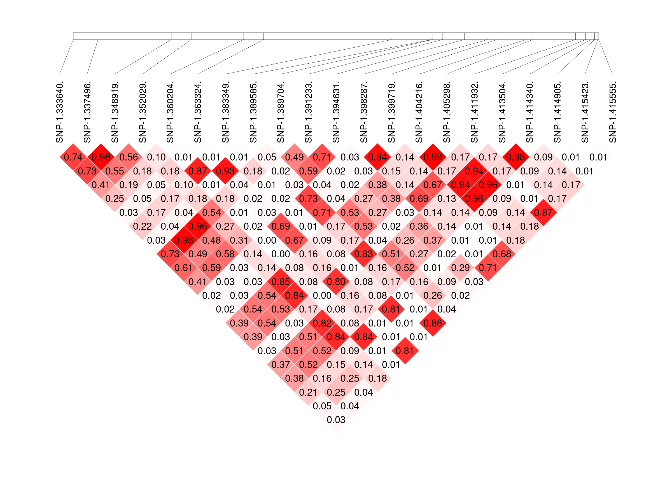

<!-- README.md is generated from README.Rmd. Please edit that file -->

# GWAS-Engine

<!-- badges: start -->
<!-- badges: end -->

The goal of GWAS-Engine is to provide simple “input/output” style code
for GWAS analysis in order to be used inside an API.

# How to use GWAS-Engine

## Dependencies

``` r
# required packages for using GWAS-Engine:
stopifnot(
  compareVersion("1.5.7", as.character(packageVersion("gaston"))) != 1
  )
stopifnot(
  compareVersion("1.7.2", as.character(packageVersion("jsonlite"))) != 1
  )
stopifnot(
  compareVersion("0.3.0", as.character(packageVersion("manhattanly"))) != 1
  )
stopifnot(
  compareVersion("2.5.0", as.character(packageVersion("R6"))) != 1
  )
library(gaston) # for many functions
#> Loading required package: Rcpp
#> Loading required package: RcppParallel
#> 
#> Attaching package: 'RcppParallel'
#> The following object is masked from 'package:Rcpp':
#> 
#>     LdFlags
#> Gaston set number of threads to 4. Use setThreadOptions() to modify this.
#> 
#> Attaching package: 'gaston'
#> The following object is masked from 'package:stats':
#> 
#>     sigma
#> The following objects are masked from 'package:base':
#> 
#>     cbind, rbind
library(jsonlite) # manage json format
library(manhattanly) # manhattan plot using plotly
#> See example usage at http://sahirbhatnagar.com/manhattanly/
library(R6) # R object oriented
```

## Load R scripts

Load all `.R` files in folder `src`.

``` r
invisible(
  sapply(FUN = source,
         X = list.files("src", pattern = ".R$",full.names = T))
)
```

## Main functions

There is the list of some main function that GWAS-engine can run.

### Run GWAS

``` r
gwas_results <- run_gwas(genoFile = "data/markers/testMarkerData01.vcf.gz",
                         phenoFile = "data/pheno/testPhenoData01.csv",
                         genoUrl = NULL,
                         phenoUrl = NULL,
                         trait = "Flowering.time.at.Arkansas",
                         test = "score",
                         fixed = 0,
                         response = "quantitative",
                         thresh_maf = 0.05,
                         thresh_callrate = 0.95,
                         dir = tempdir())
#> 2021-07-02 14:45:41 - r-run_gwas(): Get data ...
#> 2021-07-02 14:45:41 - r-readData(): get geno data ...
#> 2021-07-02 14:45:41 - r-readGenoData(): Check file extention ... 
#> 2021-07-02 14:45:41 - r-readGenoData(): Read geno file ... 
#> ped stats and snps stats have been set. 
#> 'p' has been set. 
#> 'mu' and 'sigma' have been set.
#> 2021-07-02 14:45:42 - r-readGenoData(): Read geno file DONE 
#> 2021-07-02 14:45:42 - r-readGenoData(): DONE, return output.
#> 2021-07-02 14:45:42 - r-readData(): get geno data DONE
#> 2021-07-02 14:45:42 - r-readData(): get pheno data ...
#> 2021-07-02 14:45:42 - r-readPhenoData(): Read phenotypic file ... 
#> 2021-07-02 14:45:42 - r-readPhenoData(): Read phenotypic file DONE 
#> 2021-07-02 14:45:42 - r-readPhenoData(): DONE, return output.
#> 2021-07-02 14:45:42 - r-readData(): get pheno data DONE
#> 2021-07-02 14:45:42 - r-readData(): prepare data ...
#> 2021-07-02 14:45:42 - r-prepareData(): Remove from geno data individuals that are not in phenotypic data-set ...
#> 2021-07-02 14:45:43 - r-prepareData(): Remove from geno data individuals that are not in phenotypic data-set DONE
#> 2021-07-02 14:45:43 - r-prepareData(): reorder matrix ...
#> 2021-07-02 14:45:43 - r-prepareData(): reorder matrix DONE
#> 2021-07-02 14:45:43 - r-prepareData(): remove monomorphic geno ...
#> 2021-07-02 14:45:43 - r-prepareData(): remove monomorphic geno DONE
#> 2021-07-02 14:45:43 - r-prepareData(): calculate genetic relatinoal matrix ...
#> 2021-07-02 14:45:44 - r-prepareData(): calculate genetic relatinoal matrix DONE
#> 2021-07-02 14:45:44 - r-prepareData(): DONE, return output.
#> 2021-07-02 14:45:44 - r-readData(): prepare data DONE
#> 2021-07-02 14:45:44 - r-readData(): DONE, return output.
#> 2021-07-02 14:45:44 - r-run_gwas(): Get data DONE
#> 2021-07-02 14:45:44 - r-run_gwas(): GWAS analysis ...
#> 2021-07-02 14:45:44 - r-gwas(): Check inputs ...
#> 2021-07-02 14:45:44 - r-gwas(): Check inputs DONE
#> 2021-07-02 14:45:44 - r-gwas(): aggregate data in bed matrix ...
#> 2021-07-02 14:45:44 - r-gwas(): aggregate data in bed matrix DONE
#> 2021-07-02 14:45:44 - r-gwas(): remove samples with missing phenotypic values ...
#> 2021-07-02 14:45:44 - r-gwas(): remove samples with missing phenotypic values DONE
#> 2021-07-02 14:45:44 - r-gwas(): filter SNPs ...
#> 2021-07-02 14:45:44 - r-gwas(): filter SNPs DONE
#> 2021-07-02 14:45:44 - r-gwas(): fit model ...
#> [Iteration 1] theta = 78.0648 39.8993
#> [Iteration 1] log L = -1000.94
#> [Iteration 1] AI-REML update
#> [Iteration 1] ||gradient|| = 0.403711
#> [Iteration 2] theta = 19.3247 82.1854
#> [Iteration 2] log L = -991.683
#> [Iteration 2] AI-REML update
#> [Iteration 2] ||gradient|| = 1.19645
#> [Iteration 3] theta = 25.9638 94.4353
#> [Iteration 3] log L = -985.452
#> [Iteration 3] AI-REML update
#> [Iteration 3] ||gradient|| = 0.200585
#> [Iteration 4] theta = 29.0152 95.1045
#> [Iteration 4] log L = -985.126
#> [Iteration 4] AI-REML update
#> [Iteration 4] ||gradient|| = 0.0176329
#> [Iteration 5] theta = 29.5483 94.4089
#> [Iteration 5] log L = -985.121
#> [Iteration 5] AI-REML update
#> [Iteration 5] ||gradient|| = 0.0013669
#> [Iteration 6] theta = 29.6082 94.2811
#> [Iteration 6] log L = -985.121
#> [Iteration 6] AI-REML update
#> [Iteration 6] ||gradient|| = 0.000156202
#> [Iteration 7] theta = 29.6155 94.2649
#> [Iteration 7] log L = -985.121
#> [Iteration 7] AI-REML update
#> [Iteration 7] ||gradient|| = 1.89617e-05
#> [Iteration 8] theta = 29.6163 94.2629
#> [Iteration 8] log L = -985.121
#> [Iteration 8] AI-REML update
#> [Iteration 8] ||gradient|| = 2.31733e-06
#> 2021-07-02 14:45:45 - r-gwas(): fit model DONE
#> 2021-07-02 14:45:45 - r-gwas(): DONE, return output.
#> 2021-07-02 14:45:45 - r-run_gwas(): GWAS analysis DONE
#> 2021-07-02 14:45:45 - r-run_gwas(): Save results ...
#> 2021-07-02 14:45:45 - r-saveGWAS(): Check dir ...
#> 2021-07-02 14:45:45 - r-saveGWAS(): Check dir DONE
#> 2021-07-02 14:45:45 - r-run_gwas(): Save results DONE
gwas_results$file
#> [1] "/tmp/RtmpiuaMtK/file1916d33991b7.json"
substr(gwas_results$gwasRes, start=1, stop=500)
#> [
#>   {
#>     "chr": "1",
#>     "pos": 9563,
#>     "id": "SNP-1.8562.",
#>     "A1": "A",
#>     "A2": "T",
#>     "freqA2": 0.1359,
#>     "score": 3.6664,
#>     "p": 0.0555
#>   },
#>   {
#>     "chr": "1",
#>     "pos": 25922,
#>     "id": "SNP-1.24921.",
#>     "A1": "C",
#>     "A2": "T",
#>     "freqA2": 0.1254,
#>     "score": 1.3876,
#>     "p": 0.2388
#>   },
#>   {
#>     "chr": "1",
#>     "pos": 26254,
#>     "id": "SNP-1.25253.",
#>     "A1": "A",
#>     "A2": "T",
#>     "freqA2": 0.2935,
#>     "score": 2.9466,
#>     "p": 0.0861
#>   },
#>   {
#>     "chr": "1",
#>     "p
```

### Draw Manhattan Plot

``` r
p <- draw_manhattanPlot(gwasFile = gwas_results$file,
                        gwasUrl = NULL,
                        adj_method = "bonferroni",
                        thresh_p = 0.05,
                        chr = NA,
                        title = "Example of Manhattan Plot")
#> 2021-07-02 14:45:45 - r-draw_manhattanPlot(): Get data ...
#> 2021-07-02 14:45:45 - r-readGWAS(): Read result file ... 
#> 2021-07-02 14:45:45 - r-readGWAS(): Read result file DONE 
#> 2021-07-02 14:45:45 - r-readGWAS(): Convert Json to data.frame ... 
#> 2021-07-02 14:45:46 - r-readGWAS(): Convert Json to data.frame DONE 
#> 2021-07-02 14:45:46 - r-readGWAS(): DONE, return output.
#> 2021-07-02 14:45:46 - r-draw_manhattanPlot(): Get data DONE
#> 2021-07-02 14:45:46 - r-draw_manhattanPlot(): Draw Manhattan Plot ...
#> 2021-07-02 14:45:46 - r-manPlot(): Adjust p-values ...
#> 2021-07-02 14:45:46 - r-adjustPval(): Check adj_method ...
#> 2021-07-02 14:45:46 - r-adjustPval(): Check adj_method DONE
#> 2021-07-02 14:45:46 - r-adjustPval(): Adjust p-values ...
#> 2021-07-02 14:45:46 - r-adjustPval(): Adjust p-values DONE
#> 2021-07-02 14:45:46 - r-adjustPval(): Adjust threshold ...
#> 2021-07-02 14:45:46 - r-adjustPval(): Adjust threshold DONE
#> 2021-07-02 14:45:46 - r-adjustPval(): DONE, return output
#> 2021-07-02 14:45:46 - r-manPlot(): Adjust p-values DONE
#> 2021-07-02 14:45:47 - r-manPlot(): DONE, return output
#> 2021-07-02 14:45:47 - r-draw_manhattanPlot(): Draw Manhattan Plot DONE
```


### Adjust p-values

``` r
gwas_adj <- run_resAdjustment(gwasFile = gwas_results$file,
                              gwasUrl = NULL,
                              adj_method = "bonferroni",
                              dir = tempdir())
#> 2021-07-02 14:45:47 - r-run_resAdjustment(): Get data ...
#> 2021-07-02 14:45:47 - r-readGWAS(): Read result file ... 
#> 2021-07-02 14:45:47 - r-readGWAS(): Read result file DONE 
#> 2021-07-02 14:45:47 - r-readGWAS(): Convert Json to data.frame ... 
#> 2021-07-02 14:45:48 - r-readGWAS(): Convert Json to data.frame DONE 
#> 2021-07-02 14:45:48 - r-readGWAS(): DONE, return output.
#> 2021-07-02 14:45:48 - r-run_resAdjustment(): Get data DONE
#> 2021-07-02 14:45:48 - r-run_resAdjustment(): Adjust p-values ...
#> 2021-07-02 14:45:48 - r-adjustPval(): Check adj_method ...
#> 2021-07-02 14:45:48 - r-adjustPval(): Check adj_method DONE
#> 2021-07-02 14:45:48 - r-adjustPval(): Adjust p-values ...
#> 2021-07-02 14:45:48 - r-adjustPval(): Adjust p-values DONE
#> 2021-07-02 14:45:48 - r-adjustPval(): DONE, return output
#> 2021-07-02 14:45:48 - r-run_resAdjustment(): Adjust p-values DONE
#> 2021-07-02 14:45:48 - r-run_resAdjustment(): Save results ...
#> 2021-07-02 14:45:48 - r-saveGWAS(): Check dir ...
#> 2021-07-02 14:45:48 - r-saveGWAS(): Check dir DONE
#> 2021-07-02 14:45:48 - r-run_resAdjustment(): Save results DONE
substr(gwas_adj$gwasAdjusted, start=1, stop=500)
#> [
#>   {
#>     "chr": "1",
#>     "pos": 9563,
#>     "id": "SNP-1.8562.",
#>     "A1": "A",
#>     "A2": "T",
#>     "freqA2": 0.1359,
#>     "score": 3.6664,
#>     "p": 0.0555,
#>     "p_adj": 1
#>   },
#>   {
#>     "chr": "1",
#>     "pos": 25922,
#>     "id": "SNP-1.24921.",
#>     "A1": "C",
#>     "A2": "T",
#>     "freqA2": 0.1254,
#>     "score": 1.3876,
#>     "p": 0.2388,
#>     "p_adj": 1
#>   },
#>   {
#>     "chr": "1",
#>     "pos": 26254,
#>     "id": "SNP-1.25253.",
#>     "A1": "A",
#>     "A2": "T",
#>     "freqA2": 0.2935,
#>     "score": 2.9466,
#>     "p": 0.0861
```

### Draw LD plot

``` r
imgFile <- draw_ldPlot(genoFile = "data/markers/testMarkerData01.vcf.gz",
                       genoUrl = NULL,
                       from = 42,
                       to = 62,
                       dir = tempdir()) 
#> 2021-07-02 14:45:48 - r-draw_ldPlot(): Get data ...
#> 2021-07-02 14:45:48 - r-readGenoData(): Check file extention ... 
#> 2021-07-02 14:45:48 - r-readGenoData(): Read geno file ... 
#> ped stats and snps stats have been set. 
#> 'p' has been set. 
#> 'mu' and 'sigma' have been set.
#> 2021-07-02 14:45:50 - r-readGenoData(): Read geno file DONE 
#> 2021-07-02 14:45:50 - r-readGenoData(): DONE, return output.
#> 2021-07-02 14:45:50 - r-draw_ldPlot(): Get data DONE
#> 2021-07-02 14:45:50 - r-draw_ldPlot(): Draw LD Plot ...
#> 2021-07-02 14:45:50 - r-LDplot(): Check "from" < "to"...
#> 2021-07-02 14:45:50 - r-LDplot(): Check "from" < "to" DONE
#> 2021-07-02 14:45:50 - r-LDplot(): Check number of SNP < 50...
#> 2021-07-02 14:45:50 - r-LDplot(): Check number of SNP < 50 DONE
#> 2021-07-02 14:45:50 - r-LDplot(): Check dir ...
#> 2021-07-02 14:45:50 - r-LDplot(): Check dir DONE
#> 2021-07-02 14:45:50 - r-LDplot(): Compute LD ...
#> 2021-07-02 14:45:50 - r-LDplot(): Compute LD DONE
#> 2021-07-02 14:45:50 - r-LDplot(): Create LD plot ...
#> 2021-07-02 14:45:50 - r-LDplot(): Create create file: /tmp/RtmpiuaMtK/file1916d7a499148.png
#> 2021-07-02 14:45:50 - r-LDplot(): Create LD plot DONE
#> 2021-07-02 14:45:50 - r-LDplot(): DONE, return output
#> 2021-07-02 14:45:50 - r-draw_ldPlot(): Draw LD Plot DONE
```

``` r
library(png)
img <- readPNG(imgFile)
grid::grid.raster(img)
```

<!-- -->

## Load data

Example data are stored in the `data` folder.

`readData` read and prepare the data for GWAS analysis

``` r
data <- readData(genoFile = "data/markers/testMarkerData01.vcf",
                 phenoFile = "data/pheno/testPhenoData01.csv")
#> 2021-07-02 14:45:52 - r-readData(): get geno data ...
#> 2021-07-02 14:45:52 - r-readGenoData(): Check file extention ... 
#> 2021-07-02 14:45:52 - r-readGenoData(): Read geno file ... 
#> ped stats and snps stats have been set. 
#> 'p' has been set. 
#> 'mu' and 'sigma' have been set.
#> 2021-07-02 14:45:53 - r-readGenoData(): Read geno file DONE 
#> 2021-07-02 14:45:53 - r-readGenoData(): DONE, return output.
#> 2021-07-02 14:45:53 - r-readData(): get geno data DONE
#> 2021-07-02 14:45:53 - r-readData(): get pheno data ...
#> 2021-07-02 14:45:53 - r-readPhenoData(): Read phenotypic file ... 
#> 2021-07-02 14:45:53 - r-readPhenoData(): Read phenotypic file DONE 
#> 2021-07-02 14:45:53 - r-readPhenoData(): DONE, return output.
#> 2021-07-02 14:45:53 - r-readData(): get pheno data DONE
#> 2021-07-02 14:45:53 - r-readData(): prepare data ...
#> 2021-07-02 14:45:53 - r-prepareData(): Remove from geno data individuals that are not in phenotypic data-set ...
#> 2021-07-02 14:45:53 - r-prepareData(): Remove from geno data individuals that are not in phenotypic data-set DONE
#> 2021-07-02 14:45:53 - r-prepareData(): reorder matrix ...
#> 2021-07-02 14:45:53 - r-prepareData(): reorder matrix DONE
#> 2021-07-02 14:45:53 - r-prepareData(): remove monomorphic geno ...
#> 2021-07-02 14:45:53 - r-prepareData(): remove monomorphic geno DONE
#> 2021-07-02 14:45:53 - r-prepareData(): calculate genetic relatinoal matrix ...
#> 2021-07-02 14:45:54 - r-prepareData(): calculate genetic relatinoal matrix DONE
#> 2021-07-02 14:45:54 - r-prepareData(): DONE, return output.
#> 2021-07-02 14:45:54 - r-readData(): prepare data DONE
#> 2021-07-02 14:45:54 - r-readData(): DONE, return output.
```

For online data, they can be loaded using:

``` r
data <- downloadData(genoUrl = "url/to/geno_data.vcf",
                     phenoUrl = "url/to/pheno_data.csv")
```

## GWAS

The `gwas` function return a `data.frame`.

``` r
gwasRes <- gwas(data = data,
                trait = "Flowering.time.at.Arkansas",
                test = "score",
                fixed = 0,
                response = "quantitative",
                thresh_maf = 0.05,
                thresh_callrate = 0.95)
#> 2021-07-02 14:45:54 - r-gwas(): Check inputs ...
#> 2021-07-02 14:45:54 - r-gwas(): Check inputs DONE
#> 2021-07-02 14:45:54 - r-gwas(): aggregate data in bed matrix ...
#> 2021-07-02 14:45:54 - r-gwas(): aggregate data in bed matrix DONE
#> 2021-07-02 14:45:54 - r-gwas(): remove samples with missing phenotypic values ...
#> 2021-07-02 14:45:54 - r-gwas(): remove samples with missing phenotypic values DONE
#> 2021-07-02 14:45:54 - r-gwas(): filter SNPs ...
#> 2021-07-02 14:45:54 - r-gwas(): filter SNPs DONE
#> 2021-07-02 14:45:54 - r-gwas(): fit model ...
#> [Iteration 1] theta = 78.0648 39.8993
#> [Iteration 1] log L = -1000.94
#> [Iteration 1] AI-REML update
#> [Iteration 1] ||gradient|| = 0.403712
#> [Iteration 2] theta = 19.3246 82.1855
#> [Iteration 2] log L = -991.683
#> [Iteration 2] AI-REML update
#> [Iteration 2] ||gradient|| = 1.19647
#> [Iteration 3] theta = 25.9636 94.4354
#> [Iteration 3] log L = -985.452
#> [Iteration 3] AI-REML update
#> [Iteration 3] ||gradient|| = 0.20059
#> [Iteration 4] theta = 29.0151 95.1046
#> [Iteration 4] log L = -985.125
#> [Iteration 4] AI-REML update
#> [Iteration 4] ||gradient|| = 0.0176336
#> [Iteration 5] theta = 29.5483 94.4089
#> [Iteration 5] log L = -985.121
#> [Iteration 5] AI-REML update
#> [Iteration 5] ||gradient|| = 0.00136695
#> [Iteration 6] theta = 29.6082 94.2811
#> [Iteration 6] log L = -985.12
#> [Iteration 6] AI-REML update
#> [Iteration 6] ||gradient|| = 0.000156207
#> [Iteration 7] theta = 29.6154 94.2649
#> [Iteration 7] log L = -985.12
#> [Iteration 7] AI-REML update
#> [Iteration 7] ||gradient|| = 1.89622e-05
#> [Iteration 8] theta = 29.6163 94.2629
#> [Iteration 8] log L = -985.12
#> [Iteration 8] AI-REML update
#> [Iteration 8] ||gradient|| = 2.31737e-06
#> 2021-07-02 14:45:55 - r-gwas(): fit model DONE
#> 2021-07-02 14:45:55 - r-gwas(): DONE, return output.
head(gwasRes)
#>   chr   pos           id A1 A2    freqA2    score          p
#> 1   1  9563  SNP-1.8562.  A  T 0.1358543 3.666421 0.05551927
#> 2   1 25922 SNP-1.24921.  C  T 0.1253521 1.387583 0.23881371
#> 3   1 26254 SNP-1.25253.  A  T 0.2935393 2.946582 0.08605942
#> 4   1 30214 SNP-1.29213.  T  A 0.1320225 2.189359 0.13896711
#> 5   1 31478 SNP-1.30477.  C  T 0.2268908 1.373035 0.24129105
#> 6   1 32733 SNP-1.31732.  T  G 0.2991573 3.335741 0.06778988
```

Save GWAS result in a `.json` file.

``` r
(file <- saveGWAS(gwasRes))
#> 2021-07-02 14:45:55 - r-saveGWAS(): Check dir ...
#> 2021-07-02 14:45:55 - r-saveGWAS(): Check dir DONE
#> [1] "/tmp/RtmpiuaMtK/file1916d15a56cdd.json"
cat(paste(readLines(file, n=20), collapse = "\n"))
#> [
#>   {
#>     "chr": "1",
#>     "pos": 9563,
#>     "id": "SNP-1.8562.",
#>     "A1": "A",
#>     "A2": "T",
#>     "freqA2": 0.1359,
#>     "score": 3.6664,
#>     "p": 0.0555
#>   },
#>   {
#>     "chr": "1",
#>     "pos": 25922,
#>     "id": "SNP-1.24921.",
#>     "A1": "C",
#>     "A2": "T",
#>     "freqA2": 0.1254,
#>     "score": 1.3876,
#>     "p": 0.2388
```

## Manhattan plot

This function generates a “plotly” graph.

``` r
p <- manPlot(gwas = gwasRes,
             adj_method = "bonferroni",
             thresh_p = 0.05,
             chr = NA,
             title = "Readme Example")
#> 2021-07-02 14:45:55 - r-manPlot(): Adjust p-values ...
#> 2021-07-02 14:45:55 - r-adjustPval(): Check adj_method ...
#> 2021-07-02 14:45:55 - r-adjustPval(): Check adj_method DONE
#> 2021-07-02 14:45:55 - r-adjustPval(): Adjust p-values ...
#> 2021-07-02 14:45:55 - r-adjustPval(): Adjust p-values DONE
#> 2021-07-02 14:45:55 - r-adjustPval(): Adjust threshold ...
#> 2021-07-02 14:45:55 - r-adjustPval(): Adjust threshold DONE
#> 2021-07-02 14:45:55 - r-adjustPval(): DONE, return output
#> 2021-07-02 14:45:55 - r-manPlot(): Adjust p-values DONE
#> 2021-07-02 14:45:56 - r-manPlot(): DONE, return output
```


## LD PLot

Compute *r*<sup>2</sup> Linkage Disequilibrium (LD) between given SNPs
and save a plot in a temporary PNG file.

``` r
gDta <- readGenoData("data/markers/testMarkerData01.vcf.gz")
#> 2021-07-02 14:45:56 - r-readGenoData(): Check file extention ... 
#> 2021-07-02 14:45:56 - r-readGenoData(): Read geno file ... 
#> ped stats and snps stats have been set. 
#> 'p' has been set. 
#> 'mu' and 'sigma' have been set.
#> 2021-07-02 14:45:57 - r-readGenoData(): Read geno file DONE 
#> 2021-07-02 14:45:57 - r-readGenoData(): DONE, return output.
(imgFile <- LDplot(geno = gDta,
                   from = 1,
                   to = 20,
                   dir = tempdir()))
#> 2021-07-02 14:45:57 - r-LDplot(): Check "from" < "to"...
#> 2021-07-02 14:45:57 - r-LDplot(): Check "from" < "to" DONE
#> 2021-07-02 14:45:57 - r-LDplot(): Check number of SNP < 50...
#> 2021-07-02 14:45:57 - r-LDplot(): Check number of SNP < 50 DONE
#> 2021-07-02 14:45:57 - r-LDplot(): Check dir ...
#> 2021-07-02 14:45:57 - r-LDplot(): Check dir DONE
#> 2021-07-02 14:45:57 - r-LDplot(): Compute LD ...
#> 2021-07-02 14:45:57 - r-LDplot(): Compute LD DONE
#> 2021-07-02 14:45:57 - r-LDplot(): Create LD plot ...
#> 2021-07-02 14:45:57 - r-LDplot(): Create create file: /tmp/RtmpiuaMtK/file1916d3948f226.png
#> 2021-07-02 14:45:57 - r-LDplot(): Create LD plot DONE
#> 2021-07-02 14:45:57 - r-LDplot(): DONE, return output
#> [1] "/tmp/RtmpiuaMtK/file1916d3948f226.png"
```

``` r
img <- readPNG(imgFile)
grid::grid.raster(img)
```

<!-- -->

# Functions documentation

All the functions of this engine use `roxygen2` for documentation. You
can generate a markdown documentation located in `./doc/README.md` using
the function `writeDoc` (defined in `./src/utils.R`):

``` r
writeDoc()
```

# Tests

The R package `testthat` is needed to run the unit tests. To run the
unit tests of this engine you can use the command:

``` sh
Rscript ./tests/testthat.R
```
